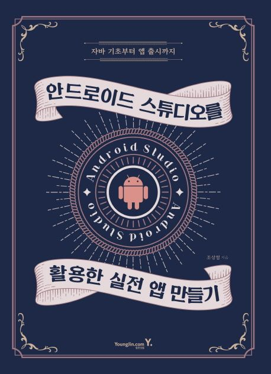

  
<h1 align="center">
  
안드로이드 스튜디오를 활용한 실전 앱 만들기

  
</h1>
  
  
<b>조상철 저</b> 
영진닷컴 · 2018년 02월 12일 출시</b>

## :bulb: 목표

- **안드로이드 앱 개발을 위한 자바 기초 공부**

  > 자바 기초부터 개념을 공부

- **게임 앱 개발**

  > 바구니 수학 게임, 2인용 우주선 게임, Air Hockey 게임 앱 개발

- **DB, 데이터를 활용한 앱 개발**

  > 데이터를 이용한 영어단어장 앱, 일기장 앱, 공공데이터를 활용한 버스 노선 앱 개발

- **앱 출시 방법 공부**

  > play 스토어 등록 과정 공부

 

## :mag: 목차

Chapter 1. 앱 만들기의 시작\_자바 문법 01. 자바 문법 익히기(1) 02. 자바 문법 익히기(2) 03. 자바 문법 익히기(3) 04. 자바 문법 익히기(4)

Chapter 2. 개발 환경 구축 및 Android Studio 시작하기 01. JDK 및 안드로이드 스튜디오 설치 02. 첫 어플 만들기

Chapter 3. 바구니 수학 게임 앱 만들기 01. 사용자 인터페이스 이해하기 02. 레이아웃(Layout) 03. 이벤트 처리하기 04. 버튼을 활용한 간단한 앱 만들기 05. View 클래스를 활용한 앱 만들기 06. 게임 속 우주선 움직이기 07. 게임원리\_미사일 발사 및 행성 움직이기 08. 바구니 수학 게임 앱 만들기

Chapter 4. SurfaceView를 활용한 바구니 수학 게임 앱 만들기 01. SurfaceView로 게임 만들기 02. Thread 이해하기

Chapter 5. DB를 활용한 영어단어 앱 만들기 01. 영어단어 앱 알아보기 02. 데이터베이스 이해하기 03. DB를 활용한 응용 앱 만들기(1) 04. DB를 활용한 응용 앱 만들기(2) 05. DB를 활용한 응용 앱 만들기(3) 06. DB를 활용한 응용 앱 만들기(4)

Chapter 6. 2인용 게임 앱 만들기 01. 우주선 게임 앱 만들기 02. Air Hockey 게임 앱 만들기

Chapter 7. 자동차 게임 앱 만들기 01. 자동차 게임 앱 만들기(1) 02. 자동차 게임 앱 만들기(2)

Chapter 8. ListView, RecyclerView를 활용한 앱 만들기 01. ListView를 활용한 앱 만들기 02. RecyclerView를 활용한 그림 영어단어장 만들기

Chapter 9. Video 플레이어 앱 만들기 01. 비디오 앨범 만들기(1) 02. 비디오 앨범 만들기(2)

Chapter 10. 네이버 지도 API 활용한 간단한 지도 앱 만들기 01. 네이버 지도 API 활용한 앱 만들기 전에 알아두기 02. 네이버 지도 API 활용한 앱 만들기

Chapter 11. 나만의 일기장 앱 만들기 01. 나만의 일기장 앱 만들기 02. 데이터베이스를 활용한 일기장 앱 만들기

Chapter 12. 공공 DB를 활용한 버스 노선 앱 만들기 01. 공공 DB를 활용한 버스 노선 앱 02. 공공 DB를 활용한 OPEN API

Chapter 13. Play 스토어에 앱 출시하기 01. APK 파일 만들기 02. Play 스토어에 앱 탑재하기

 
