# 안드로이드 스튜디오 시작하기

new project를 클릭한 뒤 Empty Activity를 선택했다. 세팅은 아래와 같다.

* Application name: AndroidStudioBasic

* Package name: com.erectbranch.AndroidStudioBasic (도메인이 반대로 쓰이고, Application name이 붙는다.)

* 사용 언어: Java

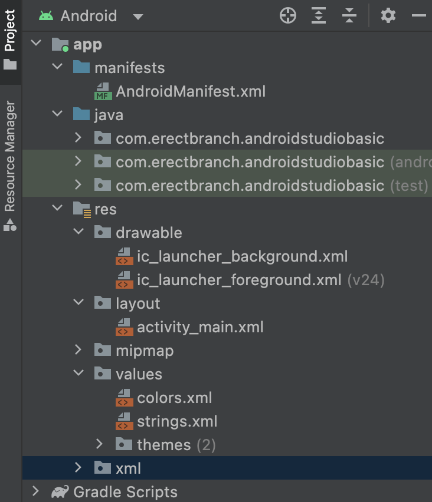

차례로 파일이 무엇인지 살피자

* manifests: 앱의 많은 정보를 담고 있으며, Activity를 만들 때마다 이곳에 정보를 등록해야 한다. 어플의 아이콘을 정하거나 진동 등 다양한 권한을 부여할 때 사용한다.

* Java: 자바 파일에 코드를 넣는 곳이다.

아래는 res 하위 폴더

* drawable: 이미지, 음악 파일 등을 넣는다.

* layout: 화면을 구성하는 xml 파일이 있다.

* mipmap: 스마트폰 화면에 표시되는 이미지(어플 아이콘)을 넣는다.

* values: strings.xml 안에는 문자열을 넣는다. 어플 이름을 바꾸고 싶다면 이 파일을 수정하면 된다.


---


## 앱 실행하기

제작한 앱을 실행하는 방법은 두 가지가 있다. 첫 번째 방법은 먼저 휴대폰에 직접 APK를 설치하는 방법이고, 두 번째 방법은 가상 디바이스(AVD)를 사용하는 방법이다.

이후는 AVD를 사용하며 Nexus 5X 시스템으로 진행했다.

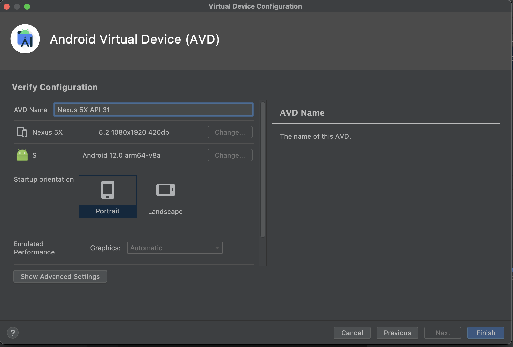

녹색 재생 아이콘을 눌러 현재 설정한 AVD에서 app을 실행하였다.

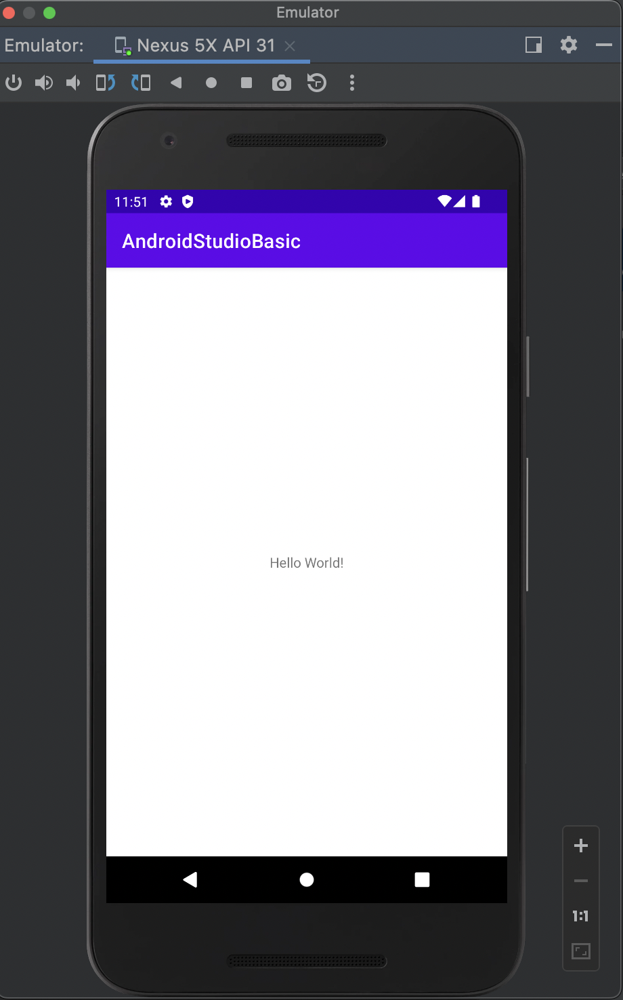

화면 중앙에 Hello, World!라는 글씨를 확인할 수 있다.


---


## 앱 이름 및 아이콘 변경하기

우선 앱에 표시되는 문장을 변경한다. [layout] 폴더에 있는 activity_main.xml 파일의 'Hello, World!' 문장을 수정할 것이다. "나의 첫 어플"이라는 문장으로 바꿀 것이다.

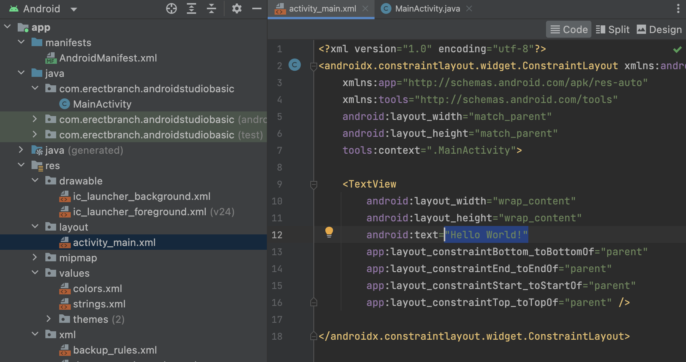

다음은 앱 이름 변경이다. [values] 폴더에 있는 strings.xml 파일의 'AndroidStudioBasic' 부분을 수정할 것이다. "나의 첫 작품"이라고 바꿀 것이다.

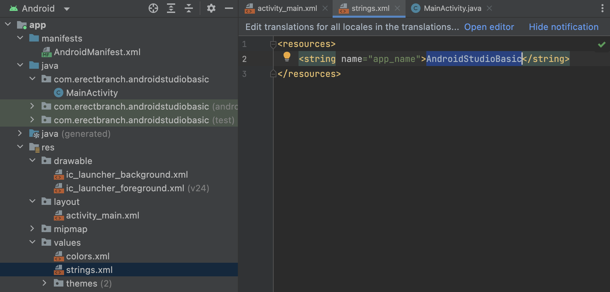

아래는 변경이 적용된 모습이다.

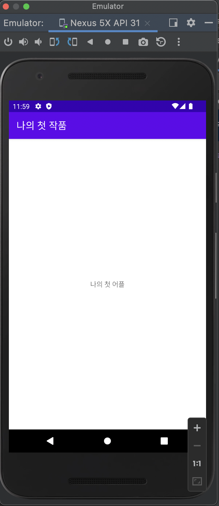

이번에는 앱 아이콘 변경이다. icon.png를 [minmap] 폴더에 넣은 후, AndroidManifest.xml에서 icon 속성 값을 @minmap/icon 으로 변경한다.

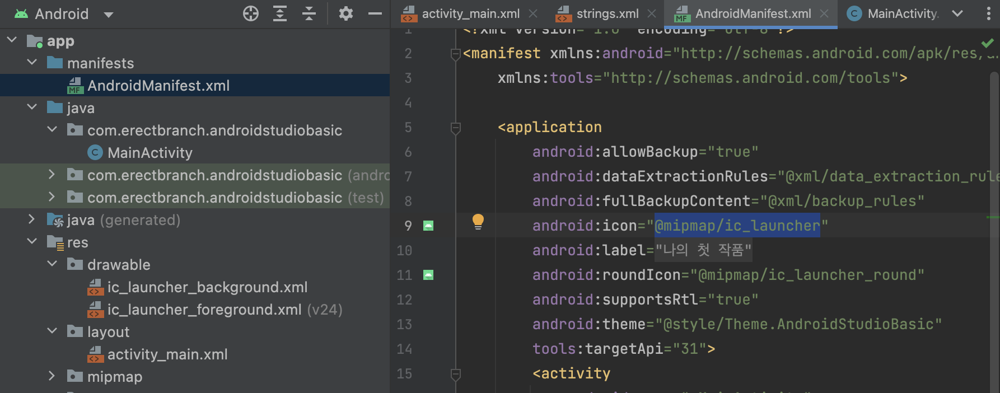

이미지를 안드로이드 스튜디오에서 폴더에 넣을 때는 특정 이미지 파일을 복사한 뒤, 안드로이드 스튜디오에서 폴더를 클릭하고 붙여넣기를 하면 된다.


---


## 뷰와 레이아웃

### 뷰그룹과 뷰

텍스트뷰, 버튼, 이미지뷰 등을 뷰(View) 또는 위젯이라고 한다. 뷰는 xml 파일 안에서 태그<>로 만들어야 한다.

다음 예제는 4개의 서로 다른 뷰로 구성되어 있다. 이러한 뷰를 하나의 그릇에 담을 수 있는데, 이를 레이아웃이라고 한다. 레이아웃 안에서 orientation 속성에 vertical 값을 입력하면 예제처럼 뷰를 수직으로 배치할 수 있다.

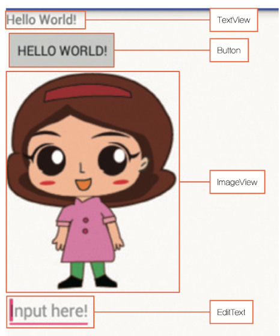

하나의 버튼 뷰(위젯)를 살펴보자. 뷰는 속성과 속성값으로 이루어져 있다.

```
<Button
    android : layout_width = "wrap_content"    // 속성 = "속성값"
    android : layout_height = "wrap_content"
    android : test = "Hello, World!"
    />
```


### LinearLayout으로 바꾸기
뷰를 담는 레이아웃은 여러 종류가 있다. 프로젝트를 새로 만들 때 [layout] 폴더의 activity_main.xml 파일은 ConstrainLayout 레이아웃(default)으로 이루어져 있다. 이 ConstrainLayout을 LinearLayout으로 바꿀 것이다. 

androidx.constraintlayout.widget.ConstraintLayout 문장을 지우고 LinearLayout을 기입한다. 또한 LinearLayout에서 사용하지 않는 4개의 constraint 부분을 삭제한다.

```
// 삭제할 constraint 부분
        app:layout_constraintBottom_toBottomOf="parent"
        app:layout_constraintEnd_toEndOf="parent"
        app:layout_constraintStart_toStartOf="parent"
        app:layout_constraintTop_toTopOf="parent"
```

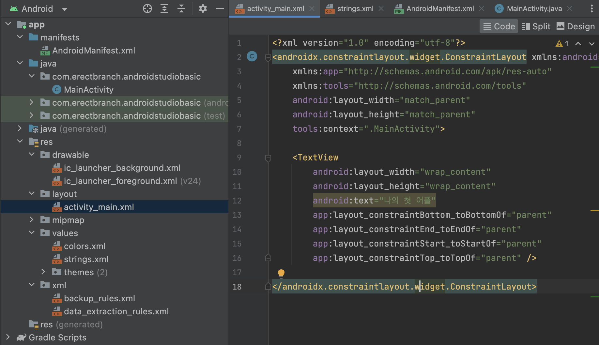

아래는 변경을 적용한 코드다.

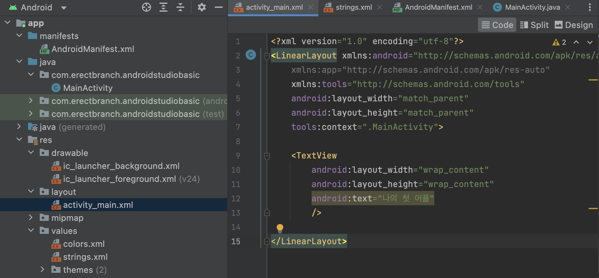


### 예제 뷰를 LinearLayout으로 구현

예제로 살펴본 4개의 뷰를 구현한 LinearLayout 내용은 다음과 같다.

```xml
<?xml version="1.0" encoding="utf-8"?>
<LinearLayout xmlns:android="http://schemas.android.com/apk/res/android"
    xmlns:app="http://schemas.android.com/apk/res-auto"
    xmlns:tools="http://schemas.android.com/tools"
    android:layout_width="match_parent"
    android:layout_height="match_parent"
    android:orientation = "vertical"   <!-- orientation 속성에 vertical 값을 설정 -->
    tools:context=".MainActivity">

    <TextView
        android:layout_width="wrap_content"
        android:layout_height="wrap_content"
        android:text="TextView 구현"
        />

    // 버튼
    <Button
        android:layout_width="wrap_content"     <!-- layout_width: 해당 뷰의 가로 크기 -->
        android:layout_height="wrap_content"    <!-- layout_height: 해당 뷰의 세로 크기 -->
        <!-- 속성 값으로 wrap_content를 주면 뷰(위젯) 크기가 된다. -->
        android:text="Button 구현"
        />

    <ImageView
        android:layout_width="wrap_content"
        android:layout_height="wrap_content"
        android:src="@drawable/girl"
        android:text="ImageView 구현"
        />

    <EditText
        android:layout_width="wrap_content"
        android:layout_height="wrap_content"
        android:hint="Edit Text 구현"
        />

</LinearLayout>
```

아래는 위 코드를 적용한 모습이다.

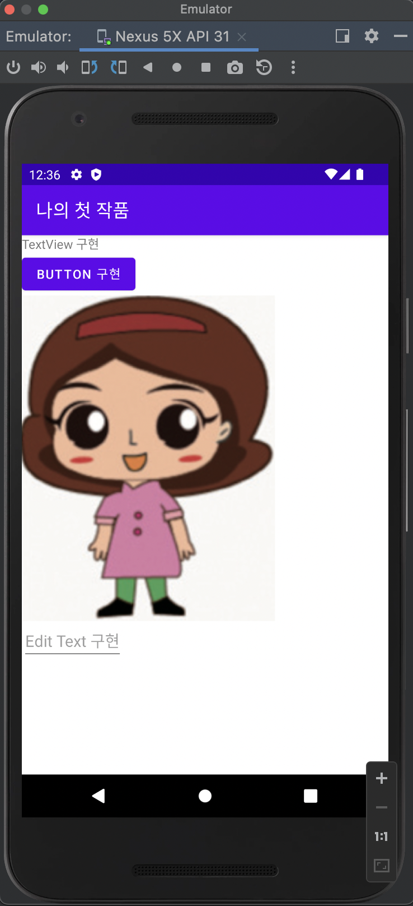


---


## 추가 개념 정리: Context

Context란 어플리케이션 현재 상태를 보여주는 맥락(Context)이다. 생성된 객체에서 어떤 일이 벌어지고 있는지 알 수 있다.

> [Context란?](https://arabiannight.tistory.com/284)

공식 Android 문서는 다음과 같이 설명한다.

> 어플리케이션 환경에 관한 글로벌 정보를 접근하기 위한 인터페이스. Abstract 클래스이며 실재 구현은 안드로이드 시스템에 의해 제공된다. Context 를 통해, 어플리케이션에 특화된 리소스나 클래스에 접근할 수 있을 뿐만 아니라, 추가적으로, 어플리케이션 레벨의 작업 - Activity 실행, Intent 브로드캐스팅, Intent 수신 등, 을 수행하기 위한 API 를 호출 할 수도 있다.

간단하게 말하면 **크게 두 가지 역할을 하는 추상 클래스**이다.

* 앱에 관해 시스템이 관리하고 있는 정보에 접근하기: 리소스, 클래스 어플리케이션 환경 정보

* 안드로이드 시스템 서비스에서 제공하는 API 호출하기: startActivity(), bindService()

Context 인터페이스가 제공하는 API 중 getPackageName(), getResource() 등의 메서드들이 첫 번째 역할을 수행하는 대표적인 메서드다. 그 외 startActivity(), bindService()와 같은 메서드가 두 번째 역할을 수행하는 대표적인 메서드다.


### 다른 플랫폼과 Context의 차이

원래 전역적인 어플리케이션 정보에 접근하거나 어플리케이션 연관된 시스템 기능을 수행하기 위해, 시스템 함수를 호출하는 건 안드로이드가 아닌 다른 플랫폼에서도 늘상 있는 일이다. 그런데 다른 플랫폼은 대체로 어떤 매개체를 거칠 필요 없이 직접적으로 API를 호출하면 된다.

아래는 C#은 System 단에서 제공하는 정적 함수(static function)을 이용해 어플리케이션 이름을 가져오고, 다른 어플리케이션을 실행하는 코드다.

```C#
// 어플리케이션 이름 가져오기
String applicationName = System.AppDomain.CurrentDomain.FriendlyName;

// 새 process 시작(applicaion)
System.Diagnostics.Process.Start("text.exe");
```

반면 안드로이드는 Context라는 인스턴스화된 매개체를 이용해야만 유사한 일을 수행할 수 있다. 아래 코드에서는 this가 인스턴스화된 Context 클래스를 나타낸다.

```Java
// 어플리케이션 이름 가져오기
String applicationName = this.getPackageName();

// 새 activity 시작(application)
this.startActivity(new Intent(this, Test.class));
```


### 그렇다면 왜 굳이 이런 차이가 생길 것일까?

> [안드로이드의 멀티테스킹](https://blog.naver.com/huewu/110085391353)

우선 짚고 넘어갈 부분은 안드로이드가 아닌 다른 플랫폼에서는 어떻게 정적 함수 호출을 통해서 어플리케이션 정보를 가져오고, 시스템 함수를 호출할 수 있을까? 간단하게 답하면 '어플리케이션이 프로세스와 밀접하게 연결되어 있기 때문'이다.

하지만 안드로이드 프로세스는 어플리케이션과 조금 특이한 관계를 가지고 있다. **안드로이드에서 어플리케이션과 프로세스는 서로 독립적으로 존재**하는 것이다. 이는 사용자를 위한 멀티태스킹 디자인을 고려하면서 나온 결과다. 사용자는 다양한 종류의 어플리케이션을 아주 짧게, 반복적으로 사용하는 경향이 있다. 하지만 모바일 디바이스는 충분한 스왑 메모리 공간을 지니지 못하며, 언제나 메모리를 빡빡하게 제한해서 사용해야 한다. 조건 속에서도 개발자들은 사용자는 1초 이내 몇몇 애플리케이션을 돌아가면서 확인할 수 있게 빠른 스위칭을 구성해야 했다. 비디오를 보다가 새로 도착한 SMS 문자를 확인하고 다시 비디오 플레이 어플리케이션으로 돌아가는 등의 사용자 시나리오를 생각하면 감이 잡힌다. 즉 **"모든 어플리케이션은 항상 실행 중"인 것처럼 느낄 수 있게** 설계했다.

안드로이드에서 프로세스와 어플리케이션은 밀접하게 연결(tightly coupled)된 요소가 아니며, 해당 어플리케이션을 현재 작동시키는 프로세스가 없어도 사용자에게는 작동 중인 것으로 보일 수 있다. 또한 여러 어플리케이션이 프로세스를 공유할 수 있으며, 하나의 어플리케이션이 여러 프로세스를 사용할 수도 있다. 반대로 어플리케이션이 작동 중이 아니더라도, 어플리케이션을 구동한 프로세스는 종료되지 않고 안드로이드 시스템에 의해 유지될 수도 있다.

즉, 개발자가 어플리케이션 프로세스가 'Running' 상태임을 확인 할 수 있다고 해서, 그것이 해당 어플리케이션이 현재 작동중이거나 어떠한 일을 하고 있다는 것을 의미하지는 않는다. 안드로이드가 어플리케이션을 관리하는 핵심은 프로세스를 깔끔하게 종료시키지 않는 것이다. 사용자가 어플리케이션을 떠나는 순간, 해당 어플리케이션의 프로세스는 계속 유지되며, 백그라운드 상에서 특정 작업을 수행할 수도 있다. 그리고 사용자가 돌아오면 즉각 포그라운드로 전환된다. 만약 디바이스의 메모리가 충분하다면, 안드로이드는 모든 어플리케이션 프로세스를 유지할 것이다.(말 그대로 모든 어플리케이션이 동시에 Running 중)

하지만 메모리는 무한하지 않다. 따라서 안드로이드 시스템은 더이상 필요하지 않은 프로세스를 종료해야 한다. 개발자가 정한 규칙에 따라 프로세스의 중요도가 결정되고, 가장 중요하지 않은 프로세스부터 종료된다. 이러한 과정이 안드로이드의 '프로세스 생명주기'(Process Lifecycle) 를 만들어 낸다.

동시에 "모든 어플리케이션은 항상 실행 중"이라는 사용자 경험을 충족시키기 위해, 사용자가 이미 종료된 어플리케이션으로 돌아갔을 때, 해당 어플리케이션의 마지막 상황과 동일한 형태로 어플리케이션이 시작되도록 했다. 이를 위해 사용자에게 표시되는 어플리케이션 요소(즉, Activity)는 늘 기록되며, 필요한 상황에 특정 Activity를 꺼내오며 Activity를 재시작한다. Activity의 상태 정보는 어플리케이션 종료가 아니라, '사용자가 어플리케이션을 떠날 때마다' 생성되므로 이러한 시스템이 가능한 것이다.

이처럼 어플리케이션과 프로세스의 연결이 느슨하다면, Activity와 같은 어플리케이션 정보는 어디서 관리하는 것일까? 바로 안드로이드 서비스 시스템 중 하나인 ActivityManagerService에서 관리하고 있다. 특정 토큰을 key 값으로 'Key-Value' 쌍으로 이루어진 배열을 이용해 어플리케이션 정보를 저장한다. 이러한 배경 때문에 안드로이드에서는 어플리케이션과 관련된 정보를 얻기 위해 ActivityManagerService를 통해야 하는 것이다. 당연히 Key-Value 쌍으로 저장되므로 어떤 어플리케이션인지 알 수 있게 key 값도 필요하다.

여기서 Context가 다음과 같은 두 역할을 수행하는 것이다.

* 자신이 어떤 어플리케이션을 나타내고 있는지 알려주는 ID 역할

* ActivityManagerService에 접근할 수 있도록 해주는 통로 역할

### Context의 종류

1. Application Context

* Application 사이클에 귀속된다.

* Singleton Instance -> 앱이 죽기 전까지 동일한 객체를 반환한다.

* **getApplicationContext()**로 접근한다.

* 어떤 Context보다도 오래 유지된다.


2. Activity Context

* Activity 라이프 사이클에 귀속된다.

* **getContext()**로 접근한다.

* Activity 범위 내에서 Context를 전달한다.


이때 메모리 누수를 피하기 위해 Activity Context는 수명이 긴 참조를 피해야 한다. 되도록이면 Application Context을 사용해야 한다.