# 바구니 수학 게임 앱 만들기

사용자 인터페이스(UI)를 삭성하는 방법은 크게 세 가지로 나눌 수 있다.

* xml 파일로만 화면 구성하기

* 코드로 UI 작성하기

* 코드와 xml 파일 함께 사용하기


---


## 1. xml 파일로만 화면 구성하기

layout 폴더의 activity_main.xml 파일로만 UI를 구성할 것이다. 우선 버튼 세 개를 만든다.

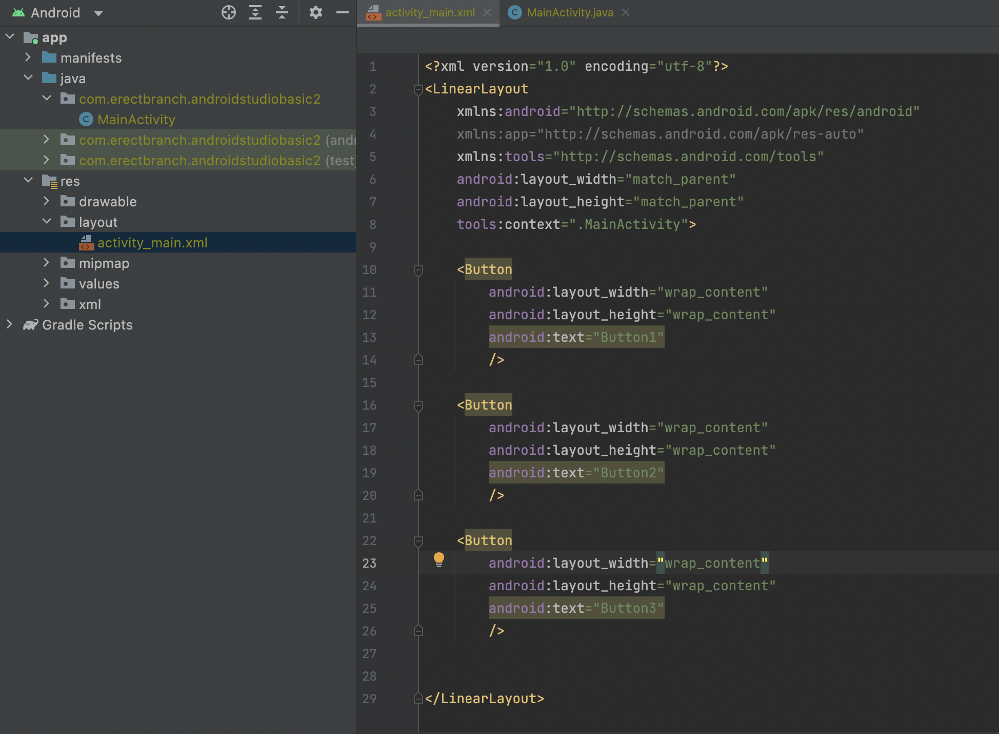

이 코드를 AVD로 실행한 화면은 다음과 같다.

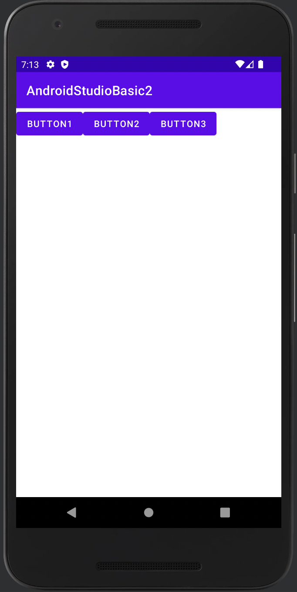

text 속성을 사용해서 버튼 화면에 제시되는 이름을 지정했다. 

Java 폴더의 MainActivity.java 코드를 보자.

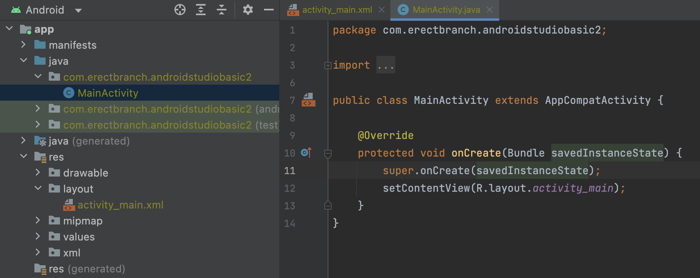

```Java
@Override
    protected void onCreate(Bundle savedInstanceState) {
        super.onCreate(savedInstanceState);
        setContentView(R.layout.activity_main);
    }
```

MainActivity 클래스는 AppCompatActivity 클래스를 상속한다. 따라서 AppCompatActivity의 메서드인 setContentView를 사용할 수 있다. 이 setContentView 메서드는 패러미터를 화면에 출력하는 기능을 한다. 여기서는 activity_main.xml 파일을 패러미터로 넣어 그 내용이 화면에 출력된 것이다.

> onCreate 메서드는 안드로이드 운영체제 시스템이 의해 Activity가 실행될 때 가장 먼저 실행되는 메서드다. 보통 이곳에 findViewById 메서드, 버튼리스너 등을 넣는다.


## 2. 코드로 사용자 인터페이스(UI) 작성하기

이번에는 반대로 xml 파일 없이 Java 코드만으로 화면을 구성할 것이다. 그러나 모든 UI를 이런 방법으로 처리하려면 불필요한 노력이 많이 든다.

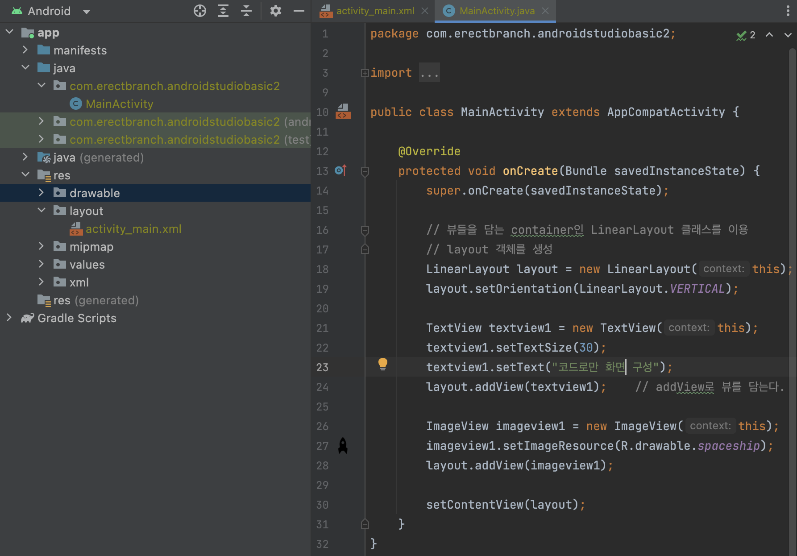

뷰를 담는 container인 LinearLayout 클래스를 이용해서 layout 객체를 생성했다. 다음으로 TextView 클래스 객체, ImageView 클래스 객체를 생성한 뒤, addView() 메서드를 사용해서 뷰를 LinearLayout에 담았다.

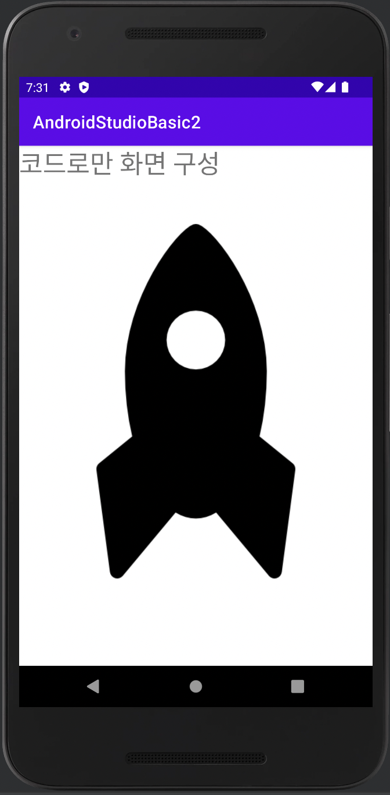

뷰가 배치되는 방향을 지정하려면 setOrientation 메서드로 HORIZONTAL(수평), VERTICAL(수직)으로 설정하면 된다.


## 3. 코드와 xml을 함께 사용하기

가장 많이 쓰는 '코드와 xml을 함께 사용'하는 방법이다. 처음에는 xml 파일로 기본 ui를 구성한 뒤 수정이 필요할 때 코드를 사용하면 된다. 이 경우 xml 파일에서 작성한 뷰를 조작하기 위해 각 뷰에 고유한 식별자(id)를 설정해야 한다.

예제에서는 우선 activity_main.xml 파일에 TextView를 추가할 것이다.

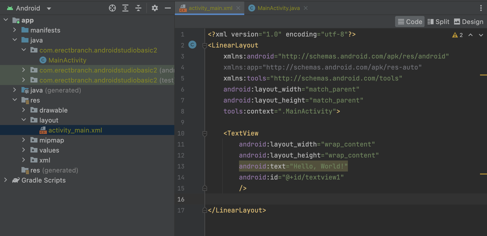

```xml
android:id="@+id/textview1"
```

위는 id 속성에 속성값을 textview1으로 설정한 것이다. 이렇게 id를 설정한 경우 MainActivity 안에서 findViewById() 메서드를 이용해 식별자가 textview1인 텍스트 뷰를 찾을 수 있다.

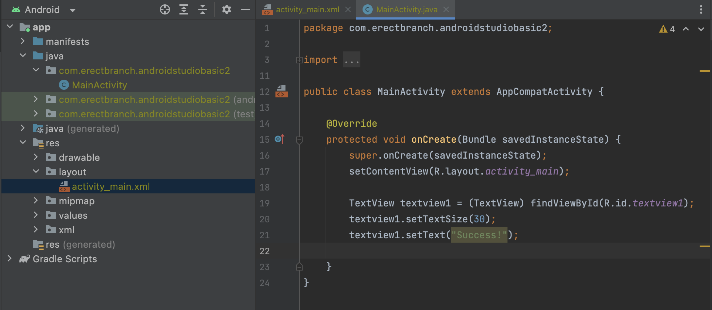

setTextSize()와 setText() 메서드를 이용해 텍스트 사이즈와 텍스트를 설정했다.

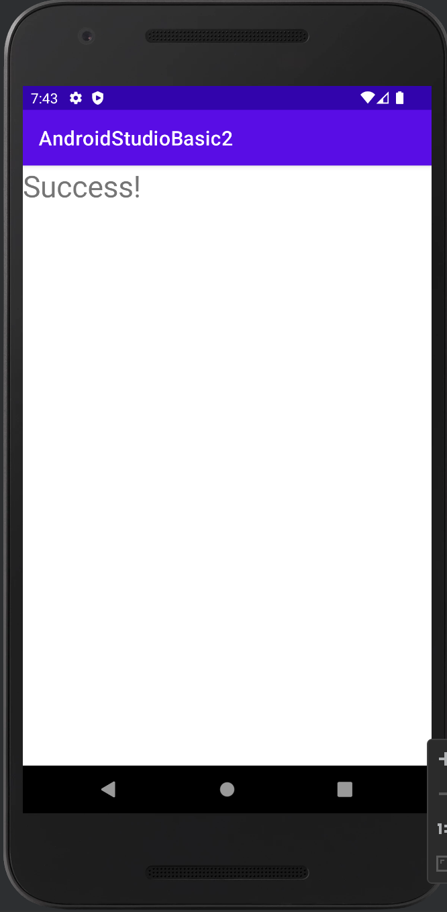

아래는 xml 파일에서 사용되는 관련 메서드다.

| xml 속성 | 관련 메서드 | 역할 | 
| --- | --- | --- |
| text | setText | 출력 텍스트를 설정 |
| textSize | setTextSize | 출력 텍스트 크기를 설정 |
| textColor | setTextColor | 텍스트 색상을 설정 |
| textStyle | setTypeface | 텍스트를 bold, Italic, bolditalic으로 설정 |
| background | setBackgroundColor | 배경색을 설정 |
| rotation | setRotation | 회전 설정 |
| visibility | setVisibility | 투명도 설정 |


---


## 레이아웃

레이아웃(layout)은 뷰를 담는 뷰그룹이다. 자주 사용하는 레이아웃은 다음과 같은 것들이 있다.

* 선형 레이아웃(LinearLayout)

* 상대 레이아웃(RelativeLayout)

* 프레임 레이아웃(FrameLayout)

이외 다양한 레이아웃이 있지만, 일단 가장 많이 사용하는 LinearLayout부터 살펴보자.


---


## 1. LinearLayout 기본

아래는 버튼 세 개로 구성된 LinearLayout이다.

```xml
<?xml version="1.0" encoding="utf-8"?>
<LinearLayout
    xmlns:android="http://schemas.android.com/apk/res/android"
    xmlns:app="http://schemas.android.com/apk/res-auto"
    xmlns:tools="http://schemas.android.com/tools"
    android:layout_width="match_parent"
    android:layout_height="match_parent"
    android:orientation="horizontal"
    tools:context=".MainActivity">

    <Button
        android:layout_width="wrap_content"
        android:layout_height="wrap_content"
        android:text="button1"
        />

    <Button
        android:layout_width="wrap_content"
        android:layout_height="wrap_content"
        android:text="button1"
        />

    <Button
        android:layout_width="wrap_content"
        android:layout_height="wrap_content"
        android:text="button1"
        />

</LinearLayout>
```

android:orientation="horizontal" 부분에서 속성값을 **vertical로 주면 뷰를 수직**으로 배치한다. 속성값을 **horizontal로 주면 뷰를 수평**으로 배치한다.

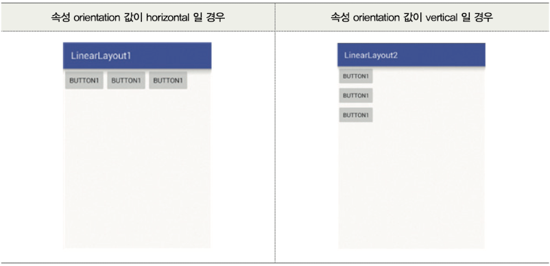

android:layout_width="wrap_content"에서 속성값 wrap_content을 주면 뷰(=위젯)의 크기에 딱 맞는 크기로 설정된다.

그렇다면 3개의 버튼이 2줄로 나열된 레이아웃을 구성하려면 어떻게 해야 할까?


### 1.2 LinearLayout 응용

아래는 3개의 버튼이 2줄로 나열된 레이아웃이다.

```xml
<?xml version="1.0" encoding="utf-8"?>
<LinearLayout
    xmlns:android="http://schemas.android.com/apk/res/android"
    xmlns:app="http://schemas.android.com/apk/res-auto"
    xmlns:tools="http://schemas.android.com/tools"
    android:layout_width="match_parent"
    android:layout_height="match_parent"
    android:orientation="vertical">
    <!-- 부모 컨테이너(뷰 그룹)으로 하위 2개 LinearLayout을 갖는다.
        android:orientation="vertical"로 하위 LinearLayout이 수직으로 배치된다.-->

    <!-- 하위 LinearLayout 1 -->
    <LinearLayout
        android:layout_width="wrap_content"
        android:layout_height="wrap_content"
        android:orientation="horizontal">

        <Button
            android:layout_width="wrap_content"
            android:layout_height="wrap_content"
            android:text="button1"
            />

        <Button
            android:layout_width="wrap_content"
            android:layout_height="wrap_content"
            android:text="button2"
            />

        <Button
            android:layout_width="wrap_content"
            android:layout_height="wrap_content"
            android:text="button3"
            />

    </LinearLayout>

    <!-- 하위 LinearLayout 2 -->
    <LinearLayout
        android:layout_width="wrap_content"
        android:layout_height="wrap_content"
        android:orientation="horizontal">

        <Button
            android:layout_width="wrap_content"
            android:layout_height="wrap_content"
            android:text="button4"
            />

        <Button
            android:layout_width="wrap_content"
            android:layout_height="wrap_content"
            android:text="button5"
            />

        <Button
            android:layout_width="wrap_content"
            android:layout_height="wrap_content"
            android:text="button6"
            />

    </LinearLayout>


</LinearLayout>
```

하위 LinearLayout 각각에서는 버튼 3개가 수평으로 배치되었다. 이 하위 레이아웃을 종합하는 부모 LinearLayout에서는 이를 수직으로 배치하였다.

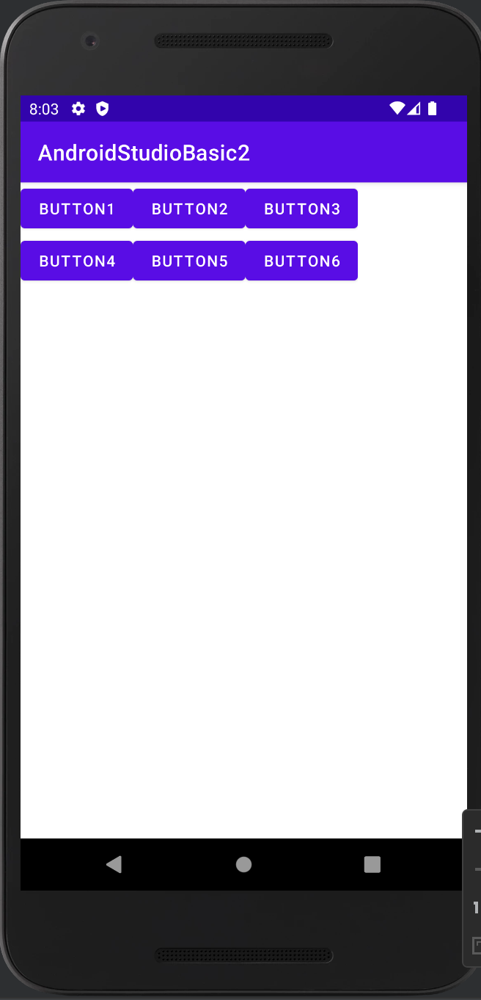


### padding과 layout_margin

* padding: 뷰(버튼, 이미지 등) 안에 표시되는 텍스트나 이미지가 갖는 여백을 의미한다. padding 속성값이 커질수록 여백이 증가하여 버튼이 커지게 된다.

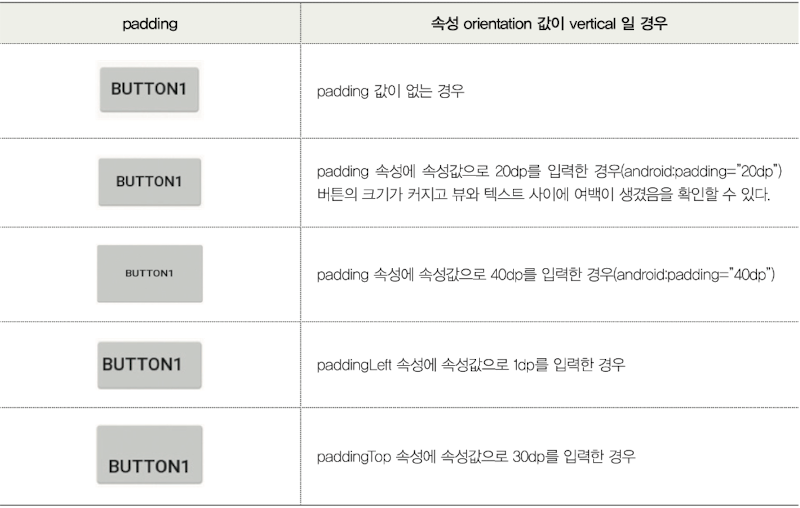


* layout_margin: 뷰(=위젯)의 바깥 부분, 즉 상하좌우에 여백을 관리하는 속성이다.

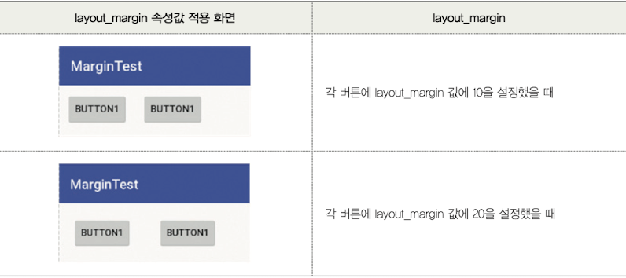


* layout_marginTop: 위쪽을 기준으로 여백을 준다.

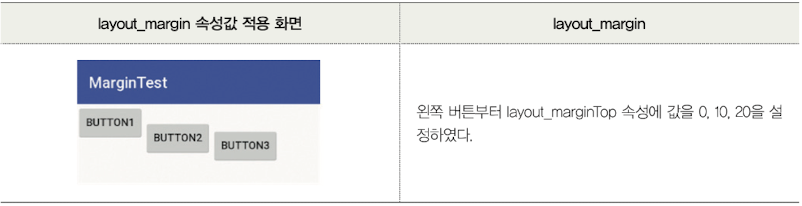


* layout_marginLeft: 왼쪽에 있는 뷰를 기준으로 여백을 준다.

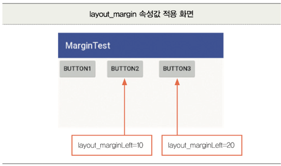


* layout_marginRight: 왼쪽에 있는 뷰를 기준으로 여백을 준다.

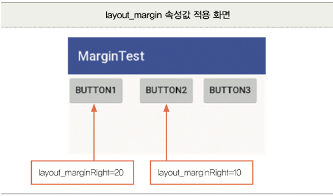


### layout_width와 layout_height

뷰의 크기를 설정하는 속성이다. 100dp, 200dp처럼 크기를 속성값으로 줄 수도 있다.

| 속성값 | 역할 |
| --- | --- |
| fill_parant<br>(=match_parent) | 크기를 꽉 채운다 |
| wrap_content | 뷰 내용물의 크기에 맞춘다 |


---


## 2. RelativeLayout 기본

상대적 레이아웃(RelativeLayout)은 뷰(=위젯) 간의 관계를 정의하여 뷰의 위치를 배치한다. 이미 존재하는 뷰를 대상으로 새로운 뷰를 정하기 때문에, **이미 존재하는 뷰의 id 값이 필요**하다.

아래는 RelativeLayout에서 사용하는 속성이다.

| 속성 | 설명 |
| --- | --- |
| layout_above | 기준 뷰의 위에 배치한다 |
| layout_below | 기준 뷰의 아래에 배치한다 |
| layout_toLeftOf | 기준 뷰의 왼쪽에 배치한다 |
| layout_toRightOf | 기준 뷰의 오른쪽에 배치한다 |
| layout_alignTop | 기준 뷰의 상단 가장자리에 맞춰 배치한다 |
| layout_alignBottom | 기준 뷰의 하단 가장자리에 맞춰 배치한다 |
| layout_alignLeft | 기준 뷰의 왼쪽 가장자리에 맞춰 배치한다 |
| layout_alignRight | 기준 뷰의 오른쪽 가장자리에 맞춰 배치한다 |

아래는 이 속성을 이용한 RelativeLayout 예제다.

```xml
<?xml version="1.0" encoding="utf-8"?>
<RelativeLayout
    xmlns:android="http://schemas.android.com/apk/res/android"
    xmlns:app="http://schemas.android.com/apk/res-auto"
    xmlns:tools="http://schemas.android.com/tools"
    android:layout_width="match_parent"
    android:layout_height="match_parent"
    >

    <Button
        android:id="@+id/button1"
        android:layout_width="wrap_content"
        android:layout_height="wrap_content"
        android:text="VIEW SIZE1"
        />

    <Button
        android:id="@+id/button2"
        android:layout_width="wrap_content"
        android:layout_height="wrap_content"
        android:layout_below="@id/button1"
        android:text="VIEW SIZE2"
        />
    <!-- button2를 button1의 아래에 배치한다. -->

    <Button
        android:id="@+id/button3"
        android:layout_width="wrap_content"
        android:layout_height="wrap_content"
        android:layout_toRightOf="@id/button2"
        android:text="VIEW SIZE3"
        />
    <!-- button3를 button2의 오른쪽에 배치한다. -->

</RelativeLayout>
```

AVD로 실행하면 다음과 같다.

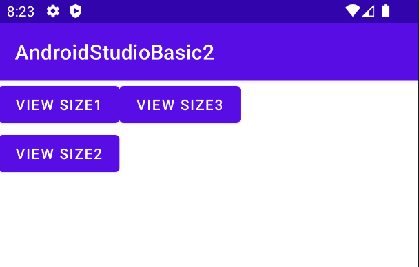

만약 VIEW SIZE3 버튼을 VIEW SIZE2와 수평으로 맞추고 싶다면, android:layout_below="@id/button1"을 추가하면 된다.

```xml
    <Button
        android:id="@+id/button3"
        android:layout_width="wrap_content"
        android:layout_height="wrap_content"
        android:layout_below="@id/button1"
        android:layout_toRightOf="@id/button2"
        android:text="VIEW SIZE3"
        />
```

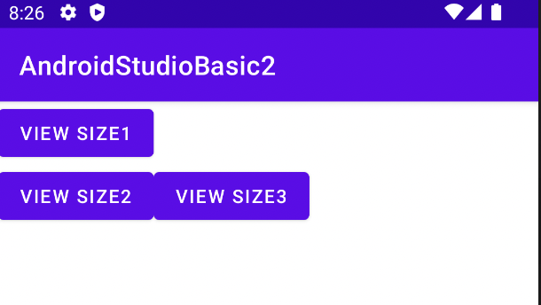


---


## 3. FrameLayout

프레임 레이아웃(FrameLayout)은 **왼쪽 상단을 기준**으로 뷰(=위젯)을 겹쳐 쌓는 레이아웃이다. 

```xml
<?xml version="1.0" encoding="utf-8"?>
<FrameLayout
    xmlns:android="http://schemas.android.com/apk/res/android"
    xmlns:app="http://schemas.android.com/apk/res-auto"
    xmlns:tools="http://schemas.android.com/tools"
    android:layout_width="fill_parent"
    android:layout_height="fill_parent"
    >

    <ImageView
        android:layout_width="wrap_content"
        android:layout_height="wrap_content"
        android:src="@drawable/image1"
        />

    <ImageView
        android:layout_width="wrap_content"
        android:layout_height="wrap_content"
        android:src="@drawable/image2"
        />

    <ImageView
        android:layout_width="wrap_content"
        android:layout_height="wrap_content"
        android:src="@drawable/image3"
        />

</FrameLayout>
```

아래는 AVD 출력이다.

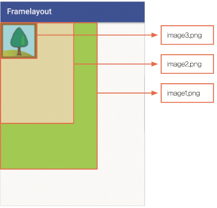


---


## 4. TableLayout

TableLayout은 각 뷰를 열과 행을 갖는 테이블 형식으로 배치할 수 있는 레이아웃이다. \<TableRow\>...\</TableRow\>가 얼마나 있는가가 행의 개수다. 그리고 \<TableRow\> 내부에 뷰가 얼마나 있는가가 열의 개수다.

아래는 계산기 화면을 TableLayout으로 구현한 것이다.

```xml
<?xml version="1.0" encoding="utf-8"?>
<TableLayout
    xmlns:android="http://schemas.android.com/apk/res/android"
    xmlns:app="http://schemas.android.com/apk/res-auto"
    xmlns:tools="http://schemas.android.com/tools"
    android:layout_width="match_parent"
    android:layout_height="match_parent"
    tools:context=".MainActivity"
    >

    <TableRow
        android:layout_width="wrap_content"
        android:layout_height="wrap_content"
        >

        <Button
            android:layout_width="wrap_content"
            android:layout_height="wrap_content"
            android:layout_marginTop="10dp"
            android:text="1"
            />

        <Button
            android:layout_width="wrap_content"
            android:layout_height="wrap_content"
            android:layout_marginTop="10dp"
            android:text="2"
            />

        <Button
            android:layout_width="wrap_content"
            android:layout_height="wrap_content"
            android:layout_marginTop="10dp"
            android:text="3"
            />

        <Button
            android:layout_width="wrap_content"
            android:layout_height="wrap_content"
            android:layout_marginTop="10dp"
            android:text="-"
            />

    </TableRow>

    <TableRow
        android:layout_width="wrap_content"
        android:layout_height="wrap_content"
        >

        <Button
            android:layout_width="wrap_content"
            android:layout_height="wrap_content"
            android:layout_marginTop="10dp"
            android:text="4"
            />

        <Button
            android:layout_width="wrap_content"
            android:layout_height="wrap_content"
            android:layout_marginTop="10dp"
            android:text="5"
            />

        <Button
            android:layout_width="wrap_content"
            android:layout_height="wrap_content"
            android:layout_marginTop="10dp"
            android:text="6"
            />

        <Button
            android:layout_width="wrap_content"
            android:layout_height="wrap_content"
            android:layout_marginTop="10dp"
            android:text="+"
            />

    </TableRow>

    <TableRow
        android:layout_width="wrap_content"
        android:layout_height="wrap_content"
        >

        <Button
            android:layout_width="wrap_content"
            android:layout_height="wrap_content"
            android:layout_marginTop="10dp"
            android:text="7"
            />

        <Button
            android:layout_width="wrap_content"
            android:layout_height="wrap_content"
            android:layout_marginTop="10dp"
            android:text="8"
            />

        <Button
            android:layout_width="wrap_content"
            android:layout_height="wrap_content"
            android:layout_marginTop="10dp"
            android:text="9"
            />

        <Button
            android:layout_width="wrap_content"
            android:layout_height="wrap_content"
            android:layout_marginTop="10dp"
            android:text="0"
            />

    </TableRow>
    
</TableLayout>
```

AVD에서 보면 다음과 같다.

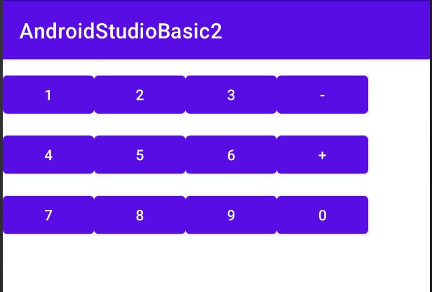


---


## 5 ConstraintLayout

ConstraintLayout은 2016년 발표된 RelativeLayout과 비슷한 레이아웃으로, 드래그만으로 누구나 쉽게 레이아웃을 구성할 수 있다. Infer Constraints 기능을 이용해 레이아웃에 배치된 뷰를 서로 쉽게 관계 짓는다.

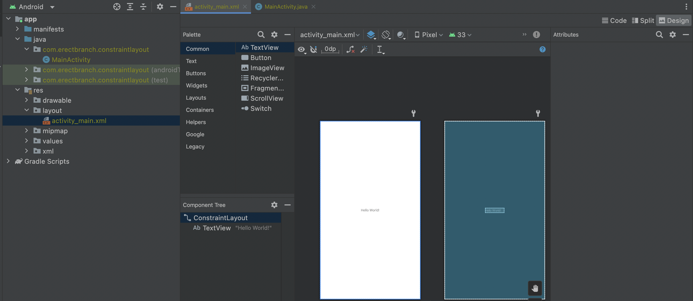

우측 상단의 Design 버튼을 눌러 ConstraintLayout으로 레이아웃을 구성할 수 있다.

* Handle: 3가지 핸들을 이용하여 뷰(=위젯)의 크기를 조절하고 정렬한다.


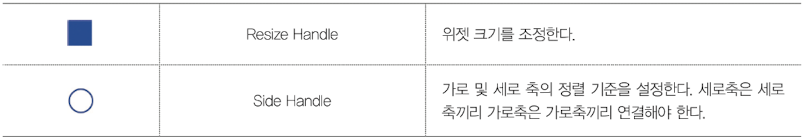

* Side Handle: 뷰 간의 관계를 지정한다.

아래는 ConstraintLayout을 이용해 화면을 구성하는 과정이다.

1. 팔레트에서 위젯을 드래그해서 화면을 구성한다.

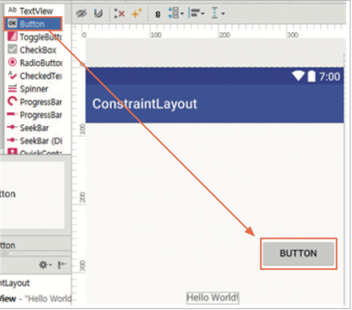

2. 드래그해서 배치한 Button의 왼쪽 Side Handle을 클릭한다.

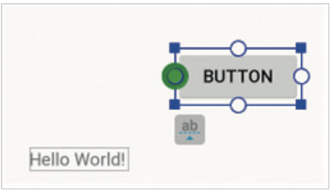

3. 드래그하여 "Hello World" TextView 오른편에 연결한다.(관계를 해제하려면 왼쪽의 x 버튼을 누르면 된다.)

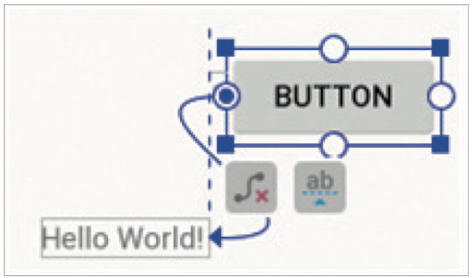

4. Properties에서 이 둘 간의 여백을 조절할 수 있다. 예시는 32로 설정했다.

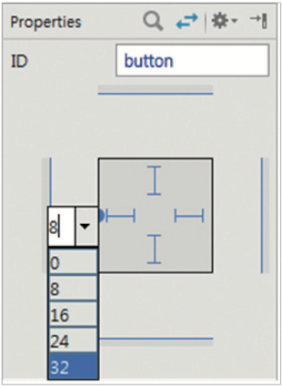

5. 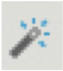 Infer Constraint을 클릭하여 현재 상태를 기반으로 레이아웃에 배치된 뷰 간의 관계를 지정한다.

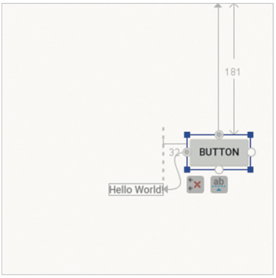

6. activity_main.xml 파일이 다음과 같이 만들어진다.

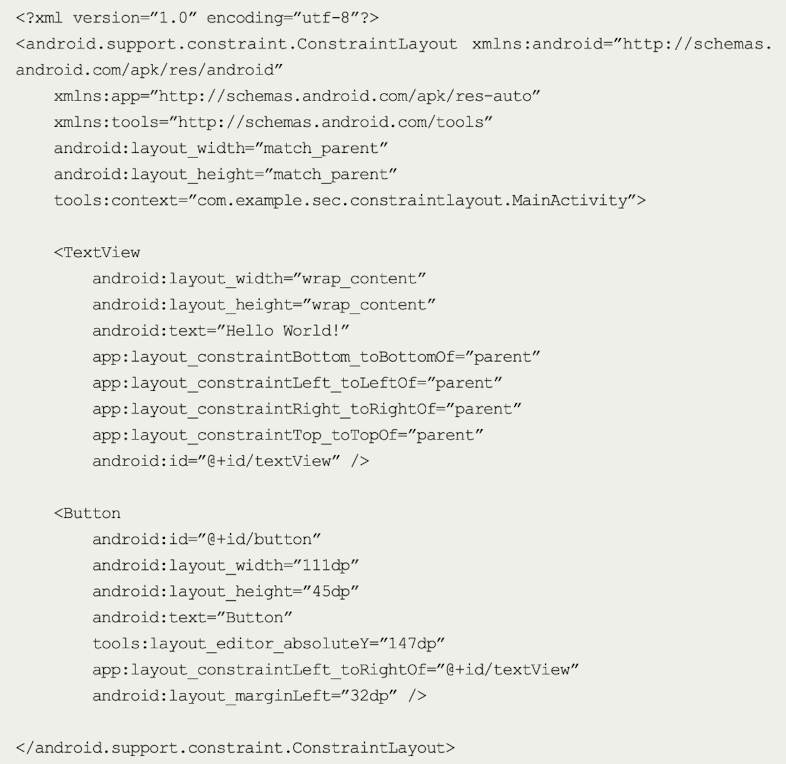


---

