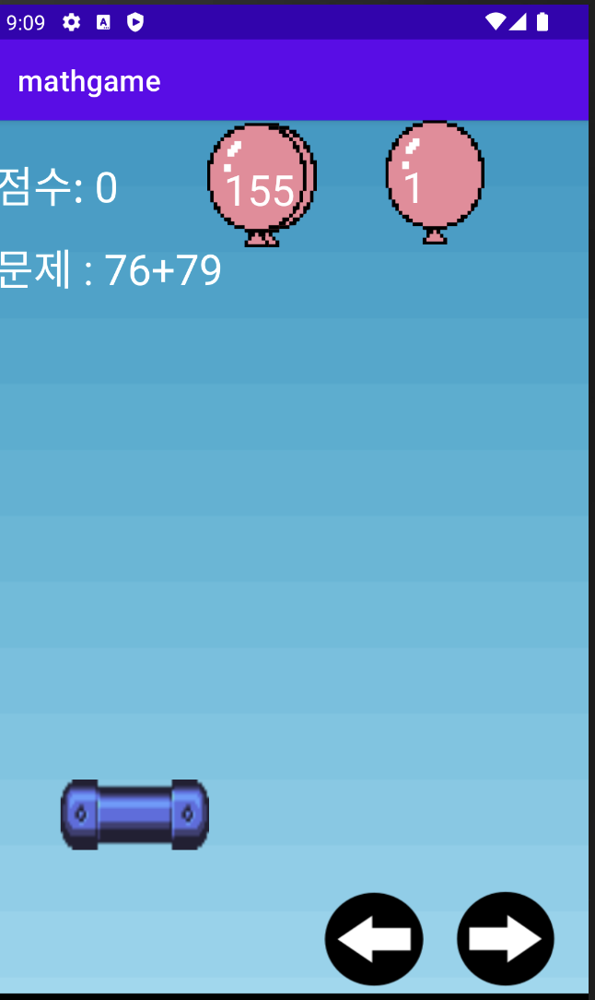

# 바구니 수학게임 만들기 이어서


---


1. 정답 풍선 클래스 만들기

```Java 
// AnswerBalloon.java 

public class AnswerBalloon {

    int balloon_x, balloon_y;
    int balloonSpeed;

    AnswerBalloon(int x, int y, int speed) {
        this.balloon_x = x;
        this.balloon_y = y;
        this.balloonSpeed = speed;
    }

    public void move() {
        balloon_y += balloonSpeed;
    }

}
```


2. 오답 풍선 클래스 만들기

```Java
public class Balloon {

    int balloon_x, balloon_y;
    int balloonSpeed;

    Balloon(int x, int y, int speed) {
        this.balloon_x = x;
        this.balloon_y = y;
        this.balloonSpeed = speed;
    }

    public void move() {
        balloon_y += balloonSpeed;
    }

}
```

3. 바구니로 오답/정답 풍선을 받았을 때 처리

```Java
public void checkCollision() {

            // 바스켓에 오답 풍선이 닿으면 적용
    Iterator<Balloon> iterator = balloon.iterator();

    while(iterator.hasNext()) {

        if (collision_x(iterator.next()) && collision_y(iterator.next())) {
            iterator.remove();    // 풍선을 제거
            score -= 10;
        }

    }

    // 바스켓에 정답 풍선이 닿으면 적용
    if (collision_x(answerBalloon) && collision_y(answerBalloon) ) {
        score += 30;
        makeQuestion();     // 새로운 정답 및 오답 리스트 생성

        // 정답 풍선을 다시 화면 맨 위로
        Random random = new Random();
        answerBalloon.balloon_x = random.nextInt(Width - balloonWidth );
        answerBalloon.balloon_y = 0;

    }


}    // end of checkCollision

public boolean collision_x (Balloon balloon) {
    // 바스켓의 시작 x 좌표 < 풍선의 중앙 x 좌표 < 바스켓의 끝 x 좌표
    return ( (bar_x < (balloon.balloon_x + balloonWidth / 2)) && ((balloon.balloon_x + balloonWidth /2) < (bar_x + barWidth)) );
}

public boolean collision_y (Balloon balloon) {
    // 바스켓의 시작 y 좌표 < 풍선의 중앙 y 좌표 < 바스켓의 끝 y 좌표
    return ( (bar_y < (balloon.balloon_y + balloonHeight / 2)) && ((balloon.balloon_y + balloonHeight /2) < (bar_y + barHeight)) );
}

public boolean collision_x (AnswerBalloon balloon) {
    // 바스켓의 시작 x 좌표 < 풍선의 중앙 x 좌표 < 바스켓의 끝 x 좌표
    return ( (bar_x < (balloon.balloon_x + balloonWidth / 2)) && ((balloon.balloon_x + balloonWidth /2) < (bar_x + barWidth)) );
}

public boolean collision_y (AnswerBalloon balloon) {
    // 바스켓의 시작 y 좌표 < 풍선의 중앙 y 좌표 < 바스켓의 끝 y 좌표
    return ( (bar_y < (balloon.balloon_y + balloonHeight / 2)) && ((balloon.balloon_y + balloonHeight /2) < (bar_y + barHeight)) );
}
```


4. 오답 풍선 만들기

ArrayList를 이용해 데이터를 추가하고 삭제할 것이다. 

```Java
ArrayList<Balloon> balloon;
balloon = new ArrayList<Balloon>();


@Override
synchronized public void onDraw(Canvas canvas) {

    // 오답 풍선이 4개보다 작으면 오답 풍선을 추가 생성
    if (balloon.size() < 4) {
        Random random = new Random();
        int ran2 = random.nextInt(Width - balloonWidth);

        balloon.add(new Balloon(ran2, 0, 5));    // ArrayList에 새 풍선 추가
    }
```


5. 오답 풍선 및 정답 풍선 스크린에 나타내기

``` Java
// 오답 풍선 그리기
    for (Balloon tmp : balloon) {
        // ArrayList에 있는 풍선들을 그리기
        canvas.drawBitmap(balloonimg, tmp.balloon_x, tmp.balloon_y, paint1);
    }

// 오답 풍선에 글씨 생성
    for (int i = balloon.size() - 1; i >= 0; i--) {
        // (잘못된 문제[i], 풍선의 x좌표+ 풍선 가로/6, 풍선의 y좌표 + 풍선 세로*2/3, paint)
        canvas.drawText(Integer.toString(wrongNumber[i]), balloon.get(i).balloon_x + balloonWidth/6,
                balloon.get(i).balloon_y + balloonHeight*2/3, paint1);
    }


// 정답 풍선 생성
    canvas.drawBitmap(balloonimg, answerBalloon.balloon_x, answerBalloon.balloon_y, paint1);

// 정답 풍선에 글씨 생성
    canvas.drawText(Integer.toString(answer), answerBalloon.balloon_x + balloonWidth/6,
                answerBalloon.balloon_y + balloonHeight*2/3, paint1);

```


6. 풍선 움직이기

```Java
public void moveBalloon() {

    // 오답 풍선 움직이기
    for (Balloon balloon : balloon) {
        balloon.move();

        // 만약 오답 풍선이 화면 끝에 도달하면 맨 위에서 다시 내려오기
    if (balloon.balloon_y > Height) {
            balloon.balloon_y = 0;
        }

    }

            // 정답 풍선 움직이기
            answerBalloon.move();

}
```


7. 문제 만들기

```Java
public void makeQuestion() {

    // 정답 풍선에 들어갈 난수 생성
    Random random = new Random();
    int ran1 = random.nextInt(99) + 1;   // 1부터 100까지의 난수 생성
    int ran2 = random.nextInt(99) + 1;

    // 정답 풍선에 들어갈 숫자
    number1 = ran1;
    number2 = ran2;

    answer = number1 + number2;     // 정답은 둘의 합

    // 오답 풍선에 들어갈 숫자
    for (int i = 0; i < wrongNumber.length; i++) {

        int ran3 = random.nextInt(197) + 1;    // 1부터 정답 아래 수까지

        while (ran3 == answer) {                      // 만약 랜덤 변수가 정답과 같은 수라면 실행
            ran3 = random.nextInt(197) + 1;
        }

        wrongNumber[i] = ran3;

    }

}
```


8. onCreate 메서드 설정

* 만든 MyView 클래스를 화면으로 설정하기

* 사용자 기기 해상도 얻기(display.getSize( size ))

* 코드에서 사용할 이미지를 decodeResource 메서드로 가져오고, createScaledBitmap 메서드로 크기를 조절하기


---


아래는 MainActivity 전문이다. 

```Java
public class MainActivity extends AppCompatActivity {

    // 비트맵
    Bitmap bar;
    Bitmap leftKey, rightKey;
    Bitmap screen;
    Bitmap balloonimg;

    // 필드 변수
    int Width, Height;    // 해상도를 받을 변수

    int bar_x, bar_y;     // 바스켓이 있을 좌표
    int barWidth;
    int barHeight;

    int leftKey_x, leftKey_y;
    int rightKey_x, rightKey_y;
    int buttonWidth;      // 버튼 크기

    int score;
    int count;

    int balloonWidth;
    int balloonHeight;

    // 문제: number1 + number2 = ?
    // 문제 초기화
    Random random = new Random();
    int number1 = random.nextInt(99) + 1;
    int number2 = random.nextInt(99) + 1;

    int answer = number1 + number2;              // 정답(number1 + number2)

    // 오답
    int[] wrongNumber = new int[] {1,1,1,1,1};   // 초기값 1로 설정

    // 객체 선언
    AnswerBalloon answerBalloon;

    // 풍선이 담긴 ArrayList
    ArrayList<Balloon> balloon;


    @Override
    protected void onCreate(Bundle savedInstanceState) {
        super.onCreate(savedInstanceState);
        setContentView(new MyView(this));     // this: 현재 Activity

        // 해상도 값 받아오기
        Display display = getWindowManager().getDefaultDisplay();
        Point size = new Point();
        display.getSize( size );
        Width = size.x;
        Height = size.y;

        // 바 크기
        barWidth = Width / 4;
        barHeight = Height / 14;

        // 버튼 크기
        buttonWidth = Width / 6;

        // 풍선이 담긴 ArrayList 객체 생성
        balloon = new ArrayList<Balloon>();

        // 비트맵 생성
        bar = BitmapFactory.decodeResource(getResources(), R.drawable.bar);
        leftKey = BitmapFactory.decodeResource(getResources(), R.drawable.leftkey);
        rightKey = BitmapFactory.decodeResource(getResources(), R.drawable.rightkey);
        screen = BitmapFactory.decodeResource(getResources(), R.drawable.screenmath);
        balloonimg = BitmapFactory.decodeResource(getResources(), R.drawable.balloon);

        // 비트맵 스케일 조정
        bar = Bitmap.createScaledBitmap(bar, barWidth, barHeight, true);
        leftKey = Bitmap.createScaledBitmap(leftKey, buttonWidth, buttonWidth, true);
        rightKey = Bitmap.createScaledBitmap(rightKey, buttonWidth, buttonWidth, true);
        balloonimg = Bitmap.createScaledBitmap(balloonimg, buttonWidth, buttonWidth*5/4, true);
        screen = Bitmap.createScaledBitmap(screen, Width, Height, true);

        // 풍선 크기
        balloonWidth = balloonimg.getWidth();
        balloonHeight = balloonimg.getHeight();

        // 바스켓 초기 좌표
        bar_x = Width / 9;
        bar_y = Height * 2/3;     // 바스켓 초기 좌표

        // 버튼 위치 좌표
        leftKey_x = Width * 5/9;
        leftKey_y = Height * 7/9;

        rightKey_x = Width * 7/9;
        rightKey_y = Height * 7/9;


        // 풍선 생성을 위한 랜덤 변수 생성
        Random random = new Random();
        int ran1 = random.nextInt(Width - balloonWidth );

        // 랜덤한 위치에 풍선 생성(랜덤 x 좌표, 꼭대기 y 좌표, 스피드 5)
        answerBalloon = new AnswerBalloon(ran1 + balloonWidth/2, 0, 5);

    }     // end of OnCreate


    class MyView extends View {

        MyView(Context context) {
            super(context);    // 상위 클래스의 생성자 호출
            setBackgroundColor(Color.BLUE);

            // View 내부 코드를 반복 실행할 핸들러
            gHandler.sendEmptyMessageDelayed(0, 1000);    // 1000(1초)마다 반복 실행
        }

        @Override
        synchronized public void onDraw(Canvas canvas) {

            // 오답 풍선이 5개보다 적게 있으면 오답 풍선을 추가 생성
            if (balloon.size() < 4) {
                Random random = new Random();
                int ran2 = random.nextInt(Width - balloonWidth);

                balloon.add(new Balloon(ran2, 0, 5));    // ArrayList에 새 풍선 추가
            }

            Paint paint1 = new Paint();
            paint1.setColor(Color.WHITE);
            paint1.setTextSize(Width / 14);

            // 캔버스에 이미지 소스 그리기
            canvas.drawBitmap(screen, 0, 0 , paint1);
            canvas.drawBitmap(bar, bar_x, bar_y, paint1);
            canvas.drawBitmap(leftKey, leftKey_x, leftKey_y, paint1);
            canvas.drawBitmap(rightKey, rightKey_x, rightKey_y, paint1);

            // 상단 글씨 표시(점수와 문제)
            canvas.drawText("점수: " + Integer.toString(score), 0, Height / 12, paint1);
            canvas.drawText("문제 : " + Integer.toString(number1) + "+" +
                    Integer.toString(number2), 0, Height / 6, paint1);    // 문제 표시(number1+number2는?)

            // 오답 풍선 생성
            for (Balloon tmp : balloon) {
                // ArrayList에 있는 풍선들을 그리기
                canvas.drawBitmap(balloonimg, tmp.balloon_x, tmp.balloon_y, paint1);
            }

            // 오답 풍선에 글씨 생성
            for (int i = balloon.size() - 1; i >= 0; i--) {
                // (잘못된 문제[i], 풍선의 x좌표+ 풍선 가로/6, 풍선의 y좌표 + 풍선 세로*2/3, paint)
                canvas.drawText(Integer.toString(wrongNumber[i]), balloon.get(i).balloon_x + balloonWidth/6,
                        balloon.get(i).balloon_y + balloonHeight*2/3, paint1);
            }


            // 정답 풍선 생성
            canvas.drawBitmap(balloonimg, answerBalloon.balloon_x, answerBalloon.balloon_y, paint1);

            // 정답 풍선에 글씨 생성
            canvas.drawText(Integer.toString(answer), answerBalloon.balloon_x + balloonWidth/6,
                    answerBalloon.balloon_y + balloonHeight*2/3, paint1);


            // 정답 풍선이 화면 끝에 도달하면
            if (answerBalloon.balloon_y > Height) {
                answerBalloon.balloon_y = 0;     // 다시 꼭대기에서 내려오게 함
            }

            // 반복할 메서드 실행
            moveBalloon();       // 풍선을 움직인다.
            checkCollision();    // 풍선이 닿는지 체크한다.
            count++;             // 반복 count

        }    // end of onDraw


        // 충돌이 일어나면 새 문제를 만든다
        public void makeQuestion() {

            // 정답 풍선에 들어갈 난수 생성
            Random random = new Random();
            int ran1 = random.nextInt(99) + 1;   // 1부터 100까지의 난수 생성
            int ran2 = random.nextInt(99) + 1;

            // 정답 풍선에 들어갈 숫자
            number1 = ran1;
            number2 = ran2;

            answer = number1 + number2;     // 정답은 둘의 합

            // 오답 풍선에 들어갈 숫자
            for (int i = 0; i < wrongNumber.length; i++) {

                int ran3 = random.nextInt(197) + 1;    // 1부터 정답 아래 수까지

                while (ran3 == answer) {                      // 만약 랜덤 변수가 정답과 같은 수라면 실행
                    ran3 = random.nextInt(197) + 1;
                }

                wrongNumber[i] = ran3;

            }

        }    // end of makeQuestion()


        public void moveBalloon() {

            // 오답 풍선 움직이기
            for (Balloon balloon : balloon) {
                balloon.move();

                // 만약 오답 풍선이 화면 끝에 도달하면 맨 위에서 다시 내려오기
                if (balloon.balloon_y > Height) {
                    balloon.balloon_y = 0;
                }
            }

            // 정답 풍선 움직이기
            answerBalloon.move();

        }    // end of moveBalloon()


        public void checkCollision() {

            // 바스켓에 오답 풍선이 닿으면 적용
            Iterator<Balloon> iterator = balloon.iterator();

            while(iterator.hasNext()) {

                if (collision_x(iterator.next()) && collision_y(iterator.next())) {
                    iterator.remove();    // 풍선을 제거
                    score -= 10;
                }

            }

            // 바스켓에 정답 풍선이 닿으면 적용
            if (collision_x(answerBalloon) && collision_y(answerBalloon) ) {
                score += 30;
                makeQuestion();     // 새로운 정답 및 오답 리스트 생성

                // 정답 풍선을 다시 화면 맨 위로
                Random random = new Random();
                answerBalloon.balloon_x = random.nextInt(Width - balloonWidth );
                answerBalloon.balloon_y = 0;

            }


        }    // end of checkCollision

        public boolean collision_x (Balloon balloon) {
            // 바스켓의 시작 x 좌표 < 풍선의 중앙 x 좌표 < 바스켓의 끝 x 좌표
            return ( (bar_x < (balloon.balloon_x + balloonWidth / 2)) && ((balloon.balloon_x + balloonWidth /2) < (bar_x + barWidth)) );
        }

        public boolean collision_y (Balloon balloon) {
            // 바스켓의 시작 y 좌표 < 풍선의 중앙 y 좌표 < 바스켓의 끝 y 좌표
            return ( (bar_y < (balloon.balloon_y + balloonHeight / 2)) && ((balloon.balloon_y + balloonHeight /2) < (bar_y + barHeight)) );
        }

        public boolean collision_x (AnswerBalloon balloon) {
            // 바스켓의 시작 x 좌표 < 풍선의 중앙 x 좌표 < 바스켓의 끝 x 좌표
            return ( (bar_x < (balloon.balloon_x + balloonWidth / 2)) && ((balloon.balloon_x + balloonWidth /2) < (bar_x + barWidth)) );
        }

        public boolean collision_y (AnswerBalloon balloon) {
            // 바스켓의 시작 y 좌표 < 풍선의 중앙 y 좌표 < 바스켓의 끝 y 좌표
            return ( (bar_y < (balloon.balloon_y + balloonHeight / 2)) && ((balloon.balloon_y + balloonHeight /2) < (bar_y + barHeight)) );
        }

        // 핸들러 정의
        Handler gHandler = new Handler() {

            public void handleMessage(Message msg) {
                invalidate();
                gHandler.sendEmptyMessageDelayed(0, 1000);
            }

        };


        // 사용자가 터치 시 반응 설정
        @Override
        public boolean onTouchEvent (MotionEvent event) {

            int touch_x = 0;
            int touch_y = 0;

            // 사용자가 터치한 부분의 좌표를 가져온다.
            if (event.getAction() == MotionEvent.ACTION_DOWN || event.getAction() == MotionEvent.ACTION_MOVE) {
                touch_x = (int) event.getX();
                touch_y = (int) event.getY();
            }

            // 왼쪽 버튼을 클릭하면
            if ( (touch_x > leftKey_x) && (touch_x < leftKey_x + buttonWidth) &&
                    (touch_y > leftKey_y) && (touch_y < leftKey_y + buttonWidth) ) {
                bar_x -= 20;     // 바스켓의 x좌표를 왼쪽으로 옮긴다.
            }

            if ( (touch_x > rightKey_x) && (touch_x < rightKey_x + buttonWidth) &&
                    (touch_y > rightKey_y) && (touch_y < rightKey_y + buttonWidth) ) {
                bar_x += 20;     // 바스켓의 x좌표를 오른쪽으로 옮긴다.
            }

            return true;

        }    // end of onTouchEvent


    }     // end of MyView


}     // end of MainActivity
```

다음은 AVD에서 실행한 화면이다.

