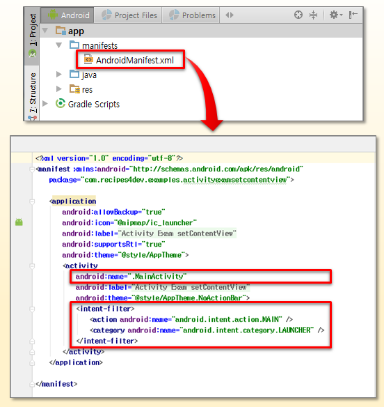

## 1.1 application component(컴포넌트)

우선 application component가 무엇으로 구성되어있는지 알아야 한다.

| 구분 | 설명 |
| --- | --- |
| Activity(액티비티) | android.app.Activity<br/>UI 구성을 위해 가장 기본이 되는 요소이다.<br/>대표적으로 "MainActivity"가 application 실행 시 제일 먼저 보여지는 Activity이다. |
| Service(서비스) | android.app.Service<br/> |
| Broadcast Receiver(브로드캐스트 리시버) | android.content.BroadcastReceiver<br/>안드로이드 폰에서 보내주는 이벤트를 받아서 처리 |
| Content Provider | android.content.ContentProvider<br/>주소록, 미디어 파일 등 저장된 파일에 접근할 수 있게 해주는 객체 |

- Activity

**UI 구성에 가장 기본이 되는 요소**이다.



> [Manifest](https://kmight0518.tistory.com/27)

> application의 각 구성 요소와 각 구성 요소에 영향을 줄 수 있는 하위 요소를 포함하는 AndroidManifest에서, activity 부문이 있던 것을 기억해 보자.

Activity는 android.content.Context에서 상속되었으므로, android.content.Context의 기능을 사용할 수 있다.

Activity가 화면에 표시할 UI는 xml 파일(R.layout.XXX)이거나, android.view.View(TextView, Button)이어야 한다.

setContentView() 함수를 통해 화면에 출력할 Layout 리소스 xml id나, View 클래스를 종종 지정했었다. 아래가 그 예시다.

```Java
    @Override
    protected void onCreate(Bundle savedInstanceState) {
        super.onCreate(savedInstanceState);

        setContentView(R.layout.activity_main);

        // 코드 계속 ...
    }
```

TextView 클래스도 비슷하게 할 수 있으나, 일반적으로 사용하지 않는다.

```Java
    @Override
    protected void onCreate(Bundle savedInstanceState) {
        super.onCreate(savedInstanceState);

        TextView textView = new TextView(this) ;
        textView.setTextSize(TypedValue.COMPLEX_UNIT_SP, 24) ;
        textView.setText("TEXT1") ;
        setContentView(textView) ;
    }
```

결과는 다음과 같다.


---

## 1.2 Intent

현재 Activity에서 다른 Activity를 실행하려면, startActivity() 함수를 호출해야 한다. 하지만 다른 Activity를 실행하기 위해서는 <U>어떠한 **Intent**(의도)를 가지고</U> Activity를 실행하려는지 기술해야 한다.

```Java
    Intent intent = new Intent(this, A.class) ;
    startActivity(intent) ;
```

> 만약 application 내에 A라는 Activity가 하나 있고, 이를 **explicit**(명시적으로) 실행하고자 한다면, 이를 "A라는 Activity를 실행"한다는 Intent(의도)를 가진다고 볼 수 있다.

하지만 반드시 자신이 만든 Activity만 실행해야 하는 것은 아니다. 예를 들어 어느 application에서 전화 걸기 기능을 추가하고 싶다면, Activity를 새로 만들 필요 없이 안드로이드가 제공하는 전화걸기 Activity를 사용하면 된다.

하지만 이때 '전화 걸기'를 위한 Activity는 직접 설계한 것이 아니므로 정확한 이름을 알 수 없다. 따라서 explicit한 실행이 불가능하다. 이런 경우는 **implicit**(암묵적인)한 intent로 '전화 걸기' Activity를 실행할 수 있다.

```Java
    Intent intent = new Intent(Intent.ACTION_DIAL, Uri.parse("tel:010-999-9999"));
    startActivity(intent) ;
```


> "전화 걸기를 action(수행)하는 Activity를 실행"


Activity가 실행된 후 작업이 완료되면, 해당 Activity를 종료하기 위해 finish() 함수를 호출해야 한다. 아니면 finishActivity() 함수를 호출하여 이전에 실행한 특정 Activity를 종료할 수도 있다.

> 물론 이런 함수의 직접적인 사용은 권장하지 않고 있다.

보통 새로운 Activity를 만드는 경우는 다음과 같다.

- 새로 화면에 표시되는 UI 구성이 기존과 완전히 구분된다.

- "뒤로 가기(Back)" 버튼을 누르면 기존 Activity 화면이 다시 표시되어야 한다.

---

# 1.3 Thread, Handler

> [Android Developers: 프로세스 및 스레드 개요](https://developer.android.com/guide/components/processes-and-threads?hl=ko#IPC)

> [thread, handler](https://youngest-programming.tistory.com/13)

> [application component](https://codedragon.tistory.com/8586)

application component를 start하고, 다른 구성 요소가 실행 중이지 않는다면, Android 시스템은 하나의 실행 thread로 application의 Linux process를 시작한다.(이를 **main thread**라고 한다.)

만약 application component가 launch 되었는데, 해당 application의 (다른 component) process가 이미 존재할 경우, 이 component는 같은 process 내에서 시작되고 같은 실행 thread를 사용하게 된다.

하지만 이런 여러 component를 별도의 process에서 실행될 수 있게 만들 수 있다. 어느 process나 추가 thread를 만들어서 이용하면 된다.

> 코드에서 따로 thread를 생성하지 않으면, **main thread**에서만 작업을 실행하게 된다.

> 주의할 점은 xml, 즉 ui에 서로 다른 thread 여러 개가 동시에 접근할 수 없다. 따라서 대체로 main thread만 ui에 접근하게 하고, 다른 thread를 별도의 제어를 처리한다.

> 공식 문서 또한 <U>'UI는 작업자 thread에서 조작해서는 안 됩니다.'</U>라고 명시하고 있다. 또한 <U>'interface 조작 작업은 모두 UI thread에서만 해야 합니다'</U>라고 명시한다.

main thread의 특성상 보통 **UI thread**라고 불릴 때가 많다. 보통 user가 button을 터치하면, 앱 UI thread가 widget에 touch event를 발송하고, widget은 눌린 상태를 설정한 뒤 event queue에 무효화 요청을 게시한다.

만약 application이 user 상호작용에 의해 리소스를 많이 소모하는 일이 발생한다면 처리 성능이 낮아지게 된다. <U>특히 ui thread에서 network access나 database query 등의 작업을 수행하려고 할 때 이런 일이 자주 발생한다.</U> 거의 모든 event가 멈추고 '어플리케이션이 동작하지 않습니다.'라는 메시지를 표시할 때가 많다.

아래는 기본적인 작업자 thread 예시다. processBitMap() 함수를 이용해 png를 bitmap화하는 작업을 수행한다. 이는 시간이 걸리므로 별도의 thread에서 진행한다.

> 이렇게 백그라운드에서 실행되어야 하는 기능을 **service**라는 application component로 정의한다.

```Java
public void onClick(View v) {
    new Thread(new Runnable() {
        public void run() {
            // a potentially time consuming task
            final Bitmap bitmap =
                    processBitMap("image.png");
            imageView.post(new Runnable() {
                public void run() {
                    imageView.setImageBitmap(bitmap);
                }
            });
        }
    }).start();
}
```

> [핸들러 사용하기](https://dongsik93.github.io/til/2020/03/13/til-doit-android(10)/)

- <U>새로운 Runnable 객체를 post() 메서드를 이용해 전달</U>하면, 이 객체에 정의된 run() 메서드 내 코드들은 <U>UI thread에서 실행된다.</U>

> 이렇게 새로 만든 thread에서 UI thread로 접근해야 할 일이 생기는데, 이때 사용하는 것이 바로 **handler**(핸들러)이다. 다시 말해, 새 thread에서 main thread로 메시지를 전달하는 역할을 한다.

- imageView는 이 새로운 thread가 아닌 main thread에서 조작되면서 안전하게 된다.

---

## 1.3.1 AsyncTask

하지만 이런 방식으로 thread를 만들다 보면 코드가 더 복잡해지기 마련이다. Handler를 통해 메세지를 main thread로 전달할 수도 있지만, **AsyncTask** 클래스를 확장하면 더 편리하게 이런 처리가 가능하다.

AsyncTask가 동작하는 순서는 다음과 같다.

1. main thread에서 **execute()** 명령어를 통해 AsyncTask가 실행된다.(클래스명.execute())

> execute(params)는 UI thread에서 직접 호출해야 한다.

2. 백그라운드 작업을 실행하기 전에, 우선 AsyncTask 내 정의해 둔 <U>**onPreExcuted()**</U>가 실행된다.

> 만약 이미지 로딩 작업이라면 로딩 중 이미지 띄워 놓기와 같은 작업. 이 작업은 main thread에서 실행된다.

3. 백그라운드 작업을 수행한다. 1번에서 호출할 때 execute() 메서드와 함께 쓰인 parameter를 전달받는다.

4. **doInBackground()**에서 만약 중간 중간 UI를 업데이트하고 싶다면, **publishProgress()** 메서드를 호출하면 된다.

> publishProgress()가 호출될 때마다 **onProgressUpdate()** 메서드가 자동으로 호출된다.

5. (4번을 했다면) <U>**onProgressUpdate()**</U> 메서드 내 작업이 수행된다.

> 따라서 onProgressUpdate()는 main thread에서 처리된다.

6. (4번이 끝나면) doInBackground() 메서드에서 작업이 끝나면 <U>**onPostExcuted()**</U> 메서드로 result parameter를 return한다. 이 parameter를 사용해 thread 작업이 끝났을 때의 동작을 구현한다. 이 메서드는 main thread에서 실행된다.

> 이때 주의할 점은 수동으로 내부 메서드를 호출하면 안 된다. 또한 오직 한번만 실행할 수 있다.(객체를 새롭게 생성하는 방법으로는 메모리 효율이 나쁘다.)

참고로 이렇게 구현한 Activity가 종료되고, 별도의 지시가 없다면 종료되지 않는다.

아래는 AsyncTask를 이용한 예시다.

```Java
public class MainActivity extends Activity {

    @Override
    protected void onCreate(Bundle savedInstanceState) {
        super.onCreate(savedInstanceState);
        setContentView(R.layout.activity_main);
    }

    // 버튼을 클릭하면 파일 다운로드 경로를 파라미터로 AsyncTask 실행
    public void OnClick(View view) {
        switch (view.getId()) {
            case R.id.button:
                try {
                    // 백그라운드 작업에 url을 전달한다.
                    // execute로 백그라운드 작업을 실행
                    new DownloadFilesTask().execute(new URL("파일 다운로드 경로1"));
                } catch (MalformedURLException e) {
                    e.printStackTrace();
                }
                break;
        }
    }

    private class DownloadFilesTask extends AsyncTask {
        // 백그라운드 작업 실행 전 main thread에서 실행될 작업
        @Override
        protected void onPreExecute() {
            super.onPreExecute();
        }

        // 백그라운드에서 본격적으로 실행할 작업
        @Override
        protected Long doInBackground(URL... urls) {
                // 전달된 URL 사용 작업

            return total;
        }

        // 백그라운드에서 publishProgress() 메서드를 호출하여, UI에 업데이트하려고 할 때 자동으로 호출되는 메서드
        @Override
        protected void onProgressUpdate(Integer... progress) {
            // 파일 다운로드 퍼센티지 표시 작업
        }

        // 백그라운드 작업이 끝나고 main thread에서 실행되는 작업
        // 결과값을 return하고 thread가 끝났을 때의 동작을 구현한다.
        @Override
        protected void onPostExecute(Long result) {
            // doInBackground 에서 받아온 total 값 사용 장소
        }
    }
}

```

---