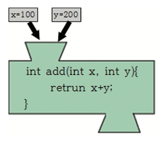

# 자바 문법 기초

자바의 기본 단위는 클래스로 이루어져 있고, 클래스는 객체를 생성하는 데 필요한 설계도이며 생성자, 필드, 메서드로 구성되어 있다.

* 클래스

```Java
public class Robot {
    // 코드
}
```

위 예제는 클래스 이름이 Robot이며 대문자로 시작한다. 메서드와 다르게 소괄호 ()를 쓰지 않는다. 클래스 앞에 쓰인 public은 다른 클래스에서도 사용할 수 있도록 공개되었다는 뜻이다.

* 메서드
```Java
void moveRight() {

}
```

메서드의 이름은 소문자로 시작하며, 메서드 앞에는 메서드가 리턴하는 자료형을 적어야 한다. void는 텅 비었다는 뜻이므로, moveRight 메서드는 반환하는 값이 없다는 뜻이다. 메서드는 메서드 이름 다음에 소괄호(())를 사용해야 하고, <U>클래스 안에서 사용한다.</U>


---


## 한 눈에 보는 클래스 구조

```Java
public class Robot {

    // '멤버 변수'(필드라고도 한다.)
    // 객체의 상태를 나타내며, 아래 메서드에서 사용할 수 있는 변수다.
    int x, y;
    int power;
    int price;
    String name;

    // '생성자'
    // 멤버 변수들을 초기화하는 데 사용한다.
    // 처음 객체 생성시 한 번 실행된다.
    Robot(int x, int y, int price, String name) {
        this.x = x;
        this.y = y;
        this.price = price;
        this.name = name;
    }

    // '멤버 메서드'
    // 객체의 동작을 나타낸다.
    // 메서드를 독립적으로 사용할 수는 없으며, 클래스 안에서만 사용한다.
    void moveRight() {
        x += 5;    // x의 값에 5만큼 더한다.
    }

    void moveLeft() {
        x -= 5;    // x의 값을 5만큼 뺀다.
    }


}
```

class 키워드 다음에 <U>대문자로 시작하는 클래스 이름</U>을 적는다. 메서드와는 달리 <U>클래스 이름 뒤에는 소괄호를 사용하지 않고</U> 중괄호를 바로 사용해서 클래스를 만든다. 클래스는 **멤버 변수(=필드), 생성자, 그리고 멤버 메서드로 구성**된다.


## 메서드

변수는 어떤 값(속성)을 저장하는 것이라면 메서드는 어떤 기능(동작)을 한다고 생각하면 된다. 



add라는 이름을 가진 메서드 앞에 있는 int는 '메서드가 데이터를 반환하고, 그 데이터가 정수형이라는 것'을 의미한다. return을 이용해 int형 값을 반환하고 있다. 만약 반환하는 값이 없는 경우 return이 필요 없으며, 반환 타입 int 대신 반환하는 값이 없다는 void를 쓰면 된다.


### 메서드 구조

```Java
int showMe(int x, int y) {
    return x + y;
}
```


## 변수

변수는 데이터를 저장하는 그릇이다. 변수 타입에 따라 다양한 데이터를 담을 수 있다. 예를 들어 정수를 담을 수 있는 변수 타입에는 byte, short, int, long이 있다.

```Java
int x;    // 변수 명이 x인 변수 선언
```


### 변수의 초기화

```Java
int x = 10;    // 변수 x에 10을 할당한다.
```


### 변수의 사용 예

```Java
// 문자형
char txt = '조'

String myHobby = "soccer";


// 정수형
byte level = 100;

short num = -30000;

int money = 3000000;

long population = 231312421;


// 실수형
float f = 3.14;

double d = 1.234;


// 불리언형

boolean b = true;
```

> class, int, for, if 등은 예약어로, 변수명으로 사용하면 안 된다.


## 클래스 맛보기

```Java
// 이클립스에서는 studyclass 프로젝트 내 Robot 클래스(책에서는 Robot.java 파일 내 저장된 코드)

public class Robot {

    // 멤버 변수
    int x, y;
    int power;
    int price;
    String name;

    // 멤버 메서드
    void moveRight() {
        x += 5;    // x 값을 5만큼 증가시키기, x = x+5
    }

    void moveLeft() {
        x -= 5;   // x 값을 5만큼 감소시키기
    }

    void showMe() {
        System.out.printIn("나의 이름은" + name + "입니다.");
        System.out.printIn(x);
    }

}
```

이제 새로운 클래스를 하나 더 만들고 그 안에서 Robot 객체를 생성할 것이다. 그 전에 객체를 생성하는 방법을 보자.

* 객체를 생성하는 방법

1. 선언 및 생성을 따로 한다.

```Java
Robot robot1;            // 객체 선언

robot1 = new Robot();    // 객체 생성
```

2. 선언 및 생성을 함께 한다.

```Java
Robot robot1 = new Robot();
```

아래는 Robot 객체를 생성하는 예제다. 여기서 main()은 제일 먼저 실행되는 중요한 메서드를 의미한다.

```Java
package studyclass;    // 이클립스에서 생성한 프로젝트 이름


public class RobotTest {

    public static void main(String[] args) {   // 제일 먼저 실행되는 main() 메서드

        // 객체 생성
        Robot robot1 = new Robot();

        Robot robot2 = new Robot();

        robot1.name = "건담";
        robot1.moveRight();
        robot1.showme();

        robot2.name = "마징가";
        robot2.moveleft();
        robot2.showme();

    }

}
```

앞에서 제작한 Robot 클래스는 설게도에 불과하며 아직 사용할 수 있는 로봇이 아니다. 설꼐 로봇을 만들기 위해서는 new 연산자를 사용해서 Robot 클래스의 객체를 생성해야 한다. 생성한 객체의 멤버와 메서드는 참조변수 robot1과 robot2를 통해 접근한다.

* 생성된 객체의 멤버 변수와 멤버 메서드를 사용하기 위한 방법: dot operater(.)를 사용하여 생성된 객체의 변수와 메서드를 호출할 수 있다. 


---


## 생성자(constructor)

이전 예제에서 로봇 2개의 객체를 생성햇다. 객체를 생성한 뒤 robot1.name = "건담", robot2.name = "마징가" 구문을 이용해서 로봇의 이름을 각각 "건담", "마징가"로 지정했다. 하지만 생성자라는 특수한 메서드를 사용하면 객체를 생성할 때 **멤버 변수를 초기화**할 수 있다.

생성자는 다음과 같은 규칙을 따른다.

* 생성자의 이름은 **클래스의 이름과 같아야 한다.**

* 메서드와 달리 **return 값이 없다.** 따라서 생성자 이름 앞에는 int, void와 같은 반환 타입을 적지 않는다.

객체를 생성할 때 생성자에 인수를 넘겨주는 방법으로 생성자를 생성할 수 있다.

```Java
Robot robot1 = new Robot(0, 0, 100, "건담");    // 인수는 (x, y, price, name)

Robot robot2 = new Robot(30, 30, 50, "마징가")
```

다음은 생성자를 사용하지 않았을 뿐인 동일한 코드다.

```Java
// 매개변수 없이 객체를 생성할 경우

Robot robot1 = new Robot();
Robot robot2 = new Robot();

robot1.x = 0;
robot1.y = 0;
robot1.price = 100;
robot1.name = "건담";

robot2.x = 30;
robot2.y = 30;
robot2.price = 50;
robot2.name = "마징가";
```


---


## 생성자 오버로딩

오버로딩이란 <U>동일한 메서드 명</U>을 사용하지만, <U>전달하는 매개변수의 개수가 다른 객체</U>를 생성할 때 사용하는 방법이다. 즉, 이름이 같은 메서드를 여러 개 정의하는 것이며, 매개변수가 다르다.

```Java
Robot(String name) {    // 매개변수로 name을 받는다.
    this.name = name;   // Robot robot4 = new Robot("태권브이"); 
}

Robot(int x, int y) {   // 매개변수로 x,y를 받는다.
    this.x = x;
    this.y = y;         // Robot robot3 = new Robot("200, 200");
}

Robot(int x, int y, int price, String name) {    // 매개변수로 x, y, price, name을 받는다.
    this.x = x;
    this.y = y;
    this.price = price;
    this.name = name;    // Robot robot1 = new Robot("0, 0, 100, "건담");
}
```

이와 같이 Robot 클래스의 객체를 생성하였다. 참조 변수 robot3의 경우 로봇의 좌표인 x = 200, y = 200을 넣었다. 로봇의 가격과 로봇의 이름은 초기화하지 않고, 로봇의 좌표만 초기화가 필요할 경우 이 생성자를 사용하면 된다.(초기화하지 않은 나머지는 null이 된다.)


---


## 변수의 종류

변수의 종류에는 클래스 변수(=static 변수, 전역 변수, 공유 변수), 인스턴스 변수, 지역 변수가 있다. 어느 위치에 쓰이는가로 구분을 할 수 있다. 멤버 변수를 제외한 변수는 지역 변수이며, 지역 변수는 일반적으로 메서드나 for 구문에서 쓰인다.

* 인스턴스 변수: 클래스와 인스턴스(객체)를 생성할 때 만들어진다. 객체를 여러 개 생성했을 때 각각 독립된 저장 공간을 가지기 때문에 값이 다를 수 있다.

* static 변수: 변수 앞에 static을 붙여서 사용한다. 객체를 생성하지 않고도 사용할 수 있으며, 생성된 객체들의 경우 공통된 저장 공간을 가지고 사용할 수 있다. 즉, 여러 객체를 생성했을 때 static 변수는 그 객체들이 공유하며 사용한다. 또한 한 객체에서 이 변수값을 바꾸면 다른 객체도 바뀐 값을 사용하게 된다. static 변수를 사용하는 방법은 **클래스명.변수**다.

* 지역 변수: 메서드, 생성자 안에서 사용되는 변수이며, 그 안에서만 사용가능하고 메서드 실행이 끝나면 값이 자동으로 사라져서 사용할 수 없게 된다.

```Java
public class Robot {

    // 멤버 변수이며 동시에 '인스턴스 변수'다.
    int x;
    int y;
    int price;
    String name;

    // 멤버 변수이며 동시에 'static 변수'다.
    Static int totalNumber;

    void rightMove() {
        int x = 0;    // 지역 변수
    }   

}
```


## static 변수(정적 변수)

static 변수는 모든 객체가 공통적으로 사용할 수 있으며, 클래스 변수(=정적 변수)라고 부른다. 클래스 변수는 객체를 생성하지 않고도 사용할 수 있다.(클래스 이름.변수명)

> static 키워드를 사용한 변수는 클래스가 메모리에 올라갈 때 자동으로 생성이 된다. 즉, 인스턴스(객체) 없이 바로 사용이 가능하다.(편리하고 빠르다.)

> **자주 변하지 않는 일정한 값**이나, **설정 값** 같은 자원에 대한 접근을 매번 메모리에 로드하거나 값을 읽어들이지 않고, 일종의 '전역 변수'와 같은 방식으로 접근할 수 있다.

> 하지만 메서드가 같은 변수를 공유하기 때문에, 다른 객체가 값을 바꾸면 모든 객체에서 바뀐 값을 쓰게 되기 때문에, 남발하지 말아야 한다. 오직 공통으로 값을 유지하고 싶을 때만 사용한다.

```Java
public class Robot {

    // 멤버 변수
    int x, y;
    int power;
    int price;
    String name;
    int id;
    static int number = 0;    // static 변수, 즉 공유해서 사용할 수 있다.

    Robot(int power, int price, String name) {
        this.power = power;
        this.price = price;
        this.name = name;

        number += 1;    // 로봇을 생성할 때마다 static 변수 number가 1씩 증가한다.
        id = number;
    }

}
```

```Java
public class RobotStatic {

    public static void main(String args[]) {
        Robot robot1 = new Robot(600, 100, "건담");
        Robot robot2 = new Robot(1000, 200, "마징가");
        Robot robot3 = new Robot(1000, 200, "태권브이");

        int num = Robot.number;    // static 변수 number
        System.out.printIn("지금까지 생성한 로봇 수 = " + num);    //=> "지금까지 생성한 로봇 수 = 3"
    }

}
```


---


## 상속

기존 클래스가 가진 필드(멤버 변수)와 메서드를 그대로 사용하는 방법이 상속이다. 아래 예제에서는 Robot 클래스를 상속받는 FishRobot과 DroneRobot 클래스를 만들 것이다. 이때 Robot 클래스를 조상 클래스, FishRobot과 DroneRobot을 자손 클래스라고 한다. 자손 클래스는 extends 키워드를 사용해 조상 클래스를 상속받을 수 있다.

또한 자손 클래스는 조상 클래스가 가지지 않은 자신만의 필드와 메서드를 만들어 사용할 수 있다.

```Java
package studyclass;    // 이클립스에서 프로젝트로 설정함

public class Robot {    // 조상 클래스

    int x,y;
    int power;
    int price;
    String name;

    void mySituation() {

        System.out.printIn("지금 위치는" + x + ", " + y + "입니다.");
        System.out.printIn(x);

    }

}


class FishRobot extends Robot {    // 자손 클래스

    int depth;
    
    void swin() {

        System.out.printIn("지금 수심은 " + depth + "m 입니다.");
        
    }

}


class DroneRobot extends Robot {    // 자손 클래스

    int altitude;

    void fly() {

        System.out.printIn("지금 높이는 " + altitude + "m 입니다.");

    }

}
```

위 예제에서 멤버 변수를 초기화할 것이다.

```Java
package studyclass;

public class RobotTest {
    
    public static void main(String[] args) {

        FishRobot fish1 = new FishRobot();
        DroneRobot drone1 = new DroneRobot();

        drone1.mySituation();    //=> "지금 위치는 0, 0입니다."

        drone1.x = 100;
        drone1.y = 200;
        drone1.altitude = 1500;
        drone1.mySituation();    //=> "지금 위치는 100, 200입니다."
        drone1.fly();            //=> "지금 높이는 1500m입니다."

        fish1.x = 100;
        fish1.y = 300;
        fish1.depth = 500;
        fish1.mySituation();     //=> "지금 위치는 100, 300입니다."
        fish1.swim();            //=> "지금 수심은 500m입니다,"

    }

}
```


### 오버라이딩

조상 클래스를 상속받으면 조상 클래스의 멤버 변수와 멤버 메서드를 사용할 수 있었다. 그런데 경우에 따라서는 조상 클래스의 메서드를 재정의(변경)해서 사용할 수 있다. 이를 오버라이딩이라고 한다.

```Java
public class Robot {

    int x, y;
    int power;
    int price;
    String name;

    void mySituation() {

        System.out.printIn("조상클래스: 지금 위치는 " + x + ", " + y + "입니다.");

    }

}


class FishRobot extends Robot {

    int depth;

    void mySituation() {    // 오버라이딩

        System.out.printIn("자손클래스: 지금 위치는 " + x + ", " + y + "입니다.");
        System.out.printIn("지금 수심은 " + depth + "m 입니다.")

    }

}
```


### super()

super()는 조상의 생성자를 호출하는 데 사용하는 키워드다. 자식의 생성자를 호출하게 되면 부모의 생성자를 호출하는데, 따라서 자식 클래스의 객체를 실행하면 부모 클래스의 생성자가 먼저 실행이 되고 자식 클래스의 생성자가 실행되는 셈이다. 부모 클래스 멤버의 초기화가 끝나면 자식 클래스의 생성자가 실행되어 자식 클래스 멤버의 초기화가 진행된다. 


```Java
package studyclass;

public class Robot {

    int x, y;
    int power;
    int price;
    String name;

    Robot(int x, int y) {
        this.x = x;
        this.y = y;
    }

    void mySituation() {

        System.out.printIn("지금 위치는 " + x + ", " + y + "입니다.");
        System.out.printIn(x);

    }

}


class FishRobot extends Robot {

    int depth;
    
    FishRobot(int x, int y) {

        super(x, y);    // super(): 조상의 생성자를 호출한다.

    }

    void swim() {

        System.out.printIn("지금 수심은 " + depth + "m 입니다.");

    }

}


class DroneRobot extends Robot {

    int altitude;

    DroneRobot(int x, int y) {

        super(x, y);

    }

    void fly() {

        System.out.printIn("지금 높이는 " + altitude + "m 입니다.");

    }

}
```

참고로 자식 클래스의 객체가 생성될 때 명시적으로 조상 생성자를 호출하지 않는 경우, 알아서 자동으로 매개 변수가 없는 조상 생성자가 호출된다. 즉, super() 구문이 있는 것처럼 처리한다. 아래 예제가 이를 잘 보여준다.

```Java
package studyclass;

class Robot {

    int x, y;
    int power;
    int price;
    String name;

    Robot() {     // 매개 변수가 없는 생성자

        System.out.printIn("조상 로봇입니다.");
    
    }

}


class FishRobot extends Robot {

    int depth;

    FishRobot() {    // 매개 변수가 없는 생성자

        // 현재 명시적으로 조상 클래스를 호출하지 않았으므로,
        // 객체를 생성할 때 알아서 매개 변수가 없는 조상 생성자가 호출될 것이다.
        // 즉, 여기 super() 구문이 있는 것과 동일하다.
        System.out.printIn("자식 로봇입니다.");

    }

}


public class RobotTest {

    public static void main(String[] args) {

        FishRobot fish1 = new FishRobot();    // 클래스 안에 생성자를 만들지 않아 자동으로 매개변수가 없는 생성자가 만들어진다.    
        //=> "조상 로봇입니다."
        //=> "자식 로봇입니다."

    }

}
```


---


## 추상 클래스

완전하게 구현되지 않은 메서드를 가진 클래스를 추상 클래스라고 한다. 메서드가 완전히 구현되지 않았으므로 객체를 생성할 수 없는 클래스이기도 하다. 추상 클래스를 상속받는 클래스는 반드시 미완성된 메서드를 구현해야 자식 클래스의 객체를 생성해서 활용할 수 있다.

```Java
package studyclass;

abstract class Robot {    // 추상 클래스 앞에는 abstract를 붙인다.

    int x, y;
    int power;
    int price;
    String name;

    abstract void mySituation();    // 추상 메서드는 반드시 마지막에 세미콜론을 붙여야 한다.

}


class FishRobot extends Robot {

    int depth;

    void mySituation() {

        System.out.printIn("위치는 x좌표: " + x + ", y좌표: " + y + "입니다.");
    
    }

}


public class RobotTest {

    public static void main(String[] args) {

        FishRobot fist1 = new FishRobot();

        fish1.x = 100;
        fish1.y = 200;
        fish1.mySituation();    //=> "위치는 x좌표: 100, y좌표: 200입니다."

    }

}
```


---


## 인터페이스

인터페이스란 서로 다른 장치를 연결해주는 규격을 의미한다. 자바에서 인터페이스는 클래스와 클래스를 연결해주는 규격이며, 추상 메서드와 상수로만 구성된다. 

클래스를 만들 때 사용한 키워드 class 대신 interface를 사용하면 된다. 자바에서는 extends 키워드를 통해 하나의 클래스만 상속받을 수 있는데, 이러한 점을 보완하는 방법이 바로 여러 개를 상속(구현)할 수 있는 인터페이스다. 인터페이스의 경우 상속이라는 용어 대신 구현이라는 용어를 사용한다. 


```Java
package studyclass;

interface Robot {    // 인터페이스

    abstract void mySituation();    // 추상 메서드

}

class FishRobot implements Robot {    // extends 대신 implemnets를 사용한다.

    int depth;
    int x, y;

    public void mySituation() {

        System.out.printIn("위치는 x좌표: " + x + ", y좌표: " + y + "입니다.");    // 반드시 추상 메서드를 구현해주어야 한다.

    }

}


public class RobotTest {

    public static void main(String[] args) {

        FishRobot fish1 = new FishRobot();

        fish1.x = 100;
        fish1.y = 200;
        fish1.mySituation();    //=> "위치는 x좌표: 100, y좌표: 200입니다."

    }

}
```


---


## 다형성

> [다형성이란?](https://life-with-coding.tistory.com/485)

조상 클래스의 참조 변수는 조상 클래스가 가진 변수나 메서드를 참조할 수 있지만, 자손 클래스만 가진 변수나 메서드는 참조할 수 없다.


```Java
public class Robot {

    int x, y;
    int power;
    int price;
    String name;

    void mySituation() {

        System.out.printIn("조상 클래스: 위치는 " + x + ", " + y + "입니다.");
    
    }

}


class FishRobot extends Robot {

    int depth;
    
    void swim() {

        System.out.printIn("수심은 " + depth + "입니다.")
    
    }

}


public class RobotTest {

    public static void main(String[] args) {

        FishRobot fish1 = new FishRobot();    // 자손 클래스

        Robot robot1 = new FishRobot();       // 조상 클래스

        robot1.x = 100;
        robot1.y = 300;
        //robot1.depth = 500;    //=> 에러 발생. 자손 클래스의 변수를 참조할 수 없다.
        robot1.mySituation();    //=> 조상 클래스: 위치는 100, 300입니다.
        //robot1.swim();         //=> 에러 발생. 자손 클래스의 메서드를 참조할 수 없다.

    }

}
```

위 예제처럼 참조 변수 robot1은 부모 클래스의 멤버만 참조할 수 있고, 자손 클래스의 멤버는 참조할 수 없다.


### 매개변수의 다형성

매개변수의 다형성을 살펴보기 위해 다음 예제를 보자. 먼저 다형성을 활용하지 않는 예제를 보자.

```Java
public class Robot {

    int x, y;
    int price;

    Robot(int price) {
        this.price = price;
    }

    void mySituation() {
        System.out.printIn("조상 클래스: 위치는 " + x + ", " + y + "입니다.");
    }

}


class FishRobot extends Robot {

    int depth;

    FishRobot(int price) {
        super(price);
    }

    void swim() {
        System.out.printIn("수심은 " + depth + "m 입니다.");
    }

}


class DroneRobot extends Robot {

    int altitude;

    DroneRobot(int price) {
        super(price);
    }

    void fly() {
        System.out.printIn("높이는 " + altitude + "m 입니다.");
    }

}


class TankRobot extends Robot {

    int speed;

    TankRobot(int price) {
        super(price);
    }

    void goForward() {
        System.out.printIn("속도는 " + speed + "m/s 입니다.");
    }

}


class Purchaser {

    int money = 200000;

    void purchase(FishRobot f) {
        money -= f.price;
    }

    void purchase(DroneRobot d) {
        money -= d.price;
    }

    void purchase(TankRobot t) {
        money -= t.price;
    }

}
```

```Java
public class RobotTest {

    public static void main(String[] args) {

        FishRobot fish1 = new FishRobot(20000);
        DroneRobot drone1 = new DroneRobot(50000);
        TankRobot tank1 = new TankRobot(30000);

        Purchaser purchaser1 = new Purchaser();

        purchaser1.purchase(fish1);
        purchaser1.purchase(drone1);
        purchaser1.purchase(tank1);

        System.out.printIn("지금 남은 돈: " + purchaser.money);

    }

}
```


매개변수의 다형성을 활용하지 않았기 때문에, 새로운 로봇이 만들어질 때마다 Purchaser 클래스 안에 purchase 메서드를 추가로 만들어야 했다. 하지만 다형성을 사용하면 이를 간단하게 해결할 수 있다.

```Java
ckass Purchaser {

    int money = 200000;

    purchase(Robot r){    // 부모 클래스

        money = money - r.money;
    
    }

}
```

FishRobot, DroneRobot, TankRobot 클래스는 모두 Robot 클래스를 상속 받았다. 따라서 Robot의 참조 변수는 자손 클래스의 객체를 모두 다룰 수 있다.(물론 Robot의 참조 변수는 Robot이 가진 멤버만 사용할 수 있다.)


---


## 제어문-조건문 if

제어문은 조건문과 반복문이 있다. 조건문에는 크게 if 문과 switch 문이 있다.


* 중괄호를 사용한 if~else 문

```Java
if(x > 3) {
    System.out.printIn("참");
    System.out.printIn("3보다 크다.");
} else {
    System.out.printIn("거짓");
    System.out.printIn("3보다 작다.");
}
```

* if~else if 문

```Java
if(score >= 90)        System.out.print("수");
else if(score >= 80)   System.out.print("우");
else if(score >= 70)   System.out.print("미");
else if(score >= 60)   System.out.print("양");
else                   System.out.print("가");
```

* 중첩 if 문

```Java
if(explainOk == 1) {    // explainOk 값이 1일 때만 수행한다.
    if(answerOk == 1) System.out.printIn("정답");
    else              System.out.printIn("오답");
}
```

* 제어문-조건문 switch

```Java
switch(level) {
    case 1 : System.out.printIn("수준 1"); break;
    case 2 : System.out.printIn("수준 2"); break;
    case 3 : System.out.printIn("수준 3"); break;
    case 4 : System.out.printIn("수준 4"); break;
    case 5 : System.out.printIn("수준 5"); break;
    
    // 어느 케이스에도 해당하지 않으면 default가 실행된다.
    default : System.out.printIn("해당하는 수준이 존재하지 않는다."); break;
}
```

이때 break 문이 없으면 다음 문장이 출력된다.

* 제어문-반복문 for

```Java
int sum = 0;    // 합을 담을 변수

for(int i = 1; i <= 10; i++) {    // 초기값, 조건식, 증감식
    sum = sum + i;
}
```

* 제어문-반복문 while

```Java
int sum = 0;
int i = 1;

while(i <= 10) {
    sum = sum + i;
    i++;
}
```

* while 문과 for 문을 이용한 무한 루프

```Java
while(true) {
    // 루프할 코드
}
```

```Java
for( ; ; ) {
    // 루프할 코드
}
```


### 반복문 제어

* break 문: 가장 가까운 반복문을 벗어나게 해준다.

* continue 문: 반복문(for, while)에서만 사용된다. 반복문을 벗어나는 게 아닌 반복문의 끝으로 이동한다.

```Java
for(int i = 1; i <= 10; i++) {
    if(i % 2 == 0) continue;    // 짝수라면 반복문, 즉 for 문의 마지막으로 이동한다.
                                // 따라서 짝수면 System.out.print 부분이 실행되지 않는다.
    System.out.print(i + " ");  // 한 칸을 띄우기 위해 공백을 넣어주었다.
                                // => 1 3 5 7 9
}
```


---


## 배열

정수형 값 100개를 저장할 수 있는 배열 s를 만들어 보자.

```Java
int[] s = new[100];    // 100개의 정수형 값을 저장할 수 있는 배열 생성
```

* 위 생성된 배열에 값을 넣는 방법: 인덱스를 이용해 넣어줄 수 있다.

```Java
s[0] = 500;
s[1] = 550;
s[2] = 600;
// ...
s[99] = 700;
```

배열을 선언과 동시에 초기화할 수도 있다.

```Java
int[] s = { 100, 200, 300, 400, 500 };
```

아래는 배열을 사용한 예다.

```Java
int[] s = { 100, 200, 300, 400 , 500};

for(int i = 0; i < s.length; i++) {
    System.out.printIn(s[i]);
}
```

향상된 for 문을 사용하면 좀 더 간결하게 처리할 수 있다.

```Java
int[] s = { 100, 200, 300, 400 , 500};

for(int tmp : s) {    // for(타입 변수명 : 배열)
    System.out.printIn(s[tmp]);
}
```


---


## ArrayList

위에서 다룬 배열은 크기를 바꿀 수 없다. 인덱스의 요소 값만 변경할 수 있다. 하지만 **ArrayList 클래스**를 이용하면 배열 중간에 요소를 추가하거나 삭제할 수 있다. ArrayList는 대문자로 시작한다.(클래스이기 때문에) 또한 클래스이므로 객체를 생성해야 한다.

형식은 다음과 같다. 참고로 배열은 대괄호 []를 사용해서 요소에 접근하지만, ArrayList에서는 소괄호 ()를 사용한다.

```
// ArrayList 객체 생성
ArrayList <자료형> list = new ArrayList< >();

// 요소를 추가
list.add("홍길동");    //=> list[0]에 문자열 "홍길동"이 추가된다.

// 요소를 삭제
list.remove(2);      //=> 인덱스 0에 있는 요소가 삭제된다.

// ArrayList가 가진 기타 메서드
size()               // 저장된 요소의 개수를 반환한다.

get(i)                // 인덱스 i에 있는 데이터를 얻는다.
```

아래는 ArrayList를 이용한 예제다.

```Java
public class ArrayList1 {    // public으로 선언한 클래스명은 파일명과 일치해야 한다.

    public static void main(String[] args) {

        ArrayList<String> arraylist1 = ArrayList<String>();
        
        System.out.printIn("초기 사이즈: " + arraylist1.size());      //=>"초기 사이즈: 0"

        arraylist1.add("홍길동");
        arraylist1.add("세종대왕");
        arraylist1.add("이순신");
        arraylist1.add("강감찬");
        arraylist1.add("을지문덕");

        System.out.printIn("추가 뒤 사이즈: " + arraylist1.size());    //=> "추가 뒤 사이즈: 5"
        
        for(String tmp : arraylist1) {    
            System.out.print(tmp + " ");       //=> "홍길동 세종대왕 이순신 강감찬 을지문덕"
        }

        arraylist1.remove(0);
        arraylist1.remove(1);

        System.out.printIn();    // 줄바꿈 효과
        System.out.printIn("삭제 뒤 사이즈: " + arraylist1.size());    //=> "삭제 뒤 사이즈: 3"

        for(String tmp : arraylist1) {    
            System.out.print(tmp + " ");       //=> "이순신 강감찬 을지문덕"
        }

    }

}
```

---


## 프로세스(process)와 쓰레드(thread)

사용자가 어떤 프로그램을 실행시키면 메모리에 올라오게 되고 CPU가 이를 처리한다. 이때 <U>프로그램이 메모리에 올라와 있는 상태를 프로세스</U>라고 한다.(작업 관리자에서 자주 확인하는 그것이다.)

1개의 프로세스는 최소한 1개의 쓰레드(실제 작업을 수행하는 일꾼)를 가진다. 지금까지 다룬 예제는 모두 main이라는 하나의 쓰레드로 구성된 프로그램이었다. 2개 이상의 쓰레드를 사용하는 프로세스는 CPU의 사용률을 높일 수 있다.


### 쓰레드가 필요한 이유

지금까지처럼 main 쓰레드 하나로만 작업을 할 경우를 생각해 보자. main 쓰레드에서 데이터를 송신하는 도중에 사용자가 사진을 보기 위해 버튼을 터치할 경우, 데이터를 다 송신하고 나서야 사진을 볼 수 있다. 이런 문제를 해결하기 위해서는 데이터 전송을 전담으로 하는 별도의 쓰레드를 만들면 된다. 


### 쓰레드 사용하기

아래 예제들 통해 쓰레드를 사용하는 과정을 살펴보자.

1. Thread 클래스를 상속 받는 Thread1 클래스를 만들고 run() 메서드를 재정의한다.

2. main 쓰레드가 있는 MThread 클래스에서 Thread1 클래스 객체(t)를 만들고 start() 메서드를 이용해 Thread1 쓰레드를 실행시킨다.

```Java
package thread;    // 이클립스 프로젝트명


class Thread1 extends Thread {

    public void run() {
        
        for(int i = 0; i < 1000; i++) System.out.print("Thread1" + i + " ");

    }

}


public class MThread {

    public static void main(String[] args) {

        Thread1 t = new Thread1();

        t.start();

        for(int i = 0; i < 1000; i++) System.out.print("mainT" + i + " ");

    }

}
```

실행 결과는 다음과 같다.


결과를 보면 main 쓰레드와 Thread1 쓰레드가 번갈아 가며 실행이 되는 것을 확인할 수 있다. 이렇게 main 쓰레드의 for 문이 다 실행될 때까지 기다렸다가 실행하지 않게 설계할 수 있다.


---


## 무명 클래스

무명 클래스는 말 그대로 이름이 없는 클래스다. 하나의 객체만 생성할 때 사용하며, 주로 부모 클래스를 상속 받거나 인터페이스를 구현할 때 사용한다.(특히 버튼을 처리할 때 자주 사용한다.)

표기 방법은 조금 난해하지만 코드를 매우 간결하게 만들 수 있다.

```
// 무명 클래스 형식
인터페이스 객체명 = new 인터페이스() {
    // 인터페이스 메서드 구현
};
```

이제 무명 클래스를 사용하지 않은 코드와 사용한 코드를 비교해 보자. 우선 사용하지 않은 코드다.

```Java
// 무명 클래스를 사용하지 않은 코드
package studyclass;

interface Robot {
    
    abstract void mySituation();

}


class FishRobot extends Robot {

    int x, y;
    int depth;

    public void mySituation() {
        System.out.printIn("위치는 " + x + ", " + y + "입니다.");
    }

}

public class RobotTest {

    public static void main(String[] args) {

        FishRobot fish1 = new FishRobot();

        fish1.mySituation();
    }

} 
```

아래는 무명 클래스를 이용해서 만든 예제다.

```Java
package studyclass;

interface Robot {

    abstract void mySituation();

}

public class RobotTest {

    public static void main(String[] args) {

        // 인터페이스 Robot을 구현하는 클래스를 별도로 만들지 않고 바로 구현한다.
        Robot robot1 = new Robot() {

            public void mySituation() {

                System.out.printIn("위치는 x좌표: 100, " + "y좌표: 200입니다.");

            }

        };    // 무명 클래스 마지막에 세미콜론을 붙이는 것을 명심하자.

        robot1.mySituation();    //=> "위치는 x좌표: 100, y좌표: 200입니다."

    }

}
```


---


## 내부 클래스

클래스 안에 넣은 클래스를 내부 클래스라고 한다. 외부 클래스에서 내부 클래스의 메서드를 사용하기 위해서는, 내부 클래스의 객체를 생성해서 접근해야 한다. 또한 내부 클래스에서 외부 클래스의 멤버 변수를 변경하려고 한다면 내부 클래스 메서드 안에서만 가능하다.

```Java
package innertest;

class Robot {

    // 외부 클래스의 멤버 변수
    int x = 100;
    InnerClass innerclass1;


    // 내부 클래스 객체 형성
    Robot() {

        innerclass1 = new InnerClass();  // 내부 클래스의 메서드에 접근하기 위한 내부 클래스 객체 생성
    
    }


    // 내부 클래스 정의
    class InnerClass {

        int v = x;    // 외부 클래스의 멤버 변수(x)를 참조할 수는 있지만,
                      // 외부 클래스의 멤버 변수의 값을 바꿀 수는 없다.
                      // 외부 클래스의 멤버 변수를 수정하는 건 내부 클래스의 메서드 안에서만 가능하다.

        void sMissile() {

            System.out.printIn("내부 클래스 메서드를 실행");
            System.out.printIn("미사일을 발사");
        
        } 

        void missileLocation() {

            x += 10;    // 내부 클래스의 메서드 안에서 외부 클래스의 멤버 변수를 수정할 수 있다.

            System.out.printIn("미사일의 x좌표는 " + x + "입니다.");
            System.out.printIn("외부 클래스 멤버 변수를 변경");

        }

    }    // class InnerClass 끝


    // 외부 클래스에서 내부 클래스 메서드에 접근하기
    void shootMissile() {

        innerclass1.sMissle();    // 외부 클래스에서 내부 클래스의 멤버 메서드에 접근하기 위햐서는
                                  // 내부 클래스의 '객체명.메서드' 형식으로 접근해야 한다.
    }
    
    
    void moveLeft() {

        innerclass1.missileLocation();

    }

}


public class Inner {

    public static void main(String[] args) {

        Robot robot1 = new Robot();

        robot1.shootMissile();     //=> "내부 클래스 메서드를 실행"
                                   //=> "미사일을 발사"
        robot1.missileLocation();  //=> "미사일의 x좌표는 110입니다."
                                   //=> "외부 클래스 멤버 변수를 변경"
    }

}
```

자바에서는 클래스 이름이 파일 이름과 동일해야 하는데, 지금처럼 하나의 파일에 여러 개의 class를 사용한다면 어떻게 해야 할까? 이 경우 1개의 클래스 파일에 public을 사용하고, 이 public이 붙은 클래스명을 파일 이름으로 하면 된다.

따라서 위 예제는 Inner.java 파일로 저장되어야 한다.


---


## 문자를 숫자로, 숫자를 문자로 바꾸기

* 문자를 숫자로 변경: Integer() 클래스의 parseInt() 메서드를 사용한다. 

```Java
// 정수형으로 변경 
int score;

score = Integer.parseInt("100");         // 문자열 "100"을 정수형으로 바꾼다.

// 실수형으로 변경
double double1;

double1 = Double.parseDouble("3.14");    // 문자열 "3.14"를 실수형으로 바꾼다.
```

* 숫자를 문자로 변경: 숫자에 큰 따옴표를 붙이면 된다.

```Java
String sumText = sum + "";
```

---


## try~catch

우선 자바 오류의 종류는 크게 두 가지로 나눌 수 있다.

* 컴파일 에러: 소스 코드를 컴파일하게 되면 클래스 파일이 생긴다. 컴파일 도중 오타나 잘못된 구문이 있다면 컴파일 에러가 발생한다.

* 런타임 에러: 프로그램 실행 중 발생하는 에러다. 런타임(실행 시) 발생하는 오류는 에러(error)와 예외(exception)으로 나뉜다. 이때 예외는 코드를 통해 수습할 수 있는 미약한 에러로, try~catch 블록으로 해결할 수 있다.

아래는 0으로 값을 나눠서 일부러 에러를 발생시킨 코드다.

```Java
package trycatch;

public class TryCatch {

    public static void main(String[] args) {

        ing a = 10;
        int result;

        result = 10 / 0;    // 에러가 발생한다.

    }

}
```


ArithmeticException 오류는 산술연산 과정에서 오류가 발생했다는 의미다.

이런 에러를 알아내기 위해 try-catch 문을 사용할 것이다.

* try-catch-finally 형식

```Java
try {
    // 예외가 발생할 수도 있는 코드
} catch (ArithmeticException e) {    // ArithmeticException 클래스의 객체 e
    // 예외가 발생하면 실행되는 코드
    System.out.print("산술연산 과정에서 오류가 발생");
} finally {
    // 예외가 발생하든 안하든 무조건 실행되는 코드(선택 사항)
}
```

아래는 이를 오류가 발생한 예제에 적용한 코드이다.

```Java
package trycatch;

public class TryCatch {

    public static void main(String[] args) {

        int a = 10;
        int result;

        try {
            result = 10 / 0;
        } catch (ArithmeticException e) {
            System.out.printIn("오류 이유: " + e.getMessage());   //=> "오류 이유: /by zero"
            System.out.print("산술연산 과정에서 오류가 발생");    //=> "산술연산 과정에서 오류가 발생"
        }
    
    }

}
```

ArithmeticException 클래스의 객체 e와 getMessage() 메서드를 이용해서 오류 원인을 찾았다.


---