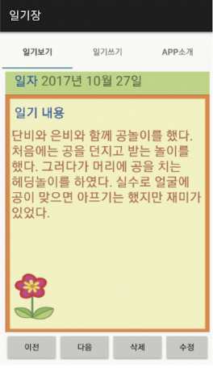

# 나만의 일기장 앱 만들기

TabWidget을 활용하여 일기장 앱을 제작할 것이다.

---

## TabWidget을 활용한 일기장 앱(지원 종료)



메인 메뉴는 크게 [일기보기], [일기쓰기], [App소개] 세 탭으로 구성한다. 

TabWidget은 기본적으로 제공되는 사용자 인터페이스 구성요소다. 탭(버튼)을 사용해서 화면에서 동일한 영역에 다른 내용을 번갈아 표시할 때 사용한다. TabWidget 클래스는 탭 위젯 안에 표시되는 탭을 추가하거나, 수정, 삭제하는 기능을 지니고 있다. TabWidget 클래스로 탭을 만들었다면, 표시하는 내용을 관리하기 위한 TabHost 클래스도 필요하다.

또한 TabHost가 관리하는 페이지 화면은 반드시 FrameLayout으로 구성해야 한다. 각각의 탭이 동일한 영역을 사용하기 때문에 새 탭 내용이 위에 겹쳐지는 구조다. TabHost는 TabWidget과 FrameLayout을 포함하고 있으며, 기본 구조는 다음과 같다.


### Activity_main.xml

TabHost를 구성하는 레이아웃 요소가 들어있다. TabHost는 뷰그룹 역할을 하며, TabWidget과 FrameLayout을 포함하고 있다. 다음 사항을 유의해서 설계해야 한다.

1. TabWidget의 id 속성에는 반드시 "@android:id/tabs" 값을 지정해야 한다.

2. TabHost 내 FrameLayout을 사용해서 내용을 표시해야 한다. 이때 내용 표시를 위한 FrameLayout의 id 속성 값을 반드시 "@android:id/tabcontent"로 지정해야 한다.

```xml
<?xml version="1.0" encoding="utf-8"?>
<TabHost
    xmlns:android="http://schemas.android.com/apk/res/android"
    android:id="@android:id/tabhost"
    android:layout_width="match_parent"
    android:layout_height="match_parent">

    <LinearLayout
        android:orientation="vertical"
        android:layout_width="match_parent"
        android:layout_height="match_parent"
        android:padding="5dp">

        <TabWidget
            android:id="@android:id/tabs"
            android:orientation="vertical"
            android:layout_width="match_parent"
            android:layout_height="wrap_content"/>

        <FrameLayout
            android:id="@android:id/tabcontent"
            android:layout_width="match_parent"
            android:layout_height="match_parent"
            android:padding="5dp"/>

    </LinearLayout>

</TabHost>
```

### MainActivity.java

전체 코드는 Tab 세 개를 생성하고 있다. 다음 과정을 통해 하나의 Tab을 만든다.

| 메서드 | 설명 |
| --- | --- |
| newTabSpec | Tag를 가진 TabSpec 객체를 생성한다.<br/>(new 키워드를 사용하지 않고 newTabSpec을 사용해서 객체를 생성한다.) |
| setIndicator | 탭에 표시할 문자열을 지정한다. |
| setContent | 사용자가 탭을 눌렀을 때 FrameLayout에 표시할 Content 뷰의 리소스 id를 지정한다.<br/>(예제에서는 Intent, 즉 화면 전환으로 설정했다.) |
| addTab | TabHost에 탭을 추가한다. |

```Java
public class MainActivity extends TabActivity {

    @Override
    protected void onCreate(Bundle savedInstanceState) {
        super.onCreate(savedInstanceState);
        setContentView(R.layout.activity_main);

        TabHost tabHost = getTabHost();
        TabHost.TabSpec spec;

        // 첫 번재 tab 생성
        Intent intent = new Intent().setClass(this, ShowMyData.class);

        spec = tabHost.newTabSpec("show").setIndicator("일기보기").setContent(intent);
        tabHost.addTab(spec);

        // 두 번쨰 tab 생성
        intent = new Intent().setClass(this, WriteDiaryActivity.class);

        spec = tabHost.newTabSpec("write").setIndicator("일기쓰기").setContent(intent);
        tabHost.addTab(spec);

        // 세 번째 tab 생성
        intent = new Intent().setClass(this, AppHelpActivity.class);

        spec = tabHost.newTabSpec("help").setIndicator("App소개").setContent(intent);
        tabHost.addTab(spec);

        // 처음 앱 실행 시 탭 활성화 지정
        tabHost.setCurrentTab(0);

    }
}
```


### 데이터베이스 및 테이블 생성

1. 예제에서 사용할 DB 구조

예제는 csc란 이름의 DB를 만들고, 그 내부에 diaryTB 이라는 이름의 테이블을 설계할 것이다. 테이블은 두 가지 유형(날짜, 일기 내용)으로 구성한다.

|| Table 명: diaryTB ||
| :---: | :---: | :---: | 
| 속성 | 데이터 유형 | 사용 |
| data1 | text | 날짜 |
| data2 | text | 일기 내용 |

2. DB를 위해 사용한 클래스와 인터페이스

> [SQLiteOpenHelper 사용하여 DB 수정하기](https://ju-hy.tistory.com/71)

DBManager 클래스는 SQLiteOpenHelper 클래스를 상속 받아 데이터베이스와 테이블을 관리하는 메서드를 사용할 것이다. 다른 파일(ShowMyData.java, WriteDiaryActivity.java, ModifyMyDate.java)에서 이를 사용한다. 

1. SQLiteOpenHelper

| 메서드 | 활용 |
| :---: | :---: | 
| onCreate() | "CREATE TABLE" 명령을 이용해서 테이블을 만든다. |
| getWritableDatabase() | 쓰고 읽을 수 있는 데이터베이스를 연다.<br/>SQLiteDatabase 객체를 반환하고, 메서드(execSQL, close 등)을 사용할 수 있다. |

2. SQLiteDatabase Class

| 메서드 | 활용 |
| :---: | :---: | 
| execSQL() | "Insert into": 레코드를 테이블에 추가하기<br/>"Update SET": 존재하는 레코드값 변경하기<br/>"Delete": 테이블에서 레코드 삭제하기 |
| close | DB 닫기 |
| query() | query()를 실행 후 커서를 반환한다. |

3. Cursor Interface

| 메서드 | 활용 |
| :---: | :---: | 
| moveToFirst() | 커서를 맨 첫 번째 행으로 이동시킨다. |
| getString() | 커서가 가리키는 곳에 위치한 데이터를 가져온다. |
| moveToPosition(i) | 커서를 특정 위치로 이동시킨다. |
| close() | 커서 사용 후 반드시 닫아야 한다. |

> [안드로이드 커서](https://lesslate.github.io/android/%EC%95%88%EB%93%9C%EB%A1%9C%EC%9D%B4%EB%93%9C-Cursor/)

> [안드로이드 커서를 활용한 DB 데이터 사용하기](https://keumjae.tistory.com/3)

```Java
import android.content.Context;
import android.database.sqlite.SQLiteDatabase;
import android.database.sqlite.SQLiteOpenHelper;

public class DBManager extends SQLiteOpenHelper {

    public DBManager(Context context) {
        super(context, "csc", null, 1);    // csc라는 이름의 DB
                                           // context, DB 이름, 팩토리 null, 버전 1
    }

    // SQLiteOpenHelper의 onCreate() 메서드로 Create Table 명령을 사용해서 테이블을 생성한다.
    @Override
    public void onCreate(SQLiteDatabase db) {
        // diaryTB이라는 이름의 테이블을 설계
        // 속성 1: data1 / 데이터 유형: text / 내용: 날짜
        // 속성 2: data2 / 데이터 유형: text / 내용: 일기 내용
        db.execSQL("create table diaryTB (data1 text, data2 text);");
    }

    @Override
    public void onUpgrade(SQLiteDatabase db, int oldVersion, int newVersion) {
    }

}
```

### 첫 번째 탭(일기보기) 만들기

우선 [일기보기] 탭을 선택하면 표시될 content를 제작할 것이다. 하단은 [이전], [다음], [삭제], [수정] 메뉴들이 나오며 해당 일기를 관리할 수 있게끔 설계한다.

1. show.xml

LinearLayout를 중첩으로 사용해서 구성하였다. 

```xml
<?xml version="1.0" encoding="utf-8"?>
<LinearLayout
    xmlns:android="http://schemas.android.com/apk/res/android"
    android:layout_width="match_parent"
    android:layout_height="match_parent"
    android:orientation="vertical">

    <!-- 일기 일자 -->
    <LinearLayout
        android:layout_width="match_parent"
        android:layout_height="wrap_content"
        android:background="#CEF279"
        android:orientation="horizontal">

        <TextView
            android:layout_width="wrap_content"
            android:layout_height="38dp"
            android:layout_marginLeft="15dp"
            android:orientation="vertical"
            android:text="일자 "
            android:textColor="#0054FF"
            android:textSize="22dp"/>

        <TextView
            android:id="@+id/datetextview"
            android:layout_width="wrap_content"
            android:layout_height="38dp"
            android:orientation="vertical"
            android:textSize="22dp"/>

    </LinearLayout>

    <!-- 일기 내용-->
    <LinearLayout
        android:layout_width="match_parent"
        android:layout_height="396dp"
        android:background="@drawable/paper"
        android:orientation="vertical">

        <TextView
            android:layout_width="wrap_content"
            android:layout_height="38dp"
            android:layout_marginLeft="15dp"
            android:layout_marginTop="15dp"
            android:orientation="vertical"
            android:text="일기 내용"
            android:textColor="#0054FF"
            android:textSize="22dp"/>

        <TextView
            android:id="@+id/diarytextview"
            android:layout_width="match_parent"
            android:layout_height="400dp"
            android:layout_marginLeft="10dp"
            android:orientation="vertical"
            android:textColor="#CC723D"
            android:textSize="22dp"/>

    </LinearLayout>

    <!-- 하단 버튼 구성 -->
    <LinearLayout
        android:layout_width="wrap_content"
        android:layout_height="match_parent"
        android:orientation="horizontal">

        <!-- 이전 버튼 -->
        <Button
            android:id="@+id/bprevious"
            android:layout_width="wrap_content"
            android:layout_height="wrap_content"
            android:onClick="previousData"
            android:text="이전"/>

        <!-- 다음 버튼 -->
        <Button
            android:id="@+id/bnext"
            android:layout_width="wrap_content"
            android:layout_height="wrap_content"
            android:onClick="nextData"
            android:text="다음"/>

        <!-- 삭제 버튼 -->
        <Button
            android:id="@+id/bdelete"
            android:layout_width="wrap_content"
            android:layout_height="wrap_content"
            android:onClick="deleteData"
            android:text="삭제"/>

        <!-- 수정 버튼 -->
        <Button
            android:id="@+id/bmodify"
            android:layout_width="wrap_content"
            android:layout_height="wrap_content"
            android:onClick="modifyData"
            android:text="수정"/>

    </LinearLayout>


</LinearLayout>
```

2. ShowMyData.java

첫 번째 탭에서 실행되는 Activity다. 

* [이전] 버튼을 클릭 시 previoutData 메서드가 실행된다.(이전 일기장 내용을 제시한다.)

* [다음] 버튼을 클릭 시 nextData 메서드가 실행된다.(다음 일기장 내용을 제시한다.)

* [삭제] 버튼을 클릭 시 deleteData 메서드가 실행되며 현재 일기는 삭제된다.

* [수정] 버튼을 클릭 시 modifyData 메서드가 실행되며 일기를 수정할 수 있도록 다른 Activity로 화면을 전환한다.(intent)

```Java
public class ShowMyData extends Activity {

    int nowData = 0;

    Cursor cursor;    // DB에서 활용할 Cursor

    TextView datetextview;          // 일기 일자 부분의 textview
    TextView diarytextview;     // 일기 내용 부분의 textview

    String diary_content;
    String diary_date;

    int numberOfData;

    @Override
    public void onCreate(Bundle savedInstanceState) {
        super.onCreate(savedInstanceState);
        setContentView(R.layout.show);

        datetextview = (TextView) findViewById(R.id.datetextview);
        diarytextview = (TextView) findViewById(R.id.diarytextview);

        try {
            DBManager dbmgr = new DBManager(this);

            SQLiteDatabase sdb = dbmgr.getReadableDatabase();

            cursor = sdb.query("diaryTB", null, null, null, null, null, null);

            numberOfData = cursor.getCount();    // getCount(): 커서가 참조 할 수 있는 해당 테이블의 행(Row)의 개수를 반환
            cursor.moveToFirst();

            if (numberOfData == 0) { nowData = 0; }
            else { nowData = 1; }

            if (cursor.getCount() > 0) {
                diary_content = cursor.getString(0);    // getString(): 커서가 가리키는 곳의 데이터를 가져온다.
                diary_date = cursor.getString(1);
            }

            cursor.close();
            dbmgr.close();

        } catch (SQLException e) {
        }

        datetextview.setText(diary_content);
        diarytextview.setText(diary_date);

    }

    // 이전 버튼을 누르면 실행되는 메서드
    public void previousData(View v) {

        try{
            DBManager dbmgr = new DBManager(this);

            SQLiteDatabase sdb = dbmgr.getReadableDatabase();

            cursor = sdb.query("diaryTB", null, null, null, null, null, null);

            if (numberOfData == 0) { nowData = 0; }

            if ((cursor.getCount() > 0) && (nowData > 1) ) {

                nowData -= 1;

                if (nowData <= 1) {
                    nowData = 1;
                }

                cursor.moveToPosition(nowData - 1);

                diary_content = cursor.getString(0);
                diary_date = cursor.getString(1);

            }

            cursor.close();
            dbmgr.close();

        } catch (SQLiteException e) {
        }

        datetextview.setText(diary_content);
        diarytextview.setText(diary_date);

    }

    // 다음 버튼을 누르면 실행되는 메서드
    public void nextData(View v) {

        try {
            DBManager dbmgr = new DBManager(this);

            SQLiteDatabase sdb = dbmgr.getReadableDatabase();

            cursor = sdb.query("diaryTB", null, null, null, null, null, null);

            if (numberOfData == 0) {
                nowData = 0;
            }

            if ((cursor.getCount() > 0) && (nowData <= numberOfData)) {

                nowData += 1;

                if (nowData >= numberOfData) {
                    nowData = numberOfData;
                }

                cursor.moveToPosition(nowData - 1);    // 커서를 nowData - 1(인덱스가 0부터 시작하기 때문)으로 옮긴다.

                diary_content = cursor.getString(0);
                diary_date = cursor.getString(1);

            }

            cursor.close();
            dbmgr.close();

        } catch (SQLiteException e) {
        }

        datetextview.setText(diary_content);
        diarytextview.setText(diary_date);

    }

    // 삭제 버튼을 누르면 실행되는 메서드
    public void deleteData(View v) {

        if (numberOfData >= 1) {
            try {
                DBManager dbmgr = new DBManager(this);

                SQLiteDatabase sdb;

                sdb = dbmgr.getWritableDatabase();

                cursor = sdb.query("diaryTB", null, null, null, null, null, null);

                cursor.moveToPosition(nowData - 1);

                diary_content = cursor.getString(0);

                nowData -= 1;

                String sql = String.format("DELETE FROM diaryTB" +
                        "WHERE data1 = '%s'", diary_content);

                sdb.execSQL(sql);

                cursor.close();
                dbmgr.close();

            } catch (SQLiteException e) {
            }
        }

    }

    // 수정 버튼을 누르면 실행되는 메서드
    public void modifyData(View v) {

        Intent it = new Intent();

        it = new Intent(this, ModifyMyData.class);

        String msg = nowData + "";

        it.putExtra("it_name", msg);

        startActivity(it);
        finish();

    }

}
```


### 두 번째 탭(일기쓰기) 만들기

1. writediary.xml

LinearLayout 뷰 그룹 안에 세 개의 LinearLayout을 수직으로 배치하였다. 

* 첫 번째 LinearLayout은 2개의 텍스트 뷰를 배치한다.(날짜: 2022년 10월 30일)

* 두 번째 LinearLayout은 텍스트 뷰와 에디드 텍스트 뷰를 수평으로 배치한다.(일기쓰기 (다음줄) 일기 내용)

* 세 번째 LinearLayout은 우측에 저장 버튼을 배치한다.

```xml
<?xml version="1.0" encoding="utf-8"?>
<LinearLayout
    xmlns:android="http://schemas.android.com/apk/res/android"
    android:layout_width="match_parent"
    android:layout_height="match_parent"
    android:background="#CEF279"
    android:orientation="vertical">

    <LinearLayout
        android:layout_width="match_parent"
        android:layout_height="wrap_content"
        android:background="#86E57F"
        android:orientation="horizontal">

        <TextView
            android:layout_width="wrap_content"
            android:layout_height="wrap_content"
            android:layout_marginLeft="15dp"
            android:orientation="vertical"
            android:text="@string/mdate"
            android:textColor="#0054FF"
            android:textSize="22dp"/>

        <!-- 날짜 입력 -->
        <EditText
            android:id="@+id/edit_date"
            android:layout_width="match_parent"
            android:layout_height="wrap_content"/>

    </LinearLayout>

    <!-- 일기 쓰기 -->
    <LinearLayout
        android:layout_width="match_parent"
        android:layout_height="416dp"
        android:background="@drawable/paper"
        android:orientation="vertical">

        <TextView
            android:layout_width="wrap_content"
            android:layout_height="wrap_content"
            android:layout_marginLeft="15dp"
            android:layout_marginTop="15dp"
            android:text="@string/mcontent"
            android:textColor="#0054FF"
            android:textSize="22dp"/>

        <EditText
            android:id="@+id/edit_diary"
            android:layout_width="match_parent"
            android:layout_height="367dp"
            android:layout_marginLeft="10dp"
            android:textColor="#CC734D"/>

    </LinearLayout>

    <!-- 저장 -->
    <LinearLayout
        android:layout_width="match_parent"
        android:layout_height="wrap_content"
        android:gravity="right"
        android:orientation="horizontal">

        <!-- 저장 버튼 -->
        <Button
            android:id="@+id/button_store"
            android:layout_width="wrap_content"
            android:layout_height="wrap_content"
            android:onClick="saveData"
            android:text="저장"/>

    </LinearLayout>

</LinearLayout>
```

2. WriteDiaryActivity.java

[일기쓰기] 탭을 클릭하면 실행되는 Activity이다.

SQLite "insert info" 문법을 사용하여 날짜와 일기 내용을 diaryTB 테이블에 저장한다.

```Java
public class WriteDiaryActivity extends Activity {

    private DBManager dbmgr;

    @Override
    public void onCreate(Bundle savedInstanceState) {
        super.onCreate(savedInstanceState);
        setContentView(R.layout.writediary);

        // Button btn = (Button) findViewById(R.id.button_store);
        // btn.setOnClickListener(this);
    }

    public void saveData(View v) {

        // 입력 받은 날짜를 변수에 저장한다.
        EditText et_date = (EditText) findViewById(R.id.edit_date);
        String diary_date = et_date.getText().toString();

        // 입력 받은 일기 내용을 변수에 저장한다.
        EditText et_name2 = (EditText) findViewById(R.id.edit_diary);
        String diary_content = et_name2.getText().toString();

        try {
            dbmgr = new DBManager(this);

            SQLiteDatabase sdb;

            // 날짜와 일기 내용을 diaryTB 테이블에 저장한다.
            sdb = dbmgr.getWritableDatabase();
            sdb.execSQL("insert into diaryTB values('" + diary_date + "', '" + diary_content + "');");

            dbmgr.close();

        } catch (SQLiteException e) {
        }

        Intent it = new Intent(this, MainActivity.class);
        startActivity(it);
        finish();

    }

}
```


### 세 번째 탭(APP소개) 만들기

세 번째 탭은 간단하다. 단순히 xml 파일 없이 자바 코드만으로 어플리케이션 제목과 만든 이를 표기할 것이다.

```Java
// AppHelpActivity.java

public class AppHelpActivity extends Activity {

    public void onCreate(Bundle savedInstanceState) {
        super.onCreate(savedInstanceState);

        TextView textview = new TextView(this);
        textview.setTextSize(20);
        textview.setText("나만의 일기장" + "\n" + "만든 이: https://github.com/erectbranch");

        setContentView(textview);
    }

}
```


### 일기 수정하기

이전 [일기보기] 탭에서 [수정] 버튼을 클릭하면 일기를 수정하는 화면으로 전환이 되는 구성이었다.

수정 중에는 [수정] 버튼을 눌러 수정을 마무리할 수 있다. 또는 [취소] 버튼을 눌러 수정을 취소할 수 있다. 두 경우 모두 [일기보기] 탭으로 화면이 전환된다.

1. modify.xml

일기쓰기 탭과 비슷하다. LinearLayout 뷰그룹 안에 LinearLayout 세 개를 수직으로 배치하였다.

```xml
<?xml version="1.0" encoding="utf-8"?>
<LinearLayout
    xmlns:android="http://schemas.android.com/apk/res/android"
    android:layout_width="match_parent"
    android:layout_height="match_parent"
    android:orientation="vertical">

    <LinearLayout
        android:layout_width="match_parent"
        android:layout_height="wrap_content"
        android:background="#CEF279"
        android:orientation="horizontal">

        <TextView
            android:layout_width="wrap_content"
            android:layout_height="38dp"
            android:layout_marginLeft="15dp"
            android:orientation="vertical"
            android:text="일자 "
            android:textColor="#0054FF"
            android:textSize="22dp"/>

        <!-- 날짜 입력 -->
        <TextView
            android:id="@+id/date"
            android:layout_width="wrap_content"
            android:layout_height="38dp"
            android:orientation="vertical"
            android:textSize="22dp"/>

    </LinearLayout>

    <!-- 일기 내용 -->
    <LinearLayout
        android:layout_width="match_parent"
        android:layout_height="416dp"
        android:background="@drawable/paper"
        android:orientation="vertical">

        <TextView
            android:layout_width="wrap_content"
            android:layout_height="38dp"
            android:layout_marginLeft="15dp"
            android:layout_marginTop="15dp"
            android:text="수정하기 "
            android:textColor="#0054FF"
            android:textSize="22dp"
            android:orientation="vertical"/>

        <EditText
            android:id="@+id/modify_text"
            android:layout_width="match_parent"
            android:layout_height="400dp"
            android:layout_marginLeft="10dp"
            android:textSize="22dp"
            android:textColor="#CC734D"
            android:orientation="vertical"/>

    </LinearLayout>

    <!-- 하단 버튼 -->
    <LinearLayout
        android:layout_width="wrap_content"
        android:layout_height="wrap_content"
        android:orientation="horizontal">

        <!-- 수정 버튼 -->
        <Button
            android:id="@+id/modify"
            android:layout_width="wrap_content"
            android:layout_height="wrap_content"
            android:onClick="modifyData"
            android:text="수정"
            android:textSize="22dp"/>

        <!-- 취소 버튼 -->
        <Button
            android:id="@+id/cancel"
            android:layout_width="wrap_content"
            android:layout_height="wrap_content"
            android:onClick="cancelData"
            android:text="취소"
            android:textSize="22dp"/>

    </LinearLayout>

</LinearLayout>
```

2. ModifyMyData.java

```Java
public class ModifyMyData extends Activity {

    int nowData = 0;

    Cursor cursor;

    TextView date;
    EditText modifytext;

    String diary_date;
    String diary_content;

    @Override
    public void onCreate(Bundle savedInstanceState) {

        super.onCreate(savedInstanceState);
        setContentView(R.layout.modify);

        date = (TextView) findViewById(R.id.date);
        modifytext = (EditText) findViewById(R.id.modify_text);

        Intent it = getIntent();

        String str_name = it.getStringExtra("it_name");
        nowData = Integer.parseInt(str_name);

        try {
            DBManager dbmgr = new DBManager(this);
            SQLiteDatabase sdb = dbmgr.getWritableDatabase();

            cursor = sdb.query("diaryTB", null, null, null, null, null, null);
            cursor.moveToPosition(nowData - 1);

            diary_date = cursor.getString(0);
            diary_content = cursor.getString(1);

            cursor.close();
            dbmgr.close();

        } catch (SQLiteException e) {
        }

        date.setText(diary_date);
        modifytext.setText(diary_content);

    }

    // 수정 버튼을 누르면 수정이 완료되며 [일기보기]로 넘어간다.
    public void modifyData (View v) {

        try {

            DBManager dbmgr = new DBManager(this);

            SQLiteDatabase sdb = dbmgr.getWritableDatabase();
            cursor = sdb.query("diaryTB", null, null, null, null, null, null);
            cursor.moveToPosition(nowData - 1);

            diary_date = cursor.getString(0);

            String str_sex = modifytext.getText().toString();

            String sql = String.format("UPDATE diaryTB SET" +
                    "data2 = '%s' WHERE data1 = '%s'", str_sex, diary_date);

            sdb.execSQL(sql);

            cursor.close();
            dbmgr.close();

        } catch (SQLiteException e) {
        }

        Intent it = new Intent();
        it = new Intent(this, MainActivity.class);

        startActivity(it);
        finish();

    }

    // 취소 버튼을 누르면 수정이 취소되고 [일기보기]로 넘어간다.
    public void cancelData (View v) {

        Intent it = new Intent();
        it = new Intent(this, MainActivity.class);

        startActivity(it);
        finish();

    }

}
```


### string.xml

[res] - [values] 폴더에 있는 string.xml 파일 내용이다. app_name은 AndroidManifest.xml 파일에서 앱 이름으로 사용하였다. mdate와 mcontent는 [일기쓰기] 탭(writediary.xml)에서 사용하였다.

```xml
<resources>
    <string name="app_name">일기장</string>
    <string name="mdate">날씨</string>
    <string name="mcontent">일기쓰기</string>
</resources>
```


### AndroidManifest.xml

Activity 파일 다섯 개를 모두 등록한다.

```xml
<?xml version="1.0" encoding="utf-8"?>
<manifest xmlns:android="http://schemas.android.com/apk/res/android"
    xmlns:tools="http://schemas.android.com/tools">

    <application
        android:allowBackup="true"
        android:dataExtractionRules="@xml/data_extraction_rules"
        android:fullBackupContent="@xml/backup_rules"
        android:icon="@mipmap/ic_launcher"
        android:label="@string/app_name"
        android:roundIcon="@mipmap/ic_launcher_round"
        android:supportsRtl="true"
        android:theme="@style/Theme.Mydiary"
        tools:targetApi="31">
        <activity
            android:name=".MainActivity"
            android:label="@string/app_name"
            android:exported="true">
            <intent-filter>
                <action android:name="android.intent.action.MAIN" />

                <category android:name="android.intent.category.LAUNCHER" />
            </intent-filter>

            <meta-data
                android:name="android.app.lib_name"
                android:value="" />
        </activity>

        <!-- [일기쓰기] 탭 -->
        <activity android:name=".WriteDiaryActivity"></activity>

        <!-- [일기보기] 탭 -->
        <activity android:name=".ShowMyData"></activity>

        <!-- 일기 수정 -->
        <activity android:name=".ModifyMyData"></activity>

        <!-- [앱도움말] 탭 -->
        <activity android:name=".AppHelpActivity"></activity>

    </application>

</manifest>
```

---
