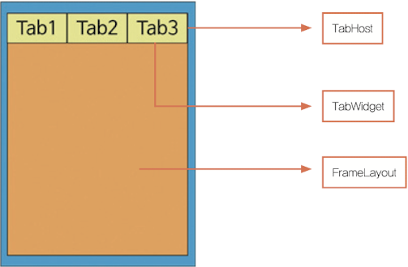

# 나만의 일기장 앱 만들기

TabWidget을 활용하여 일기장 앱을 제작할 것이다.

---

## TabWidget을 활용한 일기장 앱

메인 메뉴는 크게 [일기보기], [일기쓰기], [App소개] 세 탭으로 구성한다. 

TabWidget은 기본적으로 제공되는 사용자 인터페이스 구성요소다. 탭(버튼)을 사용해서 화면에서 동일한 영역에 다른 내용을 번갈아 표시할 때 사용한다. TabWidget 클래스는 탭 위젯 안에 표시되는 탭을 추가하거나, 수정, 삭제하는 기능을 지니고 있다. TabWidget 클래스로 탭을 만들었다면, 표시하는 내용을 관리하기 위한 TabHost 클래스도 필요하다.

또한 TabHost가 관리하는 페이지 화면은 반드시 FrameLayout으로 구성해야 한다. 각각의 탭이 동일한 영역을 사용하기 때문에 새 탭 내용이 위에 겹쳐지는 구조다. TabHost는 TabWidget과 FrameLayout을 포함하고 있으며, 기본 구조는 다음과 같다.




### Activity_main.xml

TabHost를 구성하는 레이아웃 요소가 들어있다. TabHost는 뷰그룹 역할을 하며, TabWidget과 FrameLayout을 포함하고 있다. 다음 사항을 유의해서 설계해야 한다.

1. TabWidget의 id 속성에는 반드시 "@android:id/tabs" 값을 지정해야 한다.

2. TabHost 내 FrameLayout을 사용해서 내용을 표시해야 한다. 이때 내용 표시를 위한 FrameLayout의 id 속성 값을 반드시 "@android:id/tabcontent"로 지정해야 한다.

```xml
<?xml version="1.0" encoding="utf-8"?>
<TabHost
    xmlns:android="http://schemas.android.com/apk/res/android"
    android:id="@android:id/tabhost"
    android:layout_width="match_parent"
    android:layout_height="match_parent">

    <LinearLayout
        android:orientation="vertical"
        android:layout_width="match_parent"
        android:layout_height="match_parent"
        android:padding="5dp">

        <TabWidget
            android:id="@android:id/tabs"
            android:orientation="vertical"
            android:layout_width="match_parent"
            android:layout_height="wrap_content"/>

        <FrameLayout
            android:id="@android:id/tabcontent"
            android:layout_width="match_parent"
            android:layout_height="match_parent"
            android:padding="5dp"/>

    </LinearLayout>

</TabHost>
```

### MainActivity.java

전체 코드는 Tab 세 개를 생성하고 있다. 다음 과정을 통해 하나의 Tab을 만든다.

| 메서드 | 설명 |
| --- | --- |
| newTabSpec | Tag를 가진 TabSpec 객체를 생성한다.<br/>(new 키워드를 사용하지 않고 newTabSpec을 사용해서 객체를 생성한다.) |
| setIndicator | 탭에 표시할 문자열을 지정한다. |
| setContent | 사용자가 탭을 눌렀을 때 FrameLayout에 표시할 Content 뷰의 리소스 id를 지정한다.<br/>(예제에서는 Intent, 즉 화면 전환으로 설정했다.) |
| addTab | TabHost에 탭을 추가한다. |

```Java
public class MainActivity extends TabActivity {

    @Override
    protected void onCreate(Bundle savedInstanceState) {
        super.onCreate(savedInstanceState);
        setContentView(R.layout.activity_main);

        TabHost tabHost = getTabHost();
        TabHost.TabSpec spec;

        // 첫 번재 tab 생성
        Intent intent = new Intent().setClass(this, ShowMyData.class);

        spec = tabHost.newTabSpec("show").setIndicator("일기보기").setContent(intent);
        tabHost.addTab(spec);

        // 두 번쨰 tab 생성
        intent = new Intent().setClass(this, WriteDiaryActivity.class);

        spec = tabHost.newTabSpec("write").setIndicator("일기쓰기").setContent(intent);
        tabHost.addTab(spec);

        // 세 번째 tab 생성
        intent = new Intent().setClass(this, AppHelpActivity.class);

        spec = tabHost.newTabSpec("help").setIndicator("App소개").setContent(intent);
        tabHost.addTab(spec);

        // 처음 앱 실행 시 탭 활성화 지정
        tabHost.setCurrentTab(0);

    }
}
```

### 데이터베이스 및 테이블 생성

1. 예제에서 사용할 DB 구조

예제는 csc란 이름의 DB를 만들고, 그 내부에 diaryTB 이라는 이름의 테이블을 설계할 것이다. 테이블은 두 가지 유형(날짜, 일기 내용)으로 구성한다.

|| Table 명: diaryTB ||
| :---: | :---: | :---: | 
| 속성 | 데이터 유형 | 사용 |
| data1 | text | 날짜 |
| data2 | text | 일기 내용 |

2. DB를 위해 사용한 클래스와 인터페이스

DBManager 클래스는 SQLiteOpenHelper 클래스를 상속 받아 데이터베이스와 테이블을 관리하는 메서드를 사용할 것이다. 다른 파일(ShowMyData.java, WriteDiaryActivity.java, ModifyMyDate.java)에서 이를 사용한다. 

1. SQLiteOpenHelper

| 메서드 | 활용 |
| :---: | :---: | 
| onCreate() | "CREATE TABLE" 명령을 이용해서 테이블을 만든다. |
| getWritableDatabase() | 쓰고 읽을 수 있는 데이터베이스를 연다.<br/>SQLiteDatabase 객체를 반환하고, 메서드(execSQL, close 등)을 사용할 수 있다. |

2. SQLiteDatabase Class

| 메서드 | 활용 |
| :---: | :---: | 
| execSQL() | "Insert into": 레코드를 테이블에 추가하기<br/>"Update SET": 존재하는 레코드값 변경하기<br/>"Delete": 테이블에서 레코드 삭제하기 |
| close | DB 닫기 |
| query() | query()를 실행 후 커서를 반환한다. |

3. Cursor Interface

| 메서드 | 활용 |
| :---: | :---: | 
| moveToFirst() | 커서를 맨 첫 번째 행으로 이동시킨다. |
| getString() | 커서가 가리키는 곳에 위치한 데이터를 가져온다. |
| moveToPosition(i) | 커서를 특정 위치로 이동시킨다. |
| close() | 커서 사용 후 반드시 닫아야 한다. |

```Java
import android.content.Context;
import android.database.sqlite.SQLiteDatabase;
import android.database.sqlite.SQLiteOpenHelper;

public class DBManager extends SQLiteOpenHelper {

    public DBManager(Context context) {
        super(context, "csc", null, 1);    // csc라는 이름의 DB
    }

    // SQLiteOpenHelper의 onCreate() 메서드로 Create Table 명령을 사용해서 테이블을 생성한다.
    @Override
    public void onCreate(SQLiteDatabase db) {
        // diaryTB이라는 이름의 테이블을 설계
        // 속성 1: data1 / 데이터 유형: text / 내용: 날짜
        // 속성 2: data2 / 데이터 유형: text / 내용: 일기 내용
        db.execSQL("create table diaryTB (data1 text, data2 text);");
    }

    @Override
    public void onUpgrade(SQLiteDatabase db, int oldVersion, int newVersion) {
    }

}
```