# 안드로이드 스튜디오 시작하기

new project를 클릭한 뒤 Empty Activity를 선택했다. 세팅은 아래와 같다.

* Application name: AndroidStudioBasic

* Package name: com.erectbranch.AndroidStudioBasic (도메인이 반대로 쓰이고, Application name이 붙는다.)

* 사용 언어: Java

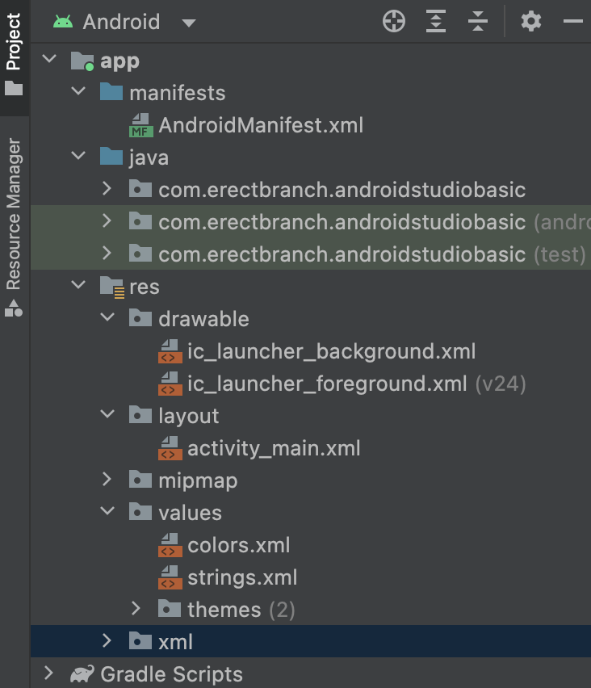

차례로 파일이 무엇인지 살피자

* manifests: 앱의 많은 정보를 담고 있으며, Activity를 만들 때마다 이곳에 정보를 등록해야 한다. 어플의 아이콘을 정하거나 진동 등 다양한 권한을 부여할 때 사용한다.

* Java: 자바 파일에 코드를 넣는 곳이다.

아래는 res 하위 폴더

* drawable: 이미지, 음악 파일 등을 넣는다.

* layout: 화면을 구성하는 xml 파일이 있다.

* mipmap: 스마트폰 화면에 표시되는 이미지(어플 아이콘)을 넣는다.

* values: strings.xml 안에는 문자열을 넣는다. 어플 이름을 바꾸고 싶다면 이 파일을 수정하면 된다.


---


## 앱 실행하기

제작한 앱을 실행하는 방법은 두 가지가 있다. 첫 번째 방법은 먼저 휴대폰에 직접 APK를 설치하는 방법이고, 두 번째 방법은 가상 디바이스(AVD)를 사용하는 방법이다.

이후는 AVD를 사용하며 Nexus 5X 시스템으로 진행했다.

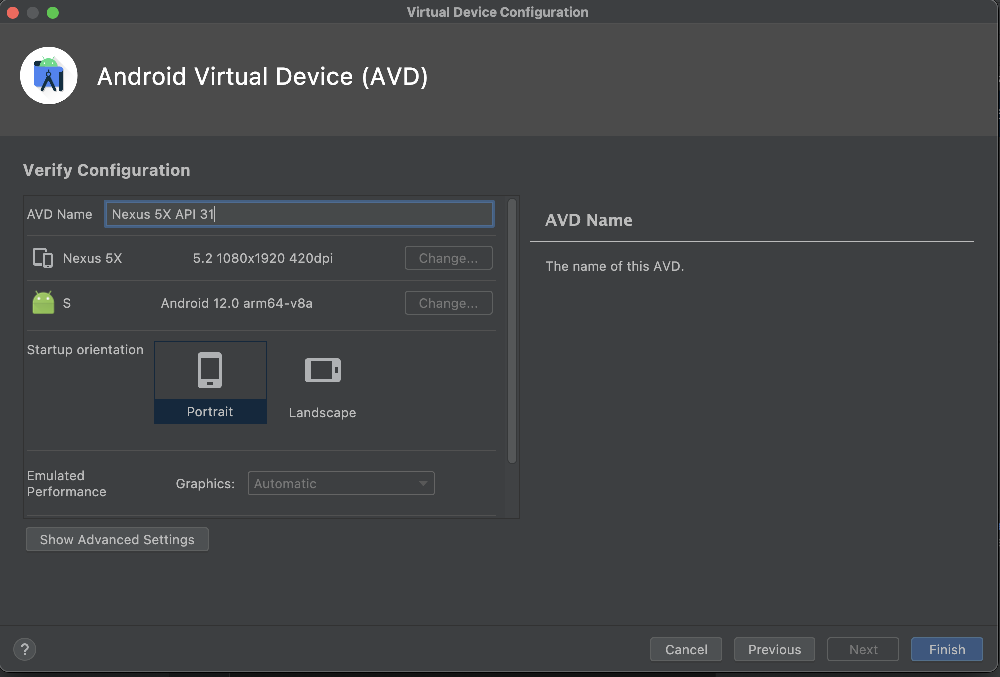

녹색 재생 아이콘을 눌러 현재 설정한 AVD에서 app을 실행하였다.

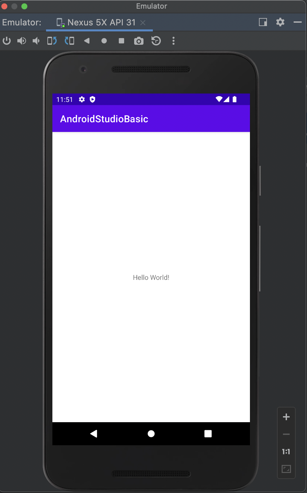

화면 중앙에 Hello, World!라는 글씨를 확인할 수 있다.


---


## 앱 이름 및 아이콘 변경하기

우선 앱에 표시되는 문장을 변경한다. [layout] 폴더에 있는 activity_main.xml 파일의 'Hello, World!' 문장을 수정할 것이다. "나의 첫 어플"이라는 문장으로 바꿀 것이다.

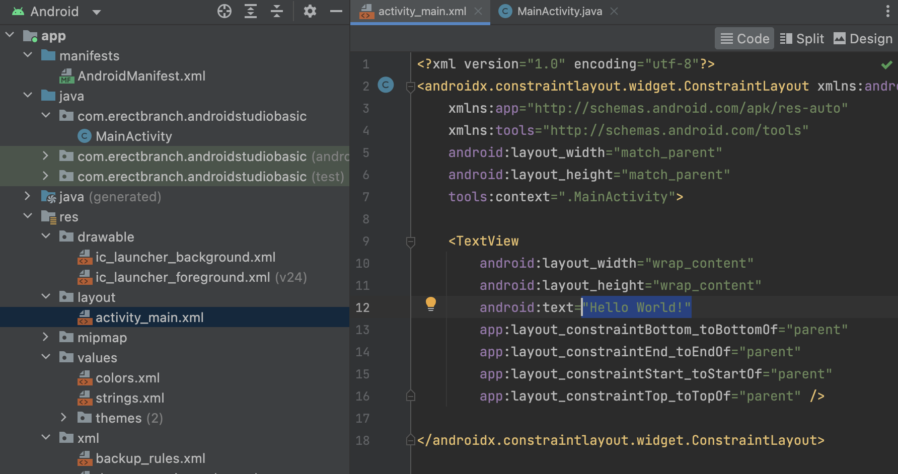

다음은 앱 이름 변경이다. [values] 폴더에 있는 strings.xml 파일의 'AndroidStudioBasic' 부분을 수정할 것이다. "나의 첫 작품"이라고 바꿀 것이다.

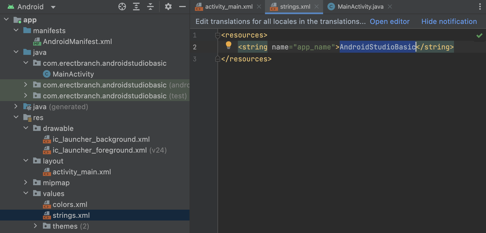

아래는 변경이 적용된 모습이다.

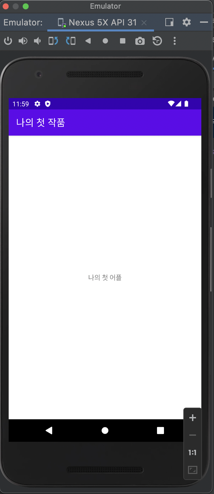

이번에는 앱 아이콘 변경이다. icon.png를 [minmap] 폴더에 넣은 후, AndroidManifest.xml에서 icon 속성 값을 @minmap/icon 으로 변경한다.

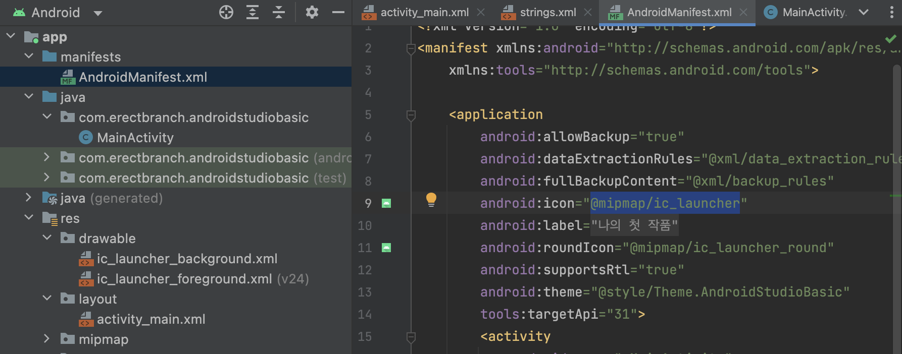

이미지를 안드로이드 스튜디오에서 폴더에 넣을 때는 특정 이미지 파일을 복사한 뒤, 안드로이드 스튜디오에서 폴더를 클릭하고 붙여넣기를 하면 된다.


---


## 뷰와 레이아웃

### 뷰그룹과 뷰

텍스트뷰, 버튼, 이미지뷰 등을 뷰(View) 또는 위젯이라고 한다. 뷰는 xml 파일 안에서 태그<>로 만들어야 한다.

다음 예제는 4개의 서로 다른 뷰로 구성되어 있다. 이러한 뷰를 하나의 그릇에 담을 수 있는데, 이를 레이아웃이라고 한다. 레이아웃 안에서 orientation 속성에 vertical 값을 입력하면 예제처럼 뷰를 수직으로 배치할 수 있다.

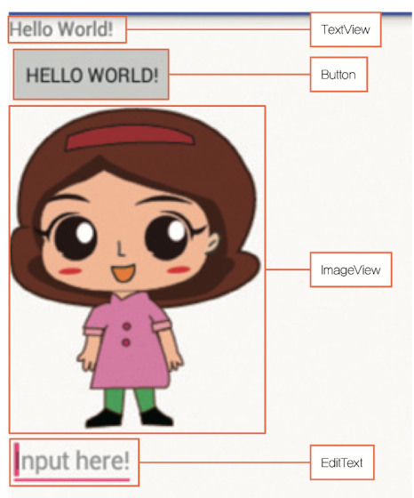

하나의 버튼 뷰(위젯)를 살펴보자. 뷰는 속성과 속성값으로 이루어져 있다.

```
<Button
    android : layout_width = "wrap_content"    // 속성 = "속성값"
    android : layout_height = "wrap_content"
    android : test = "Hello, World!"
    />
```


### LinearLayout으로 바꾸기
뷰를 담는 레이아웃은 여러 종류가 있다. 프로젝트를 새로 만들 때 [layout] 폴더의 activity_main.xml 파일은 ConstrainLayout 레이아웃(default)으로 이루어져 있다. 이 ConstrainLayout을 LinearLayout으로 바꿀 것이다. 

androidx.constraintlayout.widget.ConstraintLayout 문장을 지우고 LinearLayout을 기입한다. 또한 LinearLayout에서 사용하지 않는 4개의 constraint 부분을 삭제한다.

```
// 삭제할 constraint 부분
        app:layout_constraintBottom_toBottomOf="parent"
        app:layout_constraintEnd_toEndOf="parent"
        app:layout_constraintStart_toStartOf="parent"
        app:layout_constraintTop_toTopOf="parent"
```

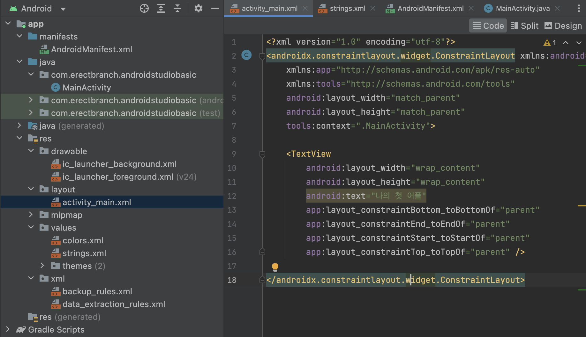

아래는 변경을 적용한 코드다.

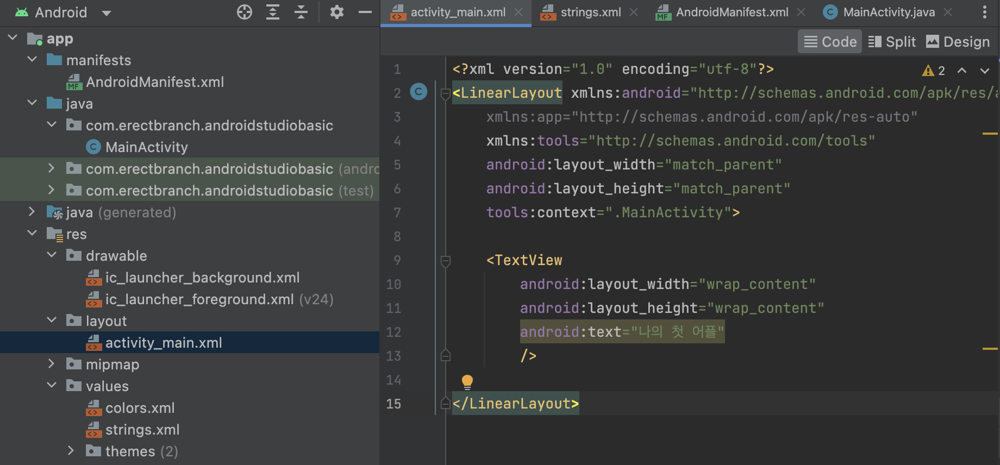


### 예제 뷰를 LinearLayout으로 구현

예제로 살펴본 4개의 뷰를 구현한 LinearLayout 내용은 다음과 같다.

```xml
<?xml version="1.0" encoding="utf-8"?>
<LinearLayout xmlns:android="http://schemas.android.com/apk/res/android"
    xmlns:app="http://schemas.android.com/apk/res-auto"
    xmlns:tools="http://schemas.android.com/tools"
    android:layout_width="match_parent"
    android:layout_height="match_parent"
    android:orientation = "vertical"   <!-- orientation 속성에 vertical 값을 설정 -->
    tools:context=".MainActivity">

    <TextView
        android:layout_width="wrap_content"
        android:layout_height="wrap_content"
        android:text="TextView 구현"
        />

    // 버튼
    <Button
        android:layout_width="wrap_content"     <!-- layout_width: 해당 뷰의 가로 크기 -->
        android:layout_height="wrap_content"    <!-- layout_height: 해당 뷰의 세로 크기 -->
        <!-- 속성 값으로 wrap_content를 주면 뷰(위젯) 크기가 된다. -->
        android:text="Button 구현"
        />

    <ImageView
        android:layout_width="wrap_content"
        android:layout_height="wrap_content"
        android:src="@drawable/girl"
        android:text="ImageView 구현"
        />

    <EditText
        android:layout_width="wrap_content"
        android:layout_height="wrap_content"
        android:hint="Edit Text 구현"
        />

</LinearLayout>
```

아래는 위 코드를 적용한 모습이다.

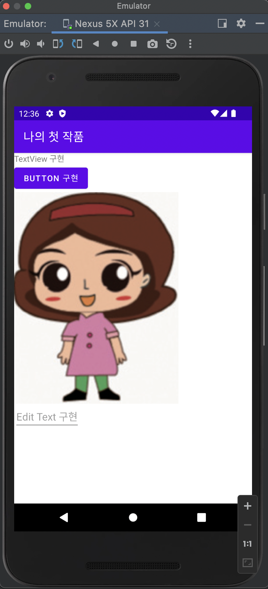


---


