## 이벤트 처리하기

이벤트를 처리하는 방법은 다양하게 있다.

### 1. View 클래스를 상속받아 처리

우선 View 클래스를 상속 받아서 처리할 것이다. View 클래스는 이벤트(터치, 드래그 등)가 발생하면 자동으로 호출되는 콜백 메서드를 지녔다. 예를 들어 사용자(User)가 화면을 터치했다면 onTouchEvent 콜백 메서드가 자동으로 호출된다.

아래는 MainActivity.java에서 View 클래스를 상속 받는 예제다.

```Java
package com.erectbranch.androidstudiobasic2;

//import ... 생략

public class MainActivity extends AppCompatActivity {

    @Override
    protected void onCreate(Bundle savedInstanceState) {
        super.onCreate(savedInstanceState);

        // View를 상속받는 MyView 클래스 객체를 생성한다.
        MyView myView = new MyView(this);
        setContentView(myView);

    }

    class MyView extends View {    // View 클래스를 상속받는 MyView 클래스를 정의

        MyView(Context context) {
            super(context);
            setBackgroundColor(Color.GREEN);
        }

        // onTouchEvent 메서드를 재정의해서 사용한다
        public boolean onTouchEvent(MotionEvent event) {

            if (event.getAction() == MotionEvent.ACTION_DOWN) {     // 사용자가 처음 눌렀을 때

                // 토스트 텍스트 박스를 띄운다. makeText(컨텍스트, TXT, 길이)
                Toast.makeText(MainActivity.this, "View 클래스를 상속받아 처리"    // View 클래스를 상속받아 만든 이벤트 처리
                        , Toast.LENGTH_SHORT).show();               // Toast.LENGTH_SHORT: 문자를 짧게 출력

            }

            return false;

        }

    }

}
```

>setContentView(myView): setContentView(myView)는 xml 파일이 아닌 View 클래스를 상속해서 생성한 myView 객체를 화면 설정으로 정한다. 참고로 이전까지 자주 보던 것은 setContentView(R.layout.activity_main)이다.

아래는 View 클래스가 가지고 있는 이벤트 처리 콜백 메서드다.

| View 클래스가 가진 이벤트 처리 콜백 메서드 ||
| --- | --- |
| onKeyDown(int, keyEvent) | Key 이벤트가 발생했을 때 호출한다 |
| onKeyUp | Key에서 손을 때면 호출한다 |
| onTrackBallEvent(MotionEvent) | Track Ball 이벤트가 발생하면 호출한다 |
| onTouchEvent(MotionEvent) | 터치 스크린 motion 이벤트가 발생하면 호출한다 |

참고로 View 클래스와 마찬가지로 Activity 클래스도 onTouchEvent() 콜백 메서드를 가지고 있다. 2개 중에서는 View 클래스의 onTouchEvent() 콜백 메서드가 우선순위가 더 높다.


---


### 2. 리스너 인터페이스 구현

리스너(listener) 인터페이스는 이벤트가 발생하면 콜백 메서드가 작동한다. View 클래스 안에 콜백 메서드를 가진 인터페이스가 있다. 인터페이스이므로 상속이 아닌 implements를 이용해 구현한다.

아래는 버튼 하나에 리스너 객체를 등록하는 예제다. 이벤트 리스너를 implements로 인터페이스를 구현하는 클래스를 만든 뒤, 이벤트 리스너 객체를 생성한다. 이후 setOnClickListener() 메서드로 뷰(위젯)에 등록할 것이다.

```xml
// activity_main.xml

<?xml version="1.0" encoding="utf-8"?>
<LinearLayout
    xmlns:android="http://schemas.android.com/apk/res/android"
    xmlns:app="http://schemas.android.com/apk/res-auto"
    xmlns:tools="http://schemas.android.com/tools"

    android:id="@+id/activity_main"
    android:layout_width="match_parent"
    android:layout_height="match_parent"
    android:paddingBottom="16dp"
    android:paddingLeft="16dp"
    android:paddingRight="16dp"
    android:paddingTop="16dp"
    tools:context=".MainActivity"
    >

    <Button
        android:id="@+id/button1"
        android:layout_width="wrap_content"
        android:layout_height="wrap_content"
        android:text="Button"
        />

</LinearLayout>
```

```Java
// MainActivity.java

package com.erectbranch.androidstudiobasic2;

//import ... 생략

public class MainActivity extends AppCompatActivity {

    // 뷰 객체
    Button button1;

    @Override
    protected void onCreate(Bundle savedInstanceState) {
        super.onCreate(savedInstanceState);
        setContentView(R.layout.activity_main);

        // 이벤트 리스너 객체 생성
        MyListener myListener1 = new MyListener();

        button1 = (Button) findViewById(R.id.button1);
        button1.setOnClickListener(myListener1);    // 뷰(위젯)에 이벤트 리스너 객체 등록

    }

    class MyListener implements View.OnClickListener {    // View 클래스를 상속받는 MyView 클래스를 정의

        public void onClick(View view) {

            Toast.makeText(MainActivity.this, "리스너 인터페이스를 구현하여 이벤트 처리"
            , Toast.LENGTH_SHORT).show();

        }

    }

}
```

OnClickListener는 View 클래스 안에 인터페이스로 정의되어 있으며, 아직 구현되지 않은 onClick 메서드를 가지고 있다. 따라서 위 예제에서 onClick() 메서드를 재정의하는 과정을 거쳤다.


---


### 3. 무명 클래스로 처리

위에서는 onClick() 같은 콜백 메서드로 이벤트를 처리했다. 하지만 메서드는 클래스나 인터페이스 안에 있어야 하며 독립적으로 존재할 수 없으므로, 매번 구현(상속)을 위한 인터페이스(클래스)를 생성해야 하는 번거로움이 생긴다. 이런 번거로움을 해결할 수 있는 방법이 무명 클래스를 이용하는 것이다.

```Java
// 리스너 객체를 등록하면서 동시에 new 연산자를 이용해 인터페이스 객체(리스너 객체)를 생성한다.
button1.setOnClickListener(new View.OnClickListener() {

    public void onClick(View view) {
        // 처리할 내용 재정의
    }
    
});
```

무명 클래스를 이용하여 이벤트를 처리하는 경우, 클래스 선언과 객체 생성을 동시에 진행한다. 이벤트 처리를 위해 button1 버튼에 setOnClickListener 메서드를 이용해서 리스너 객체를 등록한다. 이때 new 연산자를 이용해 인터페이스 객체를 동시에 생성하는 것이다. 

무명 클래스는 이름이 없고 한 번만 사용하는 경우 유효한 방법이다.

```
인터페이스 변수;
변수 = new 클래스();
```

위 과정이 무명 클래스로 간단하게 바뀐 것이다.

```
인터페이스 변수 = new 인터페이스() {
      // 실체 메서드
};    // 실행문이므로 마지막에 세미콜론을 붙여야 한다
```


---


### 3.2. 무명 클래스 간단 예제

```xml
<!-- activity_main.xml-->

<?xml version="1.0" encoding="utf-8"?>
<LinearLayout
    xmlns:android="http://schemas.android.com/apk/res/android"
    xmlns:app="http://schemas.android.com/apk/res-auto"
    xmlns:tools="http://schemas.android.com/tools"
    android:layout_width="match_parent"
    android:layout_height="match_parent"
    android:paddingBottom="16dp"
    android:paddingLeft="16dp"
    android:paddingRight="16dp"
    android:paddingTop="16dp"
    android:orientation="vertical"
    tools:context=".MainActivity"
    >

    <Button
        android:id="@+id/button1"
        android:layout_width="wrap_content"
        android:layout_height="wrap_content"
        android:text="대한민국"
        />

    <Button
        android:id="@+id/button2"
        android:layout_width="wrap_content"
        android:layout_height="wrap_content"
        android:text="영국"
        />

</LinearLayout>
```

```Java
// MainActivity.java

public class MainActivity extends AppCompatActivity {

    // 버튼
    Button button1, button2;

    @Override
    protected void onCreate(Bundle savedInstanceState) {
        super.onCreate(savedInstanceState);
        setContentView(R.layout.activity_main);

        button1 = (Button) findViewById(R.id.button1);
        button2 = (Button) findViewById(R.id.button2);

        // 무명 클래스
        button1.setOnClickListener(new View.OnClickListener() {
            @Override
            public void onClick(View view) {
                Toast.makeText(getApplicationContext(), "Seoul", Toast.LENGTH_SHORT).show();
            }
        });

        button2.setOnClickListener(new View.OnClickListener() {
            @Override
            public void onClick(View view) {
                Toast.makeText(getApplicationContext(), "London", Toast.LENGTH_SHORT).show();
            }
        });

    }

}
```

아래는 AVD에서 구동한 화면이다.

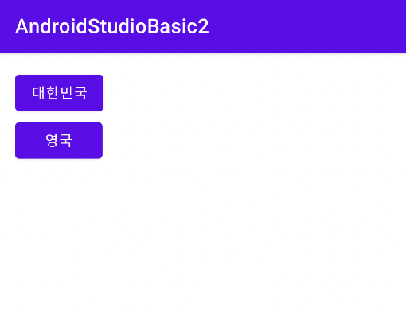

서울을 클릭 시 Seoul, 영국을 클릭 시 London 메시지가 뜬다.

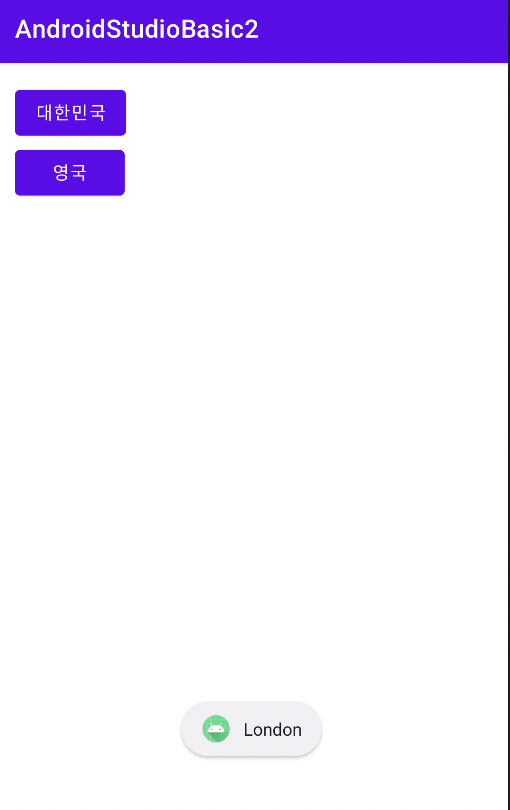


---


### 4. 하나의 리스너 객체로 여러 버튼 처리하기

switch ~ case 구문을 사용하여 어떤 버튼이 클릭되었는지를 파악하는 방법을 쓸 것이다. 

```Java
// MainActivity.java

public class MainActivity extends AppCompatActivity {

    @Override
    protected void onCreate(Bundle savedInstanceState) {
        super.onCreate(savedInstanceState);
        setContentView(R.layout.activity_main);

        button.onClickListener myClick = new Button.OnClickListener() {
            
            @Override
            public void onClick(View view) {

                switch(view.getID()) {
                    case R.id.button1:
                        Toast.makeText(getApplicationContext(), "Seoul", Toast.LENGTH_SHORT).show();
                        break;
                    case R.id.button2:
                         Toast.makeText(getApplicationContext(), "London", Toast.LENGTH_SHORT).show();
                        break;
                }

            }

        };

        findViewByID(R.id.button1).setOnClickListener(myClick);
        findViewByID(R.id.button2).setOnClickListener(myClick);

    }

}
```

OnClickListener는 static interface이기 때문에 Button.OnClickListener로 바로 접근할 수 있다. 


---


### 5. onClick 속성 이용

xml 파일에서 Button 뷰에 속성 onClick을 사용할 수 있다. onClick 속성값에 이벤트를 처리하는 메서드 이름을 적는다.

```xml
// activity_main.xml

<?xml version="1.0" encoding="utf-8"?>
<LinearLayout
    xmlns:android="http://schemas.android.com/apk/res/android"
    xmlns:app="http://schemas.android.com/apk/res-auto"
    xmlns:tools="http://schemas.android.com/tools"
    android:layout_width="match_parent"
    android:layout_height="match_parent"
    tools:context=".MainActivity"
    >

    <Button
        android:id="@+id/button1"
        android:layout_width="wrap_content"
        android:layout_height="wrap_content"
        android:text="대한민국"
        android:onClick="buttonListener1"    // onClick 속성값을 입력한다.
        />

    <Button
        android:id="@+id/button2"
        android:layout_width="wrap_content"
        android:layout_height="wrap_content"
        android:text="영국"
        android:onClick="buttonListener2"    // onClick 속성값을 입력한다.
        />

</LinearLayout>
```

```Java
// MainActivity.java

public class MainActivity extends AppCompatActivity {

    // 버튼
    Button button1, button2;

    @Override
    protected void onCreate(Bundle savedInstanceState) {
        super.onCreate(savedInstanceState);
        setContentView(R.layout.activity_main);
    }

    public void buttonListener1(View view) {
        Toast.makeText(getApplicationContext(), "Seoul", Toast.LENGTH_LONG).show();
    }

    public void buttonListener2(View view) {
        Toast.makeText(getApplicationContext(), "London", Toast.LENGTH_LONG).show();
    }

}
```


---


## 간단한 덧셈 계산기 만들기

두 숫자를 받아 덧셈한 값을 보여주는 계산기를 만들 것이다.

각각은 하위 LinearLayout으로 구성하며 내부는 수평하게 배치한다. 그리고 각각의 하위 LinearLayout을 수직하게 배치한다.

* TextView EditText(첫 번째 숫자__입력__)

* TextView EditText(두 번째 숫자__입력__)

* TextView TextView(결과: (결과값))

* ImageView Button (계산기 그림  결과 확인 버튼)


```xml
<!-- activity_main.xml -->

<?xml version="1.0" encoding="utf-8"?>
<LinearLayout
    xmlns:android="http://schemas.android.com/apk/res/android"
    xmlns:app="http://schemas.android.com/apk/res-auto"
    xmlns:tools="http://schemas.android.com/tools"
    android:layout_width="match_parent"
    android:layout_height="match_parent"
    android:orientation="vertical"
    tools:context=".MainActivity"
    >

    <!-- 첫 번째 숫자 입력 -->
    <LinearLayout
        android:layout_width="match_parent"
        android:layout_height="wrap_content"
        android:orientation="horizontal">

        <TextView
            android:layout_width="wrap_content"
            android:layout_height="wrap_content"
            android:hint="첫 번째 숫자"
            />

        <EditText
            android:id="@+id/edittext1"
            android:layout_width="wrap_content"
            android:layout_height="wrap_content"
            android:hint="여기에 입력하세요."
            />

    </LinearLayout>

    <!-- 두 번째 숫자 입력 -->
    <LinearLayout
        android:layout_width="match_parent"
        android:layout_height="wrap_content"
        android:orientation="horizontal">

        <TextView
            android:layout_width="wrap_content"
            android:layout_height="wrap_content"
            android:hint="두 번째 숫자"
            />

        <EditText
            android:id="@+id/edittext2"
            android:layout_width="wrap_content"
            android:layout_height="wrap_content"
            android:hint="여기에 입력하세요."
            />

    </LinearLayout>

    <!-- 정답을 보여주는 란 -->
    <LinearLayout
        android:layout_width="match_parent"
        android:layout_height="wrap_content"
        android:orientation="horizontal">

        <TextView
            android:layout_width="wrap_content"
            android:layout_height="wrap_content"
            android:layout_marginTop="30dp"
            android:text="결과: "
            android:textSize="30dp"
            />

        <TextView
            android:id="@+id/textview1"
            android:layout_width="wrap_content"
            android:layout_height="wrap_content"
            android:layout_marginTop="30dp"
            android:text="0"
            android:textSize="30dp"
            />

    </LinearLayout>

    <!-- 계산기 이미지와 정답 확인 버튼 -->
    <LinearLayout
        android:layout_width="match_parent"
        android:layout_height="wrap_content"
        android:orientation="horizontal">

        <ImageView
            android:layout_width="wrap_content"
            android:layout_height="wrap_content"
            android:layout_marginTop="50dp"
            android:src="@drawable/cal"
            />

        <Button
            android:id="@+id/button1"
            android:layout_width="wrap_content"
            android:layout_height="wrap_content"
            android:layout_gravity="center"
            android:layout_marginTop="50dp"
            android:text="결과 확인"
            />

    </LinearLayout>


</LinearLayout>
```

```Java
// MainActivity.java

public class MainActivity extends AppCompatActivity {

    EditText edittext1, edittext2;
    TextView textview1;
    Button button1;
    String input1, input2;
    int sum;

    @Override
    protected void onCreate(Bundle savedInstanceState) {
        super.onCreate(savedInstanceState);
        setContentView(R.layout.activity_main);

        edittext1 = (EditText) findViewById(R.id.edittext1);
        edittext2 = (EditText) findViewById(R.id.edittext2);
        textview1 = (TextView) findViewById(R.id.textview1);
        button1 = (Button) findViewById(R.id.button1);

        button1.setOnClickListener(new View.OnClickListener() {
            @Override
            public void onClick(View view) {
                input1 = edittext1.getText().toString();
                input2 = edittext2.getText().toString();
                sum = Integer.parseInt(input1) + Integer.parseInt(input2);
                textview1.setText(Integer.toString(sum));
            }
        });

    }

}
```

실행 화면은 다음과 같다.

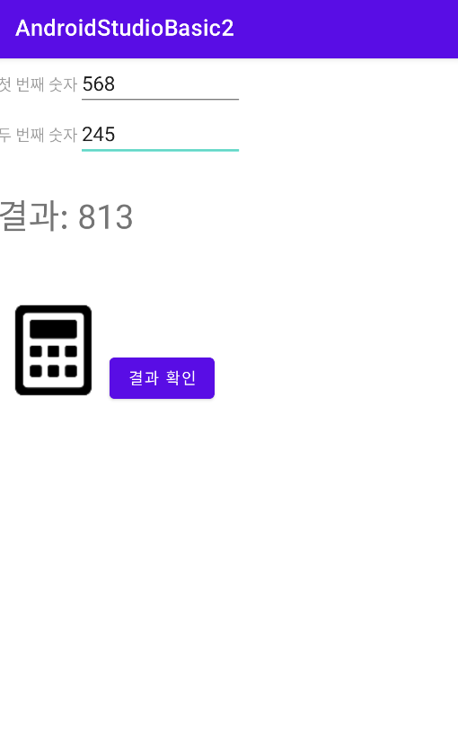

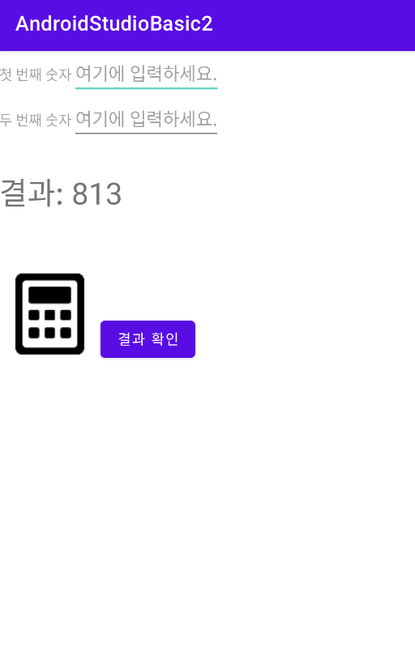


---


## 화면 전환 만들기

Activity는 기본적으로 한 화면만 처리한다. 따라서 다른 화면으로 전환할 때는 또 다른 Activity가 필요하다. 전환할 화면으로 NextPage.java 자바 클래스를 생성할 것이다.

화면을 전환하는 데 필요한 개념은 intent다. Intent 클래스 객체를 생성하고 startActivity() 메서드를 사용한다. 

```Java
    button1.setOnClickListener(new View.OnClickListener() {

        @override
        public void onClick(View view) {

            // 화면 전환. Intent 클래스 객체를 생성한다.
            // 두 번째 패러미터로 화면 전환할 클래스를 적는다.
            Intent intent1 = new Intent(getApplicationContext(), NextPage.class);
            // startActivity 메서드를 사용.
            startActivity(intent1);

        }

    });
```

Intent intent1 = new Intent(getApplicationContext(), NextPage.class); 문장에서 Intent 클래스 생성자의 두 번째 패러미터에 이동할 액티비티 클래스명을 적는다.(위에서는 NextPage 클래스로 전환한다.)

```xml
<!-- activity_main.xml -->

<?xml version="1.0" encoding="utf-8"?>
<LinearLayout
    xmlns:android="http://schemas.android.com/apk/res/android"
    xmlns:tools="http://schemas.android.com/tools"
    android:layout_width="match_parent"
    android:layout_height="match_parent"
    android:paddingBottom="16dp"
    android:paddingLeft="16dp"
    android:paddingRight="16dp"
    android:paddingTop="16dp"
    android:orientation="vertical"
    tools:context=".MainActivity"
    >

    <TextView
        android:layout_width="wrap_content"
        android:layout_height="wrap_content"
        android:text="메인 화면"
        />

    <Button
        android:id="@+id/button1"
        android:layout_width="wrap_content"
        android:layout_height="wrap_content"
        android:text="캐릭터 소개"
        />

</LinearLayout>
```

layout 폴더에 sub1.xml 파일을 추가로 만든다.([New] - [Layout resource file]을 선택해서 생성) 이는 전환한 화면의 레이아웃이다.

```xml
<!-- sub1.xml -->

<?xml version="1.0" encoding="utf-8"?>
<LinearLayout
    xmlns:android="http://schemas.android.com/apk/res/android"
    xmlns:tools="http://schemas.android.com/tools"
    android:layout_width="match_parent"
    android:layout_height="match_parent"
    android:orientation="vertical"
    tools:context=".MainActivity"
    >

    <TextView
        android:layout_width="wrap_content"
        android:layout_height="wrap_content"
        android:text="태권브이입니다"
        />

    <ImageView
        android:layout_width="wrap_content"
        android:layout_height="wrap_content"
        android:src="@drawable/taekwonv"
        />

    <Button
        style="?android:buttonStyleSmall"
        android:id="@+id/button1"
        android:layout_width="wrap_content"
        android:layout_height="wrap_content"
        android:text="돌아가기"
        android:layout_gravity="center"
        />

</LinearLayout>
```

아래는 MainActivity.java 파일이다.

```Java
// MainActivity.java

package com.erectbranch.androidstudiobasic2;

import androidx.appcompat.app.AppCompatActivity;
import android.content.Intent;
import android.os.Bundle;
import android.view.View;
import android.widget.Button;

public class MainActivity extends AppCompatActivity {

    Button button1;

    @Override
    protected void onCreate(Bundle savedInstanceState) {
        super.onCreate(savedInstanceState);
        setContentView(R.layout.activity_main);

        button1 = (Button) findViewById(R.id.button1);
        button1.setOnClickListener(new View.OnClickListener() {
            @Override
            public void onClick(View view) {
                Intent intent1 = new Intent(getApplicationContext(), NextPage.class);
                startActivity(intent1);
            }
        });

    }

}
```

이제 MainActivity.java가 위치한 디렉터리에 전환할 화면인 NextPage.class를 만든다.([New] - [Java Class])

```Java
// NextPage.java

package com.erectbranch.androidstudiobasic2;

import androidx.appcompat.app.AppCompatActivity;
import android.os.Bundle;
import android.view.View;
import android.widget.Button;

public class NextPage extends AppCompatActivity {

    Button button1;

    protected void onCreate(Bundle savedInstanceState) {
        super.onCreate(savedInstanceState);
        setContentView(R.layout.sub1);

        button1 = (Button) findViewById(R.id.button1);
        button1.setOnClickListener(new View.OnClickListener() {
            
            @Override
            public void onClick(View view) {
                finish();    // 현재 실행 중인 Activity를 종료한다.
            }
            
        });
        
    }
    
}
```

finish()로 끝내지 않고 Intent를 사용해서 MainActivity로 다시 화면을 전환해도 된다.

다만 Intent를 이용해 다시 MainActivity로 화면을 전환할 경우 스택에 계속해서 Acitivity가 쌓이게 된다. 처음 MainActivity에서 NextPage로 화면 전환을 했을 때, MainActivity 위로 NextPage 스택이 쌓인 것이다. 그 다음 NextPage에서 MainActivity로 화면 전환을 한다면 또 NextPage 위로 MainActivity 스택이 쌓인다.(**즉, 기존의 MainActivity로 돌아가는 것이 아니라, 새로운 MainActivity를 생성한다.**)

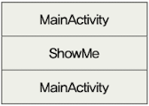

따라서 액티비티가 계속 쌓이기 때문에 이런 방식의 코드는 바람직하지 않다.

```Java
        button1.setOnClickListener(new View.OnClickListener() {
            
            @Override
            public void onClick(View view) {
                Intent intent1 = new Intent(getApplicationContext(), MainActivity.class);
                startActivity(intent1);
            }
            
        });
```

이렇게 새로운 Activity를 만든 경우, 안드로이드 운영체제가 알 수 있도록 **반드시 Manifest 파일에 선언**해야 한다.(AndroidManifest.xml 파일)

```xml
<activity android:name=".NextPage"></activity>
```

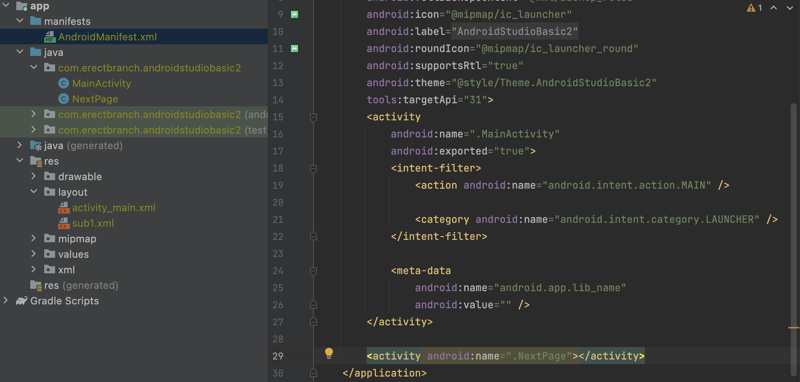

아래는 AVD에서 앱을 실행한 화면이다.

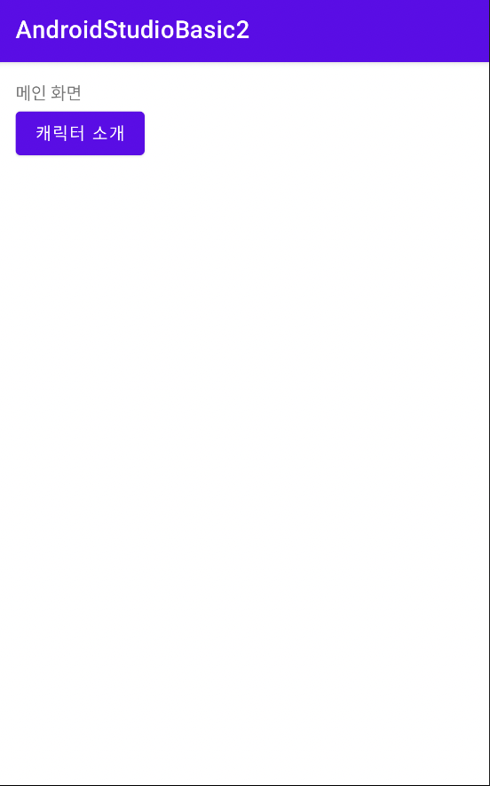

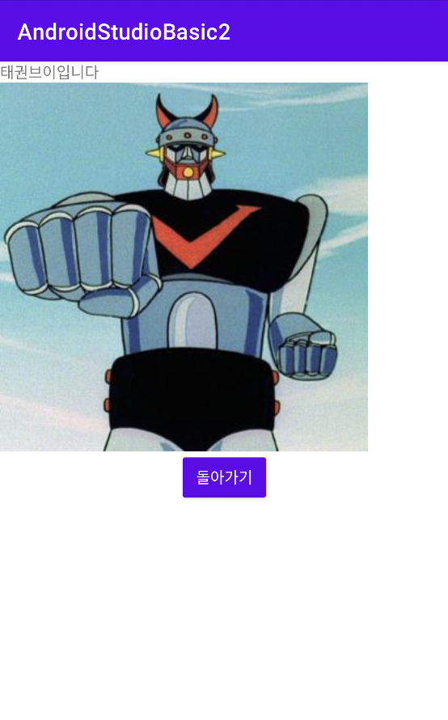


---


## 화면 가로 세로 고정하기

휴대폰 단말기를 가로 혹은 세로로 고정하여 사용해야 하는 경우를 설정할 것이다. [manifests] 디렉터리에 있는 androidManifest.xml 파일에서 screenOrientation 속성을 사용하여 화면 방향을 설정할 수 있다. Activity 클래스 파일은 각각 하나의 화면을 구성하므로, 각각에 screenOrientation 속성을 설정해야 한다.

아래는 screenOrientation 속성값이다.

| 속성값 | 기능 |
| --- | --- |
| portrait | 화면을 세로로 설정한다 |
| landscape | 화면을 가로로 설정한다 |

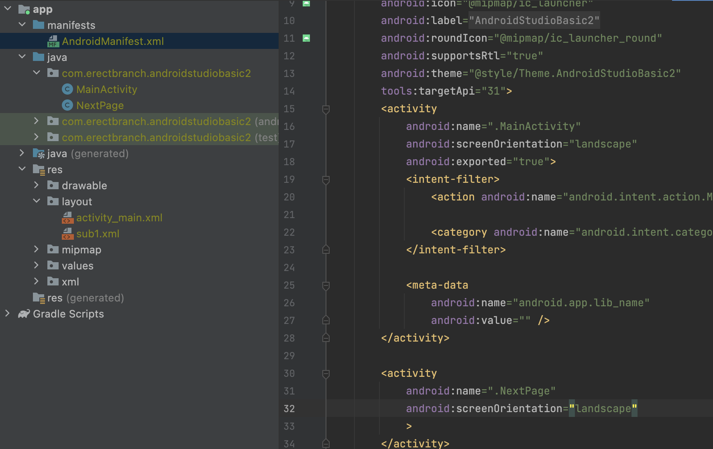

아래는 AVD에서 구동한 화면이다.

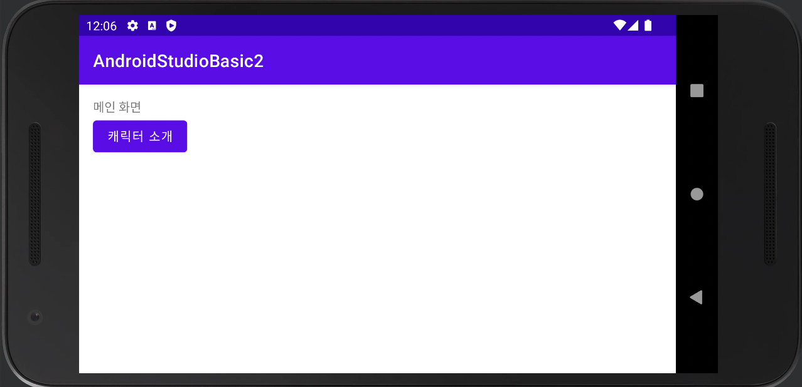

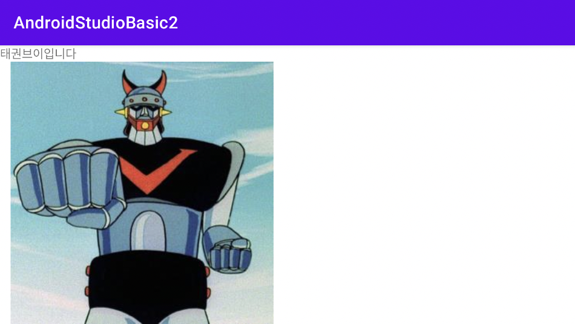


---


## View 클래스 활용


### View 클래스를 활용하여 도형, 텍스트 표시하기

View 클래스를 상속 받으면 텍스트, 이미지, 도형(점, 선, 사각형, 원 등)을 원하는 위치에 쉽게 표시할 수 있다. setContextView 메서드를 이용하여 xml 파일이 아닌 View 클래스를 상속 받은 나만의 클래스를 화면으로 설정하면 된다.


