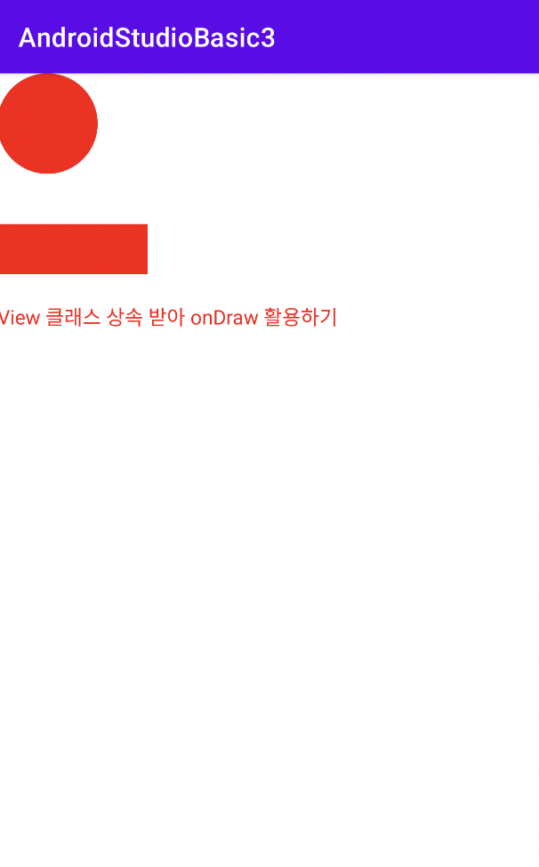
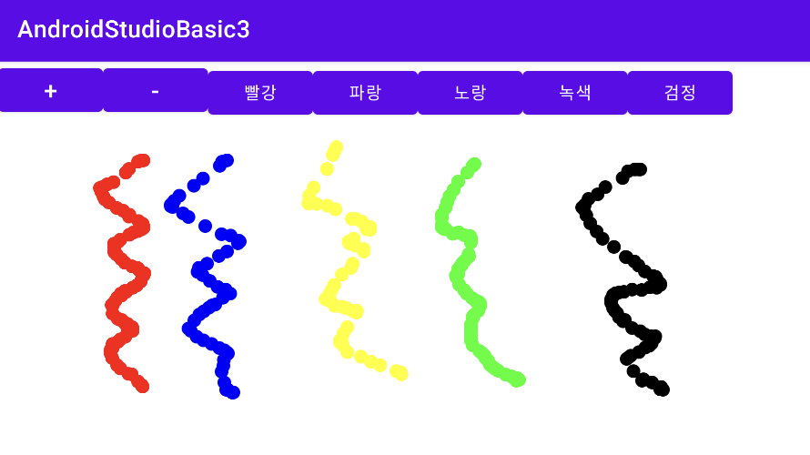
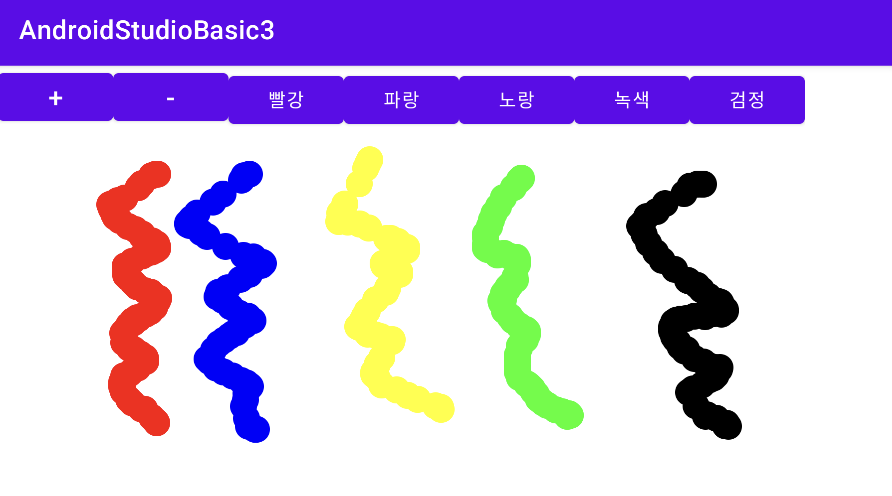
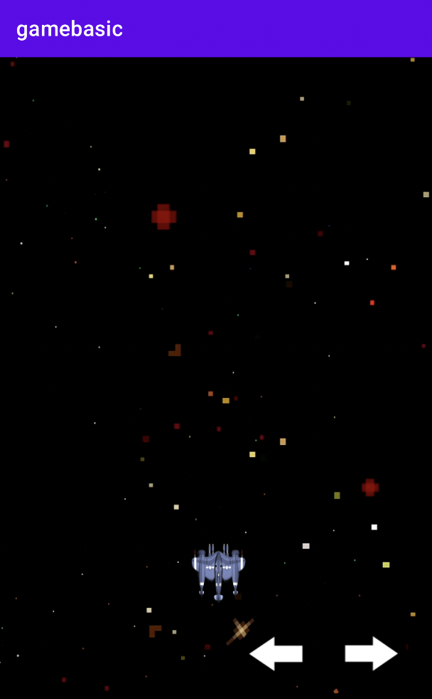
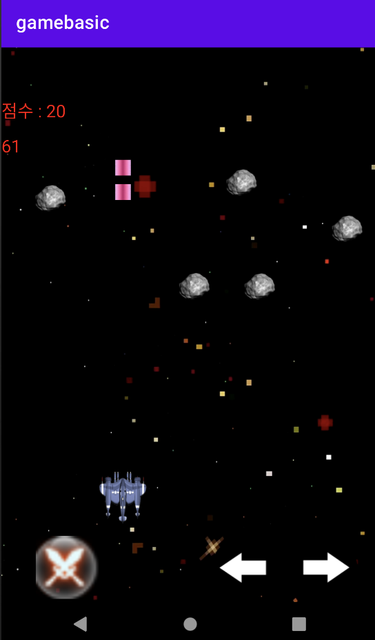

## 이벤트 처리하기

이벤트를 처리하는 방법은 다양하게 있다.

### 1. View 클래스를 상속받아 처리

우선 View 클래스를 상속 받아서 처리할 것이다. View 클래스는 이벤트(터치, 드래그 등)가 발생하면 자동으로 호출되는 콜백 메서드를 지녔다. 예를 들어 사용자(User)가 화면을 터치했다면 onTouchEvent 콜백 메서드가 자동으로 호출된다.

아래는 MainActivity.java에서 View 클래스를 상속 받는 예제다.

```Java
package com.erectbranch.androidstudiobasic2;

//import ... 생략

public class MainActivity extends AppCompatActivity {

    @Override
    protected void onCreate(Bundle savedInstanceState) {
        super.onCreate(savedInstanceState);

        // View를 상속받는 MyView 클래스 객체를 생성한다.
        MyView myView = new MyView(this);
        setContentView(myView);

    }

    class MyView extends View {    // View 클래스를 상속받는 MyView 클래스를 정의

        MyView(Context context) {
            super(context);
            setBackgroundColor(Color.GREEN);
        }

        // onTouchEvent 메서드를 재정의해서 사용한다
        public boolean onTouchEvent(MotionEvent event) {

            if (event.getAction() == MotionEvent.ACTION_DOWN) {     // 사용자가 처음 눌렀을 때

                // 토스트 텍스트 박스를 띄운다. makeText(컨텍스트, TXT, 길이)
                Toast.makeText(MainActivity.this, "View 클래스를 상속받아 처리"    // View 클래스를 상속받아 만든 이벤트 처리
                        , Toast.LENGTH_SHORT).show();               // Toast.LENGTH_SHORT: 문자를 짧게 출력

            }

            return false;

        }

    }

}
```

>setContentView(myView): setContentView(myView)는 xml 파일이 아닌 View 클래스를 상속해서 생성한 myView 객체를 화면 설정으로 정한다. 참고로 이전까지 자주 보던 것은 setContentView(R.layout.activity_main)이다.

아래는 View 클래스가 가지고 있는 이벤트 처리 콜백 메서드다.

| View 클래스가 가진 이벤트 처리 콜백 메서드 ||
| --- | --- |
| onKeyDown(int, keyEvent) | Key 이벤트가 발생했을 때 호출한다 |
| onKeyUp | Key에서 손을 때면 호출한다 |
| onTrackBallEvent(MotionEvent) | Track Ball 이벤트가 발생하면 호출한다 |
| onTouchEvent(MotionEvent) | 터치 스크린 motion 이벤트가 발생하면 호출한다 |

참고로 View 클래스와 마찬가지로 Activity 클래스도 onTouchEvent() 콜백 메서드를 가지고 있다. 2개 중에서는 View 클래스의 onTouchEvent() 콜백 메서드가 우선순위가 더 높다.


---


### 2. 리스너 인터페이스 구현

리스너(listener) 인터페이스는 이벤트가 발생하면 콜백 메서드가 작동한다. View 클래스 안에 콜백 메서드를 가진 인터페이스가 있다. 인터페이스이므로 상속이 아닌 implements를 이용해 구현한다.

아래는 버튼 하나에 리스너 객체를 등록하는 예제다. 이벤트 리스너를 implements로 인터페이스를 구현하는 클래스를 만든 뒤, 이벤트 리스너 객체를 생성한다. 이후 setOnClickListener() 메서드로 뷰(위젯)에 등록할 것이다.

```xml
// activity_main.xml

<?xml version="1.0" encoding="utf-8"?>
<LinearLayout
    xmlns:android="http://schemas.android.com/apk/res/android"
    xmlns:app="http://schemas.android.com/apk/res-auto"
    xmlns:tools="http://schemas.android.com/tools"

    android:id="@+id/activity_main"
    android:layout_width="match_parent"
    android:layout_height="match_parent"
    android:paddingBottom="16dp"
    android:paddingLeft="16dp"
    android:paddingRight="16dp"
    android:paddingTop="16dp"
    tools:context=".MainActivity"
    >

    <Button
        android:id="@+id/button1"
        android:layout_width="wrap_content"
        android:layout_height="wrap_content"
        android:text="Button"
        />

</LinearLayout>
```

```Java
// MainActivity.java

package com.erectbranch.androidstudiobasic2;

//import ... 생략

public class MainActivity extends AppCompatActivity {

    // 뷰 객체
    Button button1;

    @Override
    protected void onCreate(Bundle savedInstanceState) {
        super.onCreate(savedInstanceState);
        setContentView(R.layout.activity_main);

        // 이벤트 리스너 객체 생성
        MyListener myListener1 = new MyListener();

        button1 = (Button) findViewById(R.id.button1);
        button1.setOnClickListener(myListener1);    // 뷰(위젯)에 이벤트 리스너 객체 등록

    }

    class MyListener implements View.OnClickListener {    // View 클래스를 상속받는 MyView 클래스를 정의

        public void onClick(View view) {

            Toast.makeText(MainActivity.this, "리스너 인터페이스를 구현하여 이벤트 처리"
            , Toast.LENGTH_SHORT).show();

        }

    }

}
```

OnClickListener는 View 클래스 안에 인터페이스로 정의되어 있으며, 아직 구현되지 않은 onClick 메서드를 가지고 있다. 따라서 위 예제에서 onClick() 메서드를 재정의하는 과정을 거쳤다.


---


### 3. 무명 클래스로 처리

위에서는 onClick() 같은 콜백 메서드로 이벤트를 처리했다. 하지만 메서드는 클래스나 인터페이스 안에 있어야 하며 독립적으로 존재할 수 없으므로, 매번 구현(상속)을 위한 인터페이스(클래스)를 생성해야 하는 번거로움이 생긴다. 이런 번거로움을 해결할 수 있는 방법이 무명 클래스를 이용하는 것이다.

```Java
// 리스너 객체를 등록하면서 동시에 new 연산자를 이용해 인터페이스 객체(리스너 객체)를 생성한다.
button1.setOnClickListener(new View.OnClickListener() {

    public void onClick(View view) {
        // 처리할 내용 재정의
    }
    
});
```

무명 클래스를 이용하여 이벤트를 처리하는 경우, 클래스 선언과 객체 생성을 동시에 진행한다. 이벤트 처리를 위해 button1 버튼에 setOnClickListener 메서드를 이용해서 리스너 객체를 등록한다. 이때 new 연산자를 이용해 인터페이스 객체를 동시에 생성하는 것이다. 

무명 클래스는 이름이 없고 한 번만 사용하는 경우 유효한 방법이다.

```
인터페이스 변수;
변수 = new 클래스();
```

위 과정이 무명 클래스로 간단하게 바뀐 것이다.

```
인터페이스 변수 = new 인터페이스() {
      // 실체 메서드
};    // 실행문이므로 마지막에 세미콜론을 붙여야 한다
```


---


### 3.2. 무명 클래스 간단 예제

```xml
<!-- activity_main.xml-->

<?xml version="1.0" encoding="utf-8"?>
<LinearLayout
    xmlns:android="http://schemas.android.com/apk/res/android"
    xmlns:app="http://schemas.android.com/apk/res-auto"
    xmlns:tools="http://schemas.android.com/tools"
    android:layout_width="match_parent"
    android:layout_height="match_parent"
    android:paddingBottom="16dp"
    android:paddingLeft="16dp"
    android:paddingRight="16dp"
    android:paddingTop="16dp"
    android:orientation="vertical"
    tools:context=".MainActivity"
    >

    <Button
        android:id="@+id/button1"
        android:layout_width="wrap_content"
        android:layout_height="wrap_content"
        android:text="대한민국"
        />

    <Button
        android:id="@+id/button2"
        android:layout_width="wrap_content"
        android:layout_height="wrap_content"
        android:text="영국"
        />

</LinearLayout>
```

```Java
// MainActivity.java

public class MainActivity extends AppCompatActivity {

    // 버튼
    Button button1, button2;

    @Override
    protected void onCreate(Bundle savedInstanceState) {
        super.onCreate(savedInstanceState);
        setContentView(R.layout.activity_main);

        button1 = (Button) findViewById(R.id.button1);
        button2 = (Button) findViewById(R.id.button2);

        // 무명 클래스
        button1.setOnClickListener(new View.OnClickListener() {
            @Override
            public void onClick(View view) {
                Toast.makeText(getApplicationContext(), "Seoul", Toast.LENGTH_SHORT).show();
            }
        });

        button2.setOnClickListener(new View.OnClickListener() {
            @Override
            public void onClick(View view) {
                Toast.makeText(getApplicationContext(), "London", Toast.LENGTH_SHORT).show();
            }
        });

    }

}
```

아래는 AVD에서 구동한 화면이다.


서울을 클릭 시 Seoul, 영국을 클릭 시 London 메시지가 뜬다.


---


### 4. 하나의 리스너 객체로 여러 버튼 처리하기

switch ~ case 구문을 사용하여 어떤 버튼이 클릭되었는지를 파악하는 방법을 쓸 것이다. 

```Java
// MainActivity.java

public class MainActivity extends AppCompatActivity {

    @Override
    protected void onCreate(Bundle savedInstanceState) {
        super.onCreate(savedInstanceState);
        setContentView(R.layout.activity_main);

        button.onClickListener myClick = new Button.OnClickListener() {
            
            @Override
            public void onClick(View view) {

                switch(view.getID()) {
                    case R.id.button1:
                        Toast.makeText(getApplicationContext(), "Seoul", Toast.LENGTH_SHORT).show();
                        break;
                    case R.id.button2:
                         Toast.makeText(getApplicationContext(), "London", Toast.LENGTH_SHORT).show();
                        break;
                }

            }

        };

        findViewByID(R.id.button1).setOnClickListener(myClick);
        findViewByID(R.id.button2).setOnClickListener(myClick);

    }

}
```

OnClickListener는 static interface이기 때문에 Button.OnClickListener로 바로 접근할 수 있다. 


---


### 5. onClick 속성 이용

xml 파일에서 Button 뷰에 속성 onClick을 사용할 수 있다. onClick 속성값에 이벤트를 처리하는 메서드 이름을 적는다.

```xml
// activity_main.xml

<?xml version="1.0" encoding="utf-8"?>
<LinearLayout
    xmlns:android="http://schemas.android.com/apk/res/android"
    xmlns:app="http://schemas.android.com/apk/res-auto"
    xmlns:tools="http://schemas.android.com/tools"
    android:layout_width="match_parent"
    android:layout_height="match_parent"
    tools:context=".MainActivity"
    >

    <Button
        android:id="@+id/button1"
        android:layout_width="wrap_content"
        android:layout_height="wrap_content"
        android:text="대한민국"
        android:onClick="buttonListener1"    // onClick 속성값을 입력한다.
        />

    <Button
        android:id="@+id/button2"
        android:layout_width="wrap_content"
        android:layout_height="wrap_content"
        android:text="영국"
        android:onClick="buttonListener2"    // onClick 속성값을 입력한다.
        />

</LinearLayout>
```

```Java
// MainActivity.java

public class MainActivity extends AppCompatActivity {

    // 버튼
    Button button1, button2;

    @Override
    protected void onCreate(Bundle savedInstanceState) {
        super.onCreate(savedInstanceState);
        setContentView(R.layout.activity_main);
    }

    public void buttonListener1(View view) {
        Toast.makeText(getApplicationContext(), "Seoul", Toast.LENGTH_LONG).show();
    }

    public void buttonListener2(View view) {
        Toast.makeText(getApplicationContext(), "London", Toast.LENGTH_LONG).show();
    }

}
```


---


## 간단한 덧셈 계산기 만들기

두 숫자를 받아 덧셈한 값을 보여주는 계산기를 만들 것이다.

각각은 하위 LinearLayout으로 구성하며 내부는 수평하게 배치한다. 그리고 각각의 하위 LinearLayout을 수직하게 배치한다.

* TextView EditText(첫 번째 숫자__입력__)

* TextView EditText(두 번째 숫자__입력__)

* TextView TextView(결과: (결과값))

* ImageView Button (계산기 그림  결과 확인 버튼)


```xml
<!-- activity_main.xml -->

<?xml version="1.0" encoding="utf-8"?>
<LinearLayout
    xmlns:android="http://schemas.android.com/apk/res/android"
    xmlns:app="http://schemas.android.com/apk/res-auto"
    xmlns:tools="http://schemas.android.com/tools"
    android:layout_width="match_parent"
    android:layout_height="match_parent"
    android:orientation="vertical"
    tools:context=".MainActivity"
    >

    <!-- 첫 번째 숫자 입력 -->
    <LinearLayout
        android:layout_width="match_parent"
        android:layout_height="wrap_content"
        android:orientation="horizontal">

        <TextView
            android:layout_width="wrap_content"
            android:layout_height="wrap_content"
            android:hint="첫 번째 숫자"
            />

        <EditText
            android:id="@+id/edittext1"
            android:layout_width="wrap_content"
            android:layout_height="wrap_content"
            android:hint="여기에 입력하세요."
            />

    </LinearLayout>

    <!-- 두 번째 숫자 입력 -->
    <LinearLayout
        android:layout_width="match_parent"
        android:layout_height="wrap_content"
        android:orientation="horizontal">

        <TextView
            android:layout_width="wrap_content"
            android:layout_height="wrap_content"
            android:hint="두 번째 숫자"
            />

        <EditText
            android:id="@+id/edittext2"
            android:layout_width="wrap_content"
            android:layout_height="wrap_content"
            android:hint="여기에 입력하세요."
            />

    </LinearLayout>

    <!-- 정답을 보여주는 란 -->
    <LinearLayout
        android:layout_width="match_parent"
        android:layout_height="wrap_content"
        android:orientation="horizontal">

        <TextView
            android:layout_width="wrap_content"
            android:layout_height="wrap_content"
            android:layout_marginTop="30dp"
            android:text="결과: "
            android:textSize="30dp"
            />

        <TextView
            android:id="@+id/textview1"
            android:layout_width="wrap_content"
            android:layout_height="wrap_content"
            android:layout_marginTop="30dp"
            android:text="0"
            android:textSize="30dp"
            />

    </LinearLayout>

    <!-- 계산기 이미지와 정답 확인 버튼 -->
    <LinearLayout
        android:layout_width="match_parent"
        android:layout_height="wrap_content"
        android:orientation="horizontal">

        <ImageView
            android:layout_width="wrap_content"
            android:layout_height="wrap_content"
            android:layout_marginTop="50dp"
            android:src="@drawable/cal"
            />

        <Button
            android:id="@+id/button1"
            android:layout_width="wrap_content"
            android:layout_height="wrap_content"
            android:layout_gravity="center"
            android:layout_marginTop="50dp"
            android:text="결과 확인"
            />

    </LinearLayout>


</LinearLayout>
```

```Java
// MainActivity.java

public class MainActivity extends AppCompatActivity {

    EditText edittext1, edittext2;
    TextView textview1;
    Button button1;
    String input1, input2;
    int sum;

    @Override
    protected void onCreate(Bundle savedInstanceState) {
        super.onCreate(savedInstanceState);
        setContentView(R.layout.activity_main);

        edittext1 = (EditText) findViewById(R.id.edittext1);
        edittext2 = (EditText) findViewById(R.id.edittext2);
        textview1 = (TextView) findViewById(R.id.textview1);
        button1 = (Button) findViewById(R.id.button1);

        button1.setOnClickListener(new View.OnClickListener() {
            @Override
            public void onClick(View view) {
                input1 = edittext1.getText().toString();
                input2 = edittext2.getText().toString();
                sum = Integer.parseInt(input1) + Integer.parseInt(input2);
                textview1.setText(Integer.toString(sum));
            }
        });

    }

}
```

실행 화면은 다음과 같다.


---


## 화면 전환 만들기

Activity는 기본적으로 한 화면만 처리한다. 따라서 다른 화면으로 전환할 때는 또 다른 Activity가 필요하다. 전환할 화면으로 NextPage.java 자바 클래스를 생성할 것이다.

화면을 전환하는 데 필요한 개념은 intent다. Intent 클래스 객체를 생성하고 startActivity() 메서드를 사용한다. 

```Java
    button1.setOnClickListener(new View.OnClickListener() {

        @override
        public void onClick(View view) {

            // 화면 전환. Intent 클래스 객체를 생성한다.
            // 두 번째 패러미터로 화면 전환할 클래스를 적는다.
            Intent intent1 = new Intent(getApplicationContext(), NextPage.class);
            // startActivity 메서드를 사용.
            startActivity(intent1);

        }

    });
```

Intent intent1 = new Intent(getApplicationContext(), NextPage.class); 문장에서 Intent 클래스 생성자의 두 번째 패러미터에 이동할 액티비티 클래스명을 적는다.(위에서는 NextPage 클래스로 전환한다.)

```xml
<!-- activity_main.xml -->

<?xml version="1.0" encoding="utf-8"?>
<LinearLayout
    xmlns:android="http://schemas.android.com/apk/res/android"
    xmlns:tools="http://schemas.android.com/tools"
    android:layout_width="match_parent"
    android:layout_height="match_parent"
    android:paddingBottom="16dp"
    android:paddingLeft="16dp"
    android:paddingRight="16dp"
    android:paddingTop="16dp"
    android:orientation="vertical"
    tools:context=".MainActivity"
    >

    <TextView
        android:layout_width="wrap_content"
        android:layout_height="wrap_content"
        android:text="메인 화면"
        />

    <Button
        android:id="@+id/button1"
        android:layout_width="wrap_content"
        android:layout_height="wrap_content"
        android:text="캐릭터 소개"
        />

</LinearLayout>
```

layout 폴더에 sub1.xml 파일을 추가로 만든다.([New] - [Layout resource file]을 선택해서 생성) 이는 전환한 화면의 레이아웃이다.

```xml
<!-- sub1.xml -->

<?xml version="1.0" encoding="utf-8"?>
<LinearLayout
    xmlns:android="http://schemas.android.com/apk/res/android"
    xmlns:tools="http://schemas.android.com/tools"
    android:layout_width="match_parent"
    android:layout_height="match_parent"
    android:orientation="vertical"
    tools:context=".MainActivity"
    >

    <TextView
        android:layout_width="wrap_content"
        android:layout_height="wrap_content"
        android:text="태권브이입니다"
        />

    <ImageView
        android:layout_width="wrap_content"
        android:layout_height="wrap_content"
        android:src="@drawable/taekwonv"
        />

    <Button
        style="?android:buttonStyleSmall"
        android:id="@+id/button1"
        android:layout_width="wrap_content"
        android:layout_height="wrap_content"
        android:text="돌아가기"
        android:layout_gravity="center"
        />

</LinearLayout>
```

아래는 MainActivity.java 파일이다.

```Java
// MainActivity.java

package com.erectbranch.androidstudiobasic2;

import androidx.appcompat.app.AppCompatActivity;
import android.content.Intent;
import android.os.Bundle;
import android.view.View;
import android.widget.Button;

public class MainActivity extends AppCompatActivity {

    Button button1;

    @Override
    protected void onCreate(Bundle savedInstanceState) {
        super.onCreate(savedInstanceState);
        setContentView(R.layout.activity_main);

        button1 = (Button) findViewById(R.id.button1);
        button1.setOnClickListener(new View.OnClickListener() {
            @Override
            public void onClick(View view) {
                Intent intent1 = new Intent(getApplicationContext(), NextPage.class);
                startActivity(intent1);
            }
        });

    }

}
```

이제 MainActivity.java가 위치한 디렉터리에 전환할 화면인 NextPage.class를 만든다.([New] - [Java Class])

```Java
// NextPage.java

package com.erectbranch.androidstudiobasic2;

import androidx.appcompat.app.AppCompatActivity;
import android.os.Bundle;
import android.view.View;
import android.widget.Button;

public class NextPage extends AppCompatActivity {

    Button button1;

    protected void onCreate(Bundle savedInstanceState) {
        super.onCreate(savedInstanceState);
        setContentView(R.layout.sub1);

        button1 = (Button) findViewById(R.id.button1);
        button1.setOnClickListener(new View.OnClickListener() {
            
            @Override
            public void onClick(View view) {
                finish();    // 현재 실행 중인 Activity를 종료한다.
            }
            
        });
        
    }
    
}
```

finish()로 끝내지 않고 Intent를 사용해서 MainActivity로 다시 화면을 전환해도 된다.

다만 Intent를 이용해 다시 MainActivity로 화면을 전환할 경우 스택에 계속해서 Acitivity가 쌓이게 된다. 처음 MainActivity에서 NextPage로 화면 전환을 했을 때, MainActivity 위로 NextPage 스택이 쌓인 것이다. 그 다음 NextPage에서 MainActivity로 화면 전환을 한다면 또 NextPage 위로 MainActivity 스택이 쌓인다.(**즉, 기존의 MainActivity로 돌아가는 것이 아니라, 새로운 MainActivity를 생성한다.**)


따라서 액티비티가 계속 쌓이기 때문에 이런 방식의 코드는 바람직하지 않다.

```Java
        button1.setOnClickListener(new View.OnClickListener() {
            
            @Override
            public void onClick(View view) {
                Intent intent1 = new Intent(getApplicationContext(), MainActivity.class);
                startActivity(intent1);
            }
            
        });
```

이렇게 새로운 Activity를 만든 경우, 안드로이드 운영체제가 알 수 있도록 **반드시 Manifest 파일에 선언**해야 한다.(AndroidManifest.xml 파일)

```xml
<activity android:name=".NextPage"></activity>
```


아래는 AVD에서 앱을 실행한 화면이다.


---


## 화면 가로 세로 고정하기

휴대폰 단말기를 가로 혹은 세로로 고정하여 사용해야 하는 경우를 설정할 것이다. [manifests] 디렉터리에 있는 androidManifest.xml 파일에서 screenOrientation 속성을 사용하여 화면 방향을 설정할 수 있다. Activity 클래스 파일은 각각 하나의 화면을 구성하므로, 각각에 screenOrientation 속성을 설정해야 한다.

아래는 screenOrientation 속성값이다.

| 속성값 | 기능 |
| --- | --- |
| portrait | 화면을 세로로 설정한다 |
| landscape | 화면을 가로로 설정한다 |


아래는 AVD에서 구동한 화면이다.


---


## View 클래스 활용


### View 클래스를 활용하여 도형, 텍스트 표시하기

View 클래스를 상속 받으면 텍스트, 이미지, 도형(점, 선, 사각형, 원 등)을 원하는 위치에 쉽게 표시할 수 있다. setContextView 메서드를 이용하여 xml 파일이 아닌 View 클래스를 상속 받은 나만의 클래스를 화면으로 설정하면 된다.

```Java
// MainActivity.Java

package com.erectbranch.androidstudiobasic3;

import androidx.appcompat.app.AppCompatActivity;

import android.content.Context;
import android.graphics.Canvas;
import android.graphics.Color;
import android.graphics.Paint;
import android.os.Bundle;
import android.view.View;

public class MainActivity extends AppCompatActivity {

    Paint paint1 = new Paint();

    @Override
    protected void onCreate(Bundle savedInstanceState) {
        super.onCreate(savedInstanceState);

        MyView myView = new MyView(this);
        setContentView(myView);
    }

    public class MyView extends View {

        public MyView(Context context) {
            super(context);
            paint1.setColor(Color.RED);
            paint1.setTextSize(40);
        }

        public void onDraw(Canvas canvas) {
            // drawCircle(x좌표, y좌표, 반지름, paint)
            canvas.drawCircle(100, 100, 100, paint1);
            // drawRect(사각형 왼쪽 상단 x, y좌표, 오른쪽 하단 x, y좌표, paint)
            canvas.drawRect(0, 300, 300, 400, paint1);
            // drawText("텍스트", x좌표, y좌표)
            canvas.drawText("View 클래스 상속 받아 onDraw 활용하기", 0, 500, paint1);
        }

    }
}
```

Canvas 클래스는 텍스트 표시하기(drawText), 원 그리기(drawCircle), 이미지 표시하기(drawBitmap) 등 다양한 메서드를 가지고 있다.

Paint 클래스는 색상을 설정하는 setColor, 텍스트 크기를 설정하는 setTextSize, 알파값을 설정하는 setAlpha 등 다양한 메서드를 가지고 있다. canvas.drawCircle(100, 100, 100, paint1);처럼 마지막 인수에 Paint 클래스의 객체를 넣어서 도형이나 글자의 속성을 지정한다.

AVD에서 실행 시 다음과 같다.




---


### 미니 그림판 제작하기

예제는 다음과 같은 구성이다. 

* xml 파일 상단은 붓 크기 조절 및 색상 선택 버튼을 배치한다. 하단은 커스텀 뷰가 오도록 할 것이다.

* 따라서 View 클래스를 상속 받는 클래스(커스텀 뷰)를 내부 클래스가 아닌 독립 클래스로 제작할 것이다.

```xml
<!-- activity_main.xml -->

<?xml version="1.0" encoding="utf-8"?>
<LinearLayout
    xmlns:android="http://schemas.android.com/apk/res/android"
    xmlns:tools="http://schemas.android.com/tools"
    android:layout_width="fill_parent"
    android:layout_height="fill_parent"
    android:orientation="vertical"
    tools:context=".MainActivity">

    <LinearLayout
        android:layout_width="wrap_content"
        android:layout_height="wrap_content"
        android:orientation="horizontal"
        >

        <Button
            android:layout_width="wrap_content"
            android:layout_height="wrap_content"
            android:text="+"
            android:textSize="20dp"
            android:onClick="increaseValue"
            />

        <Button
            android:layout_width="wrap_content"
            android:layout_height="wrap_content"
            android:text="-"
            android:textSize="20dp"
            android:onClick="decreaseValue"
            />

        <Button
            android:layout_width="wrap_content"
            android:layout_height="wrap_content"
            android:onClick="setRed"
            android:text="빨강"
            />

        <Button
            android:layout_width="wrap_content"
            android:layout_height="wrap_content"
            android:onClick="setBlue"
            android:text="파랑"
            />

        <Button
            android:layout_width="wrap_content"
            android:layout_height="wrap_content"
            android:onClick="setYellow"
            android:text="노랑"
            />

        <Button
            android:layout_width="wrap_content"
            android:layout_height="wrap_content"
            android:onClick="setGreen"
            android:text="녹색"
            />

        <Button
            android:layout_width="wrap_content"
            android:layout_height="wrap_content"
            android:onClick="setBlack"
            android:text="검정"
            />

    </LinearLayout>

    <!-- View 클래스를 상속 받은 MyView 클래스를 버튼 아래 배치 -->
    <com.erectbranch.androidstudiobasic3.MyView
        android:layout_width="fill_parent"
        android:layout_height="fill_parent"
        />

</LinearLayout>
```

```Java
// MainActivity.Java

package com.erectbranch.androidstudiobasic3;

import androidx.appcompat.app.AppCompatActivity;

import android.content.Context;
import android.graphics.Canvas;
import android.graphics.Color;
import android.graphics.Paint;
import android.os.Bundle;
import android.view.View;

public class MainActivity extends AppCompatActivity {

    @Override
    protected void onCreate(Bundle savedInstanceState) {
        super.onCreate(savedInstanceState);
        setContentView(R.layout.activity_main);
    }

    public void increaseValue(View v) {
        MyView.radius += 2;
    }

    public void decreaseValue(View v) {
        MyView.radius -= 2;
    }

    public void setRed(View v) {
        MyView.whatColor = 1;
    }

    public void setBlue(View v) {
        MyView.whatColor = 2;
    }

    public void setYellow(View v) {
        MyView.whatColor = 3;
    }

    public void setGreen(View v) {
        MyView.whatColor = 4;
    }

    public void setBlack(View v) {
        MyView.whatColor = 0;
    }

}

```

```Java
// MyView.java

package com.erectbranch.androidstudiobasic3;

import android.content.Context;
import android.graphics.Canvas;
import android.graphics.Color;
import android.graphics.Paint;
import android.util.AttributeSet;
import android.view.MotionEvent;
import android.view.View;

public class MyView extends View {

    Paint paint1 = new Paint(); // 검정
    Paint paint2 = new Paint(); // 빨강
    Paint paint3 = new Paint(); // 파랑
    Paint paint4 = new Paint(); // 노랑
    Paint paint5 = new Paint(); // 녹색

    int myData_x[] = new int[30000];
    int myDate_y[] = new int[30000];
    int myData_color[] = new int[30000];

    static int radius = 15;

    int touchNumber = 0;
    int touch_x, touch_y;
    static int whatColor = 0;

    public MyView(Context context, AttributeSet attr) {

        super(context);
        paint1.setColor(Color.BLACK);
        paint2.setColor(Color.RED);
        paint3.setColor(Color.BLUE);
        paint4.setColor(Color.YELLOW);
        paint5.setColor(Color.GREEN);

        myData_x[0] = 0;
        myDate_y[0] = 0;
        myData_color[0] = 0;

    }

    @Override
    public void onDraw(Canvas canvas) {

        // 터치한 개수만큼 반복한다.
        for (int i = 1; i <= touchNumber; i++) {

            if (myData_color[i] == 0) {
                canvas.drawCircle(myData_x[i], myDate_y[i], radius, paint1);
            }

            if (myData_color[i] == 1) {
                canvas.drawCircle(myData_x[i], myDate_y[i], radius, paint2);
            }

            if (myData_color[i] == 2) {
                canvas.drawCircle(myData_x[i], myDate_y[i], radius, paint3);
            }

            if (myData_color[i] == 3) {
                canvas.drawCircle(myData_x[i], myDate_y[i], radius, paint4);
            }

            if (myData_color[i] == 4) {
                canvas.drawCircle(myData_x[i], myDate_y[i], radius, paint5);
            }

        }
        invalidate();    // onDraw() 메서드를 호출한다.
    }

    public void saveData() {    // 터치한 화면의 좌표와 색상을 지정한다.

        myData_x[touchNumber] = touch_x;
        myDate_y[touchNumber] = touch_y;
        myData_color[touchNumber] = whatColor;

    }

    public boolean onTouchEvent(MotionEvent event) {

        touch_x = (int) event.getX();
        touch_y = (int) event.getY();

        touchNumber += 1;    // 화면을 터치할 때마다 touchNumber 값이 1씩 증가한다.
        saveData();
        return true;
    }

}
```






---


### 게임 속 우주선 움직이기

사용자가 버튼을 터치할 때 우주선이 움직이게 할 것이다. 먼저 왼쪽, 오른쪽 버튼을 만들고 이 버튼을 터치하면 우주선이 움직인다. 

* 해상도 구하기

우선 단말기 해상도를 구하기 위해 Display 클래스의 getSize 메서드를 이용한다. getSize 메서드는 스크린의 가로, 세로 길이를 자동으로 구해준다. 아래 코드를 onCreate 메서드 안에 작성할 것이다.

```Java
Display display = getWindowManager().getDefaultDisplay();
    Point size = new Point();
    display.getSize( size );

    int Width = size.x;
    int Height = size.y;
```

* 그림 처리

리소스 그림은 BitmapFactory 클래스의 decodeResource 메서드를 이용한다. 이 메서드는 [drawable] 폴더에 넣은 리소스 파일을 가져와서 비트맵으로 만든다. 여기선 plane.png 그림 파일을 가져와서 크기를 재조정할 것이다. 전 단계에서 단말기 해상도로 Width, Height를 받았으므로, 그 크기를 이용해 1/8로 나눈 것으로 plane 크기를 조정한다. Bitmap 클래스의 createScaledBitmap 메서드를 이용하면 된다.

| 클래스 | 메서드 | 기능 |
| --- | --- | --- |
| BitmapFactory | decodeResource | 리소스 [drawable]에 있는 이미지를 가져와서 비트맵으로 만든다 |
| Bitmap | createScaledBitmap | 이미지 크기를 재조정한다 |

* onCreate 메서드

Activity 실행 시 시스템에 의해 최초로 실행되는 메서드다.(main 함수와 유사) 이 특성상 초기값 설정, 객체 생성 등에 쓰인다. onCreate 메서드의 매개변수인 'savedInstanceState'는 어플리케이션이 이전에 실행된 정보를 가지고 있다.

```Java
protected void onCreate (Bundle savedInstanceState) {
    super.onCreate(savedInstanceState);
    //...
}
```

* View 클래스를 상속 받아 커스텀 뷰 처리

MyView 클래스를 만들어서 사용자(User)와 상호작용을 처리할 것이다. onDraw() 메서드 안에 있는 drawBitmap 메서드 등을 활용해 그림이나 문자를 그려야 한다. View 클래스가 가진 여러 콜백 메서드를 이용하며, 여기서는 사용자가 화면을 터치하면 자동으로 실행되는 onTouchEvent 콜백 메서드를 사용한다.

```Java
class Myview extends View {
    MyView(Context context) {
        super(context);    // 상위 클래스의 생성자를 호출
        //...
    }

    @Override
    public void onDraw(Canvas canvas) {
        // 이곳에 화면에 나타낼 그림이나 문자를 처리하는 코드를 작성한다.
    }

    public boolean onTouchEvent(MotionEvent event) {
        // 이곳에 화면을 터치하면 발생하는 동작 코드를 작성한다.
    }
}
```

* onTouchEvent

onTouchEvent 콜백 메서드는 사용자가 화면을 터치하면 event 객체를 통해 여러 정보를 전달해 준다. 여기서는 event 객체와 getAction() 메서드를 통해 사용자가 화면을 터치한 좌표를 얻을 것이다.

```Java
    public boolean onTouchEvent(MotionEvent event) {
        int x=0, y=0;    // 사용자가 터치한 x,y 좌표를 저장할 변수
        
        // ACTION_DOWN: 사용자가 누르면 발생
        // ACTION_UP: 누르고 있다가 떼면 발생
        // ACTION_MOVE: 움직이고 있으면 발생
        // 화면을 터치하거나 혹은 화면에서 터치로 움직이고 있으면
        if ((event.getAction() == MotionEvent.ACTION_DOWN) || (event.getAction() == MotionEvent.ACTION_MOVE)) {

            // x와 y 좌표를 변수에 저장한다.
            x = (int) event_getX();
            y = (int) event_getY();
        
        }

        // 왼쪽 조작키를 터치하면
        if((x>leftKey_x) && (x<leftKey_x+button_width) && (y>leftKey_y) && (x<leftKey_y+button_width)) {

            plane_x -= 20;    // 우주선을 왼쪽으로 20만큼 이동시킨다.
            return true;

        }

    } 
```

* Canvas 클래스

Canvas 클래스에 있는 drawBitmap() 메서드와 drawText() 메서드를 활용하기 위해서는 먼저 Canvas 객체를 하나 생성해야 한다/ 여기서는 객체명을 canvas로 하여 Canvas 클래스의 객체를 생성할 것이다.(즉, canvas.drawBitmap(), canvas.drawText()처럼 처리하게 된다.)

```java
public void onDraw(Canvas canvas) {

    // Paint 객체를 생성하면 색상, 선의 스타일, 글자 크기 등 다양한 효과를 지정할 수 있다.
    Paint paint1 = new Paint();
    paint1.setColor(Color.RED);
    paint1.setTextSize(50);

    // (표시할 대상, x좌표, y좌표, paint 객체)
    canvas.drawText("hello", 0, 200, paint1);
    canvas.drawBitmap(plane, plane_x, plane_y, paint1);
    canvas.drawBitmap(leftKey, leftKey_x, leftKey_y, paint1);
    canvas.drawBitmap(rightKey, rightKet_x, rightKey_y, paint1);
}
```

> Paint 클래스를 이용하면 이미지와 글자를 표현할 때 색상, 선의 스타일, 글자 크기 등 다양한 효과를 낼 수 있다. Paint 클래스 객체를 생성한 뒤 그 객체를 drawText, drawBitmap 등 메서드의 마지막 매개변수로 넣으면 된다.

> drawText() 메서드로 숫자를 표현하기 위해서는 숫자를 문자로 바꾸거나 ""를 붙여주면 된다.

```Java
drawText( Integer.toString(숫자), x, y, paint1);
drawText( 숫자 + "", x, y, paint1);
```

아래는 MainActivity.java 기본적인 구조다.

```Java
public class MainActivity extends AppCompatActivity {

    // 비트맵 필드 변수
    Bitmap plane;                 // 우주선
    Bitmap leftKey, rightKey;     // 좌우 방향키
    Bitmap screen;                // 배경

    int plane_x, plane_y;         // 우주선 위치
    int leftKey_x, leftKey_y;    // 좌우 방향키 위치
    int rightKey_x, rightKey_y;
    int Width, Height;            // 해상도(기기 가로, 세로 길이)
    int button_width;             // 방향키 버튼 크기


    @Override
    protected void onCreate(Bundle savedInstanceState) {
        super.onCreate(savedInstanceState);

        // this: 현재 Activity
        setContentView(new MyView(this));

        // 해상도를 가져온다
        Display display = getWindowManager().getDefaultDisplay();

        Point size = new Point();
        display.getSize( size );
        Width = size.x;
        Height = size.y;

        // 에셋을 비트맵으로 불러오기
        plane = BitmapFactory.decodeResource(getResources(), R.drawable.plane);
        leftKey = BitmapFactory.decodeResource(getResources(), R.drawable.leftkey);
        rightKey = BitmapFactory.decodeResource(getResources(), R.drawable.rightkey);
        screen = BitmapFactory.decodeResource(getResources(), R.drawable.screen);

        // 에셋 크기 설정
        // 우주선
        int x = Width/8;
        int y = Height/11;
        plane = Bitmap.createScaledBitmap(plane, x, y, true);

        plane_x = Width*1/9;
        plane_y = Height*6/9;

        // 좌우 방향키
        leftKey_x = Width*5/9;
        leftKey_y = Height*7/9;

        rightKey_x = Width*7/9;
        rightKey_y = Height*7/9;

        button_width = Width/6;

        leftKey = Bitmap.createScaledBitmap(leftKey, button_width, button_width, true);
        rightKey = Bitmap.createScaledBitmap(rightKey, button_width, button_width, true);

        // 배경
        screen = Bitmap.createScaledBitmap(screen, Width, Height, true);

    }

    // 상호작용을 처리할 MyView 클래스
    class MyView extends View {

        MyView(Context context) {

            super(context);     // 상위 클래스의 생성자를 호출해야 한다
            setBackgroundColor(Color.BLUE);

        }

        // drawBitmap, drawText 등을 사용해 이미지와 문자를 표현
        @Override
        public void onDraw(Canvas canvas) {

            Paint paint1 = new Paint();
            paint1.setColor(Color.RED);
            paint1.setTextSize(50);

            // 배경 그리기
            canvas.drawBitmap(screen, 0, 0, paint1);

            // 우주선
            canvas.drawBitmap(plane, plane_x, plane_y, paint1);

            // 방향키
            canvas.drawBitmap(leftKey, leftKey_x, leftKey_y, paint1);
            canvas.drawBitmap(rightKey, rightKey_x, rightKey_y, paint1);

        }

        // 사용자가 터치하면 작용할 코드
        @Override
        public boolean onTouchEvent(MotionEvent event) {
            int x=0, y=0;

            if ((event.getAction() == MotionEvent.ACTION_DOWN) || (event.getAction() == MotionEvent.ACTION_MOVE)) {

                // x와 y 좌표를 변수에 저장한다.
                x = (int) event.getX();
                y = (int) event.getY();

            }

            // 왼쪽 조작키를 터치하면
            if((x>leftKey_x) && (x<leftKey_x+button_width) && (y>leftKey_y) && (x<leftKey_y+button_width)) {

                plane_x -= 20;    // 우주선을 왼쪽으로 20만큼 이동시킨다.

            }

            // 오른쪽 조작키를 터치하면
            if((x>rightKey_x) && (x<rightKey_x+button_width) && (y>rightKey_y) && (x<rightKey_y+button_width)) {

                plane_x += 20;    // 우주선을 왼쪽으로 20만큼 이동시킨다/

            }

            invalidate();
            return true;    // 제대로 처리되면 true 값을 반환한다.

        }

    }    // end of MyView

}    // end of MainActivity
```

AVD로 실행하면 다음과 같다. 현재는 방향키를 눌러서 좌우로 우주선을 움직일 수만 있다.




---


### 미사일 발사 및 소행성 움직이기

위에서 만든 예제 게임은 버튼을 터치할 경우에만 invalidate를 통해서 화면이 새롭게 그려지는 단점이 있다. 이렇게 설계를 한다면 미사일을 발사했을 때 버튼 터치와는 관계 없이 미사일만 계속 움직이게 할 수 없다. 이 문제를 해결하기 위해서는 Thread의 일종인 Handler를 무명 클래스로 구성하고 그 안에 invalidate를 넣어 onDraw 메서드가 실행되게 구성하면 된다.

무명 클래스 Handler는 처음 View를 상속한 클래스(여기서는 MyView)의 생성자에서 한 번만 실행하게 만들면 자동으로 계속 실행이 된다.

미사일과 소행성의 정보를 담은 클래스 파일을 각각 만들 것이다. [Java] 폴더에서 [New] - [Java Class]로 새 클래스를 만든다. (MyMissile.java, Planet.java)

1. MyMissile 클래스는 다음과 같이 만든다.

* public 클래스로 만든다. 클래스이므로 대문자로 시작한다.

* MyMissle 필드 영역에 미사일 위치를 나타내는 missile_x, missile_y 변수와 미사일 속도를 나타내는 missileSpeed 변수를 만든다.

* move 메서드를 만들어 설정한 속도(missileSpeed)에 따라 미사일이 날아가게 한다. 값이 클수록 화면 위쪽으로 빠르게 움직인다.

```Java
// MyMissile.java

public class MyMissile {

    int missile_x, missile_y;
    int missileSpeed = 35;

    MyMissile(int x, int y) {
        this.missile_x = x;
        this.missile_y = y;
    }

    public void move() {
        missile_y -= missileSpeed;     // 설정한 missileSpeed 만큼 위로 이동(좌측 상단이 (0,0))
    }

}
```

2. 행성 움직임을 나타내는 Planet 클래스다.

```Java
// Planet.java

public class Planet {

    // 행성 변수
    int planet_x, planet_y;
    int planetSpeed = 15;
    int planetDir;                           // 행성의 방향
    static final int DIR_LEFT = 0;     // 행성이 왼쪽으로 이동
    static final int DIR_RIGHT = 1;    // 행성이 오른쪽으로 이동

    Planet(int x, int y, int dir) {
        this.planet_x = x; this.planet_y = y; this.planetDir = dir;
    }

    public void move() {

        if(this.planetDir == DIR_LEFT)    {         // 왼쪽으로 이동하면
            planet_x -= planetSpeed;
        } else if(this.planetDir == DIR_RIGHT) {    // 오른쪽으로 이동하면
            planet_x += planetSpeed;
        }

    }

}
```

3. 특정 코드 반복 실행

Handler를 활용해서 특정 코드를 일정 간격으로 반복해서 호출할 수 있다. 이를 이용해서 View의 onDraw() 메서드를 호출하면 미사일, 우주선, 행성 위치를 호출할 때마다 다시 그려줄 것이다. 생성자 영역에 한 번만 적어주면 다음부터는 일정한 시간에 맞춰 자동으로 반복해서 실행해 준다.

아래는 Handler 코드다. 이때 반복에 지연 시간을 입력하는 코드를 유심히 보자. sendEmptyMessageDelayed(0, 1000)에서 두 번째 인자 1000은 지연값을 의미하며, 지연값 만큼의 시간 후 다음 문장이 실행된다. 지연값 1000 = 1초를 의미하며 따라서 1초 delay 뒤 다음 문장이 실행된다.(지연값 100이면 0.1초마다 실행된다는 것과 마찬가지다.)

아래 코드는 Handler gHandler = new Handler()로 이미 핸들러 객체를 생성하고 진행한 것이다.

```Java
MyView(Context context) {
    //...
    gHandler.sendEmptyMessageDelayed(0, 200);
}

// 메모리 누수로 인해 권장하지 않는 방식
Handler gHandler = new Handler() {

    public void handleMessage(Message msg) {
        invalidate();
        gHandler.sendEmptyMessageDelayed(0, 200);  // 1000로 하면 1초에 한번 실행된다.

    }
};
```

그런데 게임에서는 행성이 하나만 있지 않고 여러 개가 움직일 예정이다. 따라서 행성을 관리하기 쉽도록 ArrayList 클래스를 이용할 것이다. 행성을 추가하려면 add() 메서드를 이용하고, 행성을 제거하려면 remove() 메서드를 사용할 것이다. 

ArrayList 클래스 사용법은 다음과 같다.

```Java
ArrayList<클래스명> 객체명;         // 클래스 형태의 ArrayList 객체를 선언
객체명 = new ArrayList<클래스명>    // 객체를 생성한다.
```

본 예제에서는 다음과 같이 사용할 것이다.

```Java
ArrayList<Planet> planet;
planet = new ArrayList<Planet>(); 
```

4. 미사일 움직이기

또한 미사일이 움직이게 해야 하므로 moveMissile() 메서드를 만든다. 미사일을 움직이게 하면서, 화면을 벗어난 미사일은 제거할 것이다. ArrayList의 get(i) 메서드를 이용하여 i번째 미사일의 x좌표, y좌표를 얻는다.

```Java
public void moveMissile() {
    // 미사일을 계속 움직인다.
    for (int i = myM.size() - 1; i >= 0; i--) {
        myM.get(i).move();
    }

    // 미사일이 화면 밖을 벗어나면 미사일을 제거한다.
    for (int i = myM.size() - 1; i >= 0; i--) {
        if (myM.get(i).missile_y < 0) {
            myM.remove(i);
        }
    }
}
```

5. 행성 랜덤하게 생성하기

Random 클래스를 이용해 난수를 발생시켜 행성이 랜덤 위치를 돌아다니도록 만들 것이다.

```Java
Random random1 = new Random();
            int ran = random1.nextInt(Width);
            int ran2 = random1.nextInt(Height*1/3);
            int ran3 = random1.nextInt(2);    // 왼쪽 오른쪽 랜덤 변수


            if(planet.size() < 5) {     // 소행성이 5개 미만으로 있다면
                planet.add(new Planet(ran, ran2, ran3));    // 랜덤한 좌표에 소행성 생성
            }
```

6. 미사일 발사 처리하기

사용자가 미사일 버튼 영역을 터치하면 미사일을 발사하도록 처리한다. 미사일 버튼의 좌상단이 (missileButton_x, missileButton_y)이며, 여기에 button_width를 더한 것이 가로, 세로 크기가 된다.

```Java
if (event.getAction() == MotionEvent.ACTION_DOWN) {
    
    // 버튼 영역을 사용자가 터치하면
    if ((x > missileButton_x) && (x < missileButton_x + button_width)
         && (y > missileButton_y) && (y < missileButton_y + button_width)) {
            // 미사일을 발사한다.
            myM.add(new MyMissile(plane_x + plane.getWidth() / 2- missileWidth /2, plane_y));    // 우주선의 중앙에서 발사

         }

}
```

7. 확장 for 구문을 사용해서 행성 생성하기

for(자료형 임시변수 : 배열) 문법을 사용해서 하나씩 행성을 생성할 것이다.

```Java
for(Planet tmp : planet) {
    canvas.drawBitmap(asteroid, tmp.planet_x, tmp.planet_y, paint1);
}
```

8. 미사일과 행성 충돌 처리

```Java
public void checkCollision() {
    // 이중 for 구문
    for (int i = planet.size() - 1; i > 0; i--) {

        for (int j = myM.size() - 1; j >= 0; j--) {

            // i번째 행성에 어떤 미사일(j)가 충돌하면
            if ( collision_x(i, j) && collision_y(i, j) ) {

                planet.remove(i);        // i번째 행성을 제거한다.
                myM.get(j).missile_y = -30;      // 미사일을 화면 밖으로

                score += 10;             // 점수 + 10

            }

        }
    }

}    // end of checkCollision

public boolean collision_x (int i, int j) {
    // i번째 행성 x좌표 좌측끝 < 어떤 미사일의 x좌표 + 미사일 크기의 반 < i번째 행성의 x좌표 우측끝이면
    return (myM.get(j).missile_x + missile_middle > planet.get(i).planet_x) && (myM.get(j).missile_x + missile_middle < planet.get(i).planet_x + button_width);
}

public boolean collision_y (int i, int j) {
    // i번째 행성의 y좌표 상단 < 어떤 미사일의 y좌표 < i번째 행성의 y좌표 하단
    return (myM.get(j).missile_y > planet.get(i).planet_y) && (myM.get(j).missile_y < planet.get(i).planet_y + button_width);
}
```

아래는 위 과정을 합친 코드 전문이다.


```Java
public class MainActivity extends AppCompatActivity {

    // 비트맵 필드 변수
    Bitmap plane;                 // 우주선
    Bitmap leftKey, rightKey;     // 좌우 방향키
    Bitmap screen;                // 배경

    Bitmap asteroid;              // 장애물 행성
    Bitmap missile;               // 미사일
    Bitmap missileButton;         // 미사일 발사키


    int plane_x, plane_y;         // 우주선 위치
    int planeWidth;               // 우주선 크기
    int leftKey_x, leftKey_y;     // 좌우 방향키 위치
    int rightKey_x, rightKey_y;
    int Width, Height;            // 해상도(기기 가로, 세로 길이)
    int button_width;             // 방향키 버튼 크기

    int score;                    // 점수

    int count;                    // 화면이 계속 그려지면서 올라가는 count

    int missileButton_x, missileButton_y;    // 미사일 버튼 좌표
    int missileWidth;                        // 미사일 버튼 길이
    int missile_middle;                      // 미사일 크기 1/2

    ArrayList<MyMissile> myM;
    ArrayList<Planet> planet;


    @Override
    protected void onCreate(Bundle savedInstanceState) {
        super.onCreate(savedInstanceState);

        // this: 현재 Activity
        setContentView(new MyView(this));

        // 해상도를 가져온다
        Display display = getWindowManager().getDefaultDisplay();

        Point size = new Point();
        display.getSize( size );
        Width = size.x;
        Height = size.y;

        // 에셋을 비트맵으로 불러오기
        plane = BitmapFactory.decodeResource(getResources(), R.drawable.plane);
        leftKey = BitmapFactory.decodeResource(getResources(), R.drawable.leftkey);
        rightKey = BitmapFactory.decodeResource(getResources(), R.drawable.rightkey);
        screen = BitmapFactory.decodeResource(getResources(), R.drawable.screen);
        missileButton = BitmapFactory.decodeResource(getResources(), R.drawable.missilebutton);
        missile = BitmapFactory.decodeResource(getResources(), R.drawable.missile);
        asteroid = BitmapFactory.decodeResource(getResources(), R.drawable.asteroid);

        // 에셋 크기 설정
        // 우주선 크기
        int plane_width = Width/8;
        int plane_height = Height/11;

        // 방향키 크기
        button_width = Width/6;

        // 사이즈 조절
        // Bitmap.createScaledBitmap(Bitmap, 가로 사이즈, 세로 사이즈, 필터 적용 여부))
        plane = Bitmap.createScaledBitmap(plane, plane_width, plane_height, true);
        leftKey = Bitmap.createScaledBitmap(leftKey, button_width, button_width, true);
        rightKey = Bitmap.createScaledBitmap(rightKey, button_width, button_width, true);
        screen = Bitmap.createScaledBitmap(screen, Width, Height, true);    // 배경
        missileButton = Bitmap.createScaledBitmap(missileButton, button_width, button_width, true);
        missile = Bitmap.createScaledBitmap(missile, button_width / 4, button_width / 4, true);
        asteroid = Bitmap.createScaledBitmap(asteroid, button_width, button_width, true);

        // 우주선의 처음 좌표
        plane_x = Width/9;
        plane_y = Height*6/9;

        // 좌우 방향키 좌표
        leftKey_x = Width*5/9;
        leftKey_y = Height*7/9;

        rightKey_x = Width*7/9;
        rightKey_y = Height*7/9;

        // 미사일 버튼 좌표
        missileButton_x = Width/11;
        missileButton_y = Height*7/9;

        // 미사일과 소행성 ArrayList
        myM = new ArrayList<MyMissile>();
        planet = new ArrayList<Planet>();

        missileWidth = missile.getWidth();
        planeWidth = plane.getWidth();

    }

    // 상호작용을 처리할 MyView 클래스
    class MyView extends View {

        MyView(Context context) {

            super(context);     // 상위 클래스의 생성자를 호출해야 한다
            setBackgroundColor(Color.BLUE);

            // Handler
            gHandler.sendEmptyMessageDelayed(0, 200);

        }

        // drawBitmap, drawText 등을 사용해 이미지와 문자를 표현
        @Override
        synchronized public void onDraw(Canvas canvas) {

            // 소행성 생성하기 앞서 랜덤 변수 생성
            Random random1 = new Random();
            int ran = random1.nextInt(Width);
            int ran2 = random1.nextInt(Height*1/3);
            int ran3 = random1.nextInt(2);    // 왼쪽 오른쪽 랜덤 변수


            if(planet.size() < 5) {                             // 소행성이 5개 미만으로 있다면
                planet.add(new Planet(ran, ran2, ran3));    // 랜덤한 좌표에 소행성 생성
            }

            Paint paint1 = new Paint();
            paint1.setColor(Color.RED);
            paint1.setTextSize(50);

            // 배경 그리기
            canvas.drawBitmap(screen, 0, 0, paint1);

            // 우주선
            canvas.drawBitmap(plane, plane_x, plane_y, paint1);

            // 방향키
            canvas.drawBitmap(leftKey, leftKey_x, leftKey_y, paint1);
            canvas.drawBitmap(rightKey, rightKey_x, rightKey_y, paint1);

            // 미사일 버튼
            canvas.drawBitmap(missileButton, missileButton_x, missileButton_y, paint1);

            // 점수 표시
            canvas.drawText("점수 : " + Integer.toString(score), 0, 200, paint1);

            // 카운트 표시
            canvas.drawText(Integer.toString(count), 0, 300, paint1);

            // 미사일
            for (MyMissile tmp : myM) {
                canvas.drawBitmap(missile, tmp.missile_x, tmp.missile_y, paint1);
            }

            // 소행성
            for (Planet tmp : planet) {
                canvas.drawBitmap(asteroid, tmp.planet_x, tmp.planet_y, paint1);
            }

            moveMissile();
            movePlanet();
            checkCollision();
            count++;

        }

        public void moveMissile() {
            // 미사일을 계속 움직인다.
            for (int i = myM.size() - 1; i >= 0; i--) {
                myM.get(i).move();
            }

            // 미사일이 화면 밖을 벗어나면 미사일을 제거한다.
            for (int i = myM.size() - 1; i >= 0; i--) {
                if (myM.get(i).missile_y < 0) {
                    myM.remove(i);
                }
            }
        }

                public void movePlanet() {
                    for (int i = planet.size() - 1; i >= 0; i--) {
                        planet.get(i).move();
                    }

                    // 소행성이 화면 밖을 벗어나면 소행성을 제거한다.
                    for (int i = planet.size() - 1; i >= 0; i--) {
                        if ( (planet.get(i).planet_x < 0) || (planet.get(i).planet_x > Width) ) {
                    planet.remove(i);
                }
            }
        }

        public void checkCollision() {
            // 이중 for 구문
            for (int i = planet.size() - 1; i > 0; i--) {

                for (int j = myM.size() - 1; j >= 0; j--) {

                    // i번째 행성에 어떤 미사일(j)가 충돌하면
                    if ( collision_x(i, j) && collision_y(i, j) ) {

                        planet.remove(i);        // i번째 행성을 제거한다.
                        myM.get(j).missile_y = -30;      // 미사일을 화면 밖으로

                        score += 10;             // 점수 + 10

                    }

                }
            }

        }    // end of checkCollision

        public boolean collision_x (int i, int j) {
            // i번째 행성 x좌표 좌측끝 < 어떤 미사일의 x좌표 + 미사일 크기의 반 < i번째 행성의 x좌표 우측끝이면
            return (myM.get(j).missile_x + missile_middle > planet.get(i).planet_x) && (myM.get(j).missile_x + missile_middle < planet.get(i).planet_x + button_width);
        }

        public boolean collision_y (int i, int j) {
            // i번째 행성의 y좌표 상단 < 어떤 미사일의 y좌표 < i번째 행성의 y좌표 하단
            return (myM.get(j).missile_y > planet.get(i).planet_y) && (myM.get(j).missile_y < planet.get(i).planet_y + button_width);
        }


        // 특정 코드를 반복하게 만들 핸들러
        Handler gHandler = new Handler() {

            public void handleMessage(Message msg) {
                invalidate();
                gHandler.sendEmptyMessageDelayed(0, 200);  // 1000로 하면 1초에 한번 실행된다.

            }
        };


        // 사용자가 터치하면 작용할 코드
        @Override
        public boolean onTouchEvent(MotionEvent event) {
            int x=0, y=0;

            if ((event.getAction() == MotionEvent.ACTION_DOWN) || (event.getAction() == MotionEvent.ACTION_MOVE)) {

                // x와 y 좌표를 변수에 저장한다.
                x = (int) event.getX();
                y = (int) event.getY();

            }

            // 왼쪽 조작키를 터치하면
            if((x>leftKey_x) && (x<leftKey_x+button_width) && (y>leftKey_y) && (x<leftKey_y+button_width)) {

                plane_x -= 20;    // 우주선을 왼쪽으로 20만큼 이동시킨다.

            }

            // 오른쪽 조작키를 터치하면
            if((x>rightKey_x) && (x<rightKey_x+button_width) && (y>rightKey_y) && (x<rightKey_y+button_width)) {

                plane_x += 20;    // 우주선을 왼쪽으로 20만큼 이동시킨다/

            }

            // 미사일 버튼을 터치하면
            if ( (x > missileButton_x) && (x < missileButton_x + button_width)
                    && (y > missileButton_y) && (y < missileButton_y + button_width) ) {
                // 미사일을 발사한다.
                myM.add(new MyMissile(plane_x + planeWidth / 2 - missileWidth /2, plane_y));    // 우주선의 중앙에서 발사

            }

            invalidate();
            return true;    // 제대로 처리되면 true 값을 반환한다.

        }

    }    // end of MyView

}    // end of MainActivity
```

아래는 AVD로 실행한 화면이다.



---


