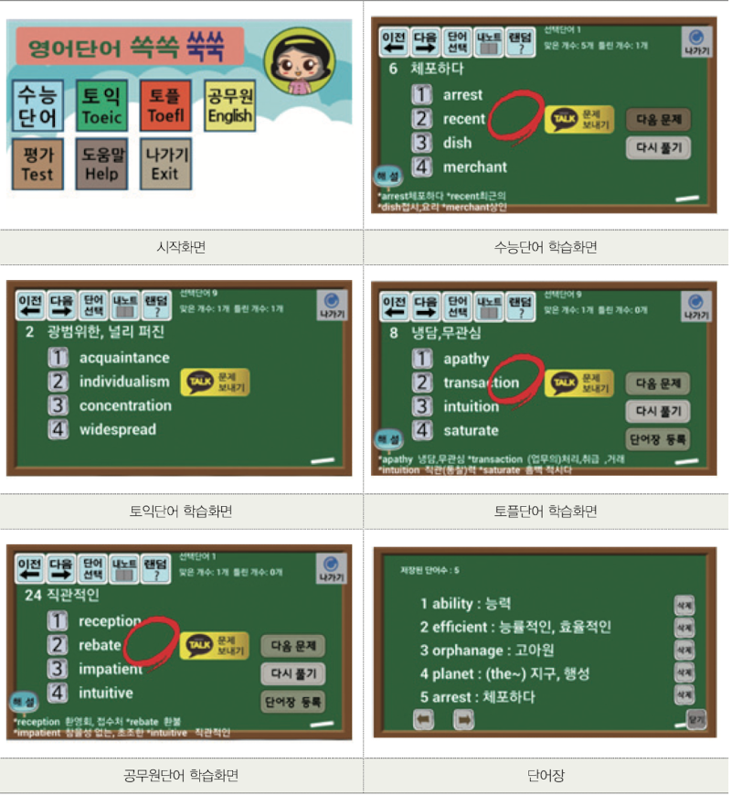
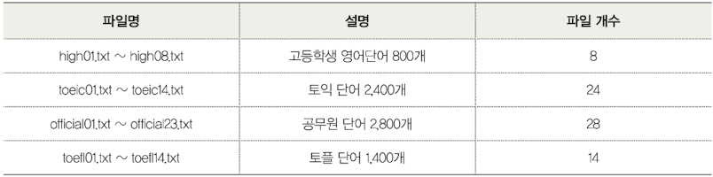
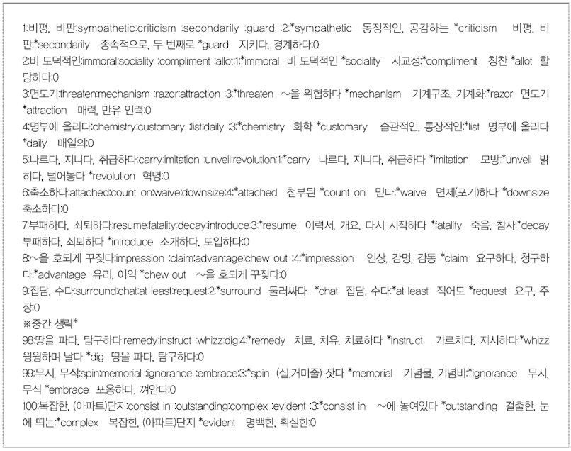
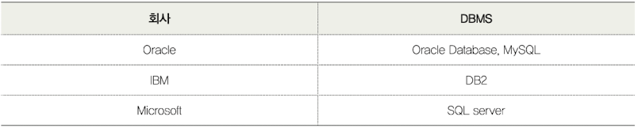
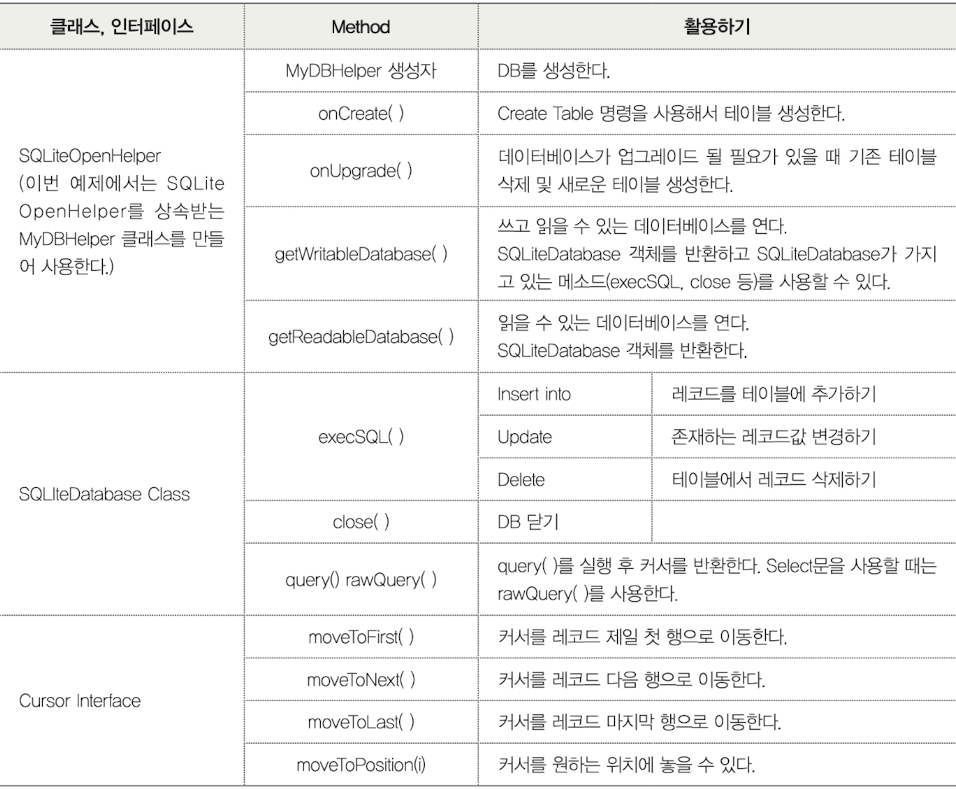

# DB를 활용한 영어단어 앱 만들기

이번 챕터는 영어단어 800개, 토익 2400개, 공무원 영어 단어 2800개, 토플 단어 1400개를 문제풀이식으로 단어를 학습할 수 있는 앱을 제작할 것이다.



* 첫 시작 화면은 [수능단어], [토익], [토플], [공무원], [평가], [도움말], [나가기]로 구성한다.

* [수능단어], [토익], [토플], [공무원] 안에는 [단어선택] 메뉴가 있으며, [단어선택]를 선택하면 서브메뉴가 나온다. 각 서브메뉴에는 100개의 문제풀이식 영어 단어가 들어있다.

* 저장하고 싶은 단어를 [내단어장]에 저장하여 관리할 수 있다.

* 문제를 친구에게 카카오톡으로 공유할 수 있다.

특히 이번 예제에서는 데이터베이스를 활용하여 데이터를 저장하거나 삭제하는 방법을 학습한다.


---


## 파일 구성

리소스에서 raw 디렉터리를 만들고, 그 안에 텍스트 파일을 넣었다. 




### raw 폴더 내 txt 파일 불러오기
[raw] 폴더에는 다양한 영어단어 학습 파일이 있고, 평가용으로 text00.txt 파일이 들어 있다. 파일 하나당 문제 100개가 있으며, 각 문제는 10개의 첨자로 이루어져 있다. 첨자를 구분하는 기호는 콜론(:)을 사용하였다.



이제 이 텍스트 파일을 분석하자. 한 문제를 살펴볼 것이다.. 

> 1:비평, 비판:sympathetic:criticism:secondarily:guard:2:\*sympathetic 동정적인, 공감하는 \*criticism 비평,비판:\*secondarily 종속적으로, 두 번째로 \*guard 지키다, 경계하다:0

자바와 c언어의 경우 첨자(열)가 0부터 시작한다. 위 문제에서 사용된 각각의 첨자의 의미는 다음과 같다. 콜론(:)으로 구분된 각각의 첨자를 살펴보자.

| 첨자 | 값 | 사용 |
|:---:|:---:|:---:|
|0|1|문제 번호|
|1|비평, 비판|문제|
|2|sympathetic|객관식 1번 내용|
|3|criticism|객관식 2번 내용|
|4|secondarily|객관식 3번 내용|
|5|guard|객관식 4번 내용|
|6|2|정답|
|7|sympathetic : 동정적인, 공감하는 criticism : 비평,비판|문제를 푼 뒤 해설아이콘을 터치하면 나오는 설명|
|8|secondarily : 종속적으로, 두 번째로 guard : 지키다, 경계하다|7과 동일|
|9|0|평가에서 사용되는 값, 같은 문제 출제 방지를 위해 사용|

이처럼 100개의 문제는 모두 10개의 열로 이루어져 있다. 이러한 값을 담기 위해서 이차원 배열을 사용할 것이다.(String questionNum[][] = new String[100][10];)

지금 살핀 문제에서 questionNum[0][1]의 값은 "비평, 비판"이 될 것이며, questionNum[2][2]의 값은 3번 문제의 객관식 1번 내용인 "threaten"이 될 것이다.


### txt 파일에 있는 내용 분리하기

FileTable 클래스

* raw 폴더에 있는 영어단어 파일을 불러와서 내용을 data 배열에 담는다. 그리고 FileSplit() 클래스 파일에 데이터를 넘겨주는 역할을 한다.

* loadFile() 메서드는 매개변수로 넘겨 받는 num 값에 따라 openRawResource() 메서드를 이용해여 high01.txt에서 high08.txt 파일을 불러온다.

* loadFile2() 메서드는 넘겨 받는 num 값에 따라 text00.txt, text01.txt, text02.txt 등의 파일을 불러올 수 있다. 본 예제에서는 text00.txt 파일만 사용할 것이다.(즉, num으로 0 값을 받을 것이다.)

* available() 메서드를 이용해서 파일 크기를 구할 수 있으며, byte[] 형 변수 data에 read() 메서드를 이용하여 읽은 값을 저장한다. 단어 학습은 FileSplit() 클래스에서, 평가 문항은 FileSplit1() 클래스에서 불러온 데이터를 넘겨준다.

```Java
public class FileTable {
    
    InputStream fi;    // byte 단위로 파일에서 프로그램으로 데이터를 운반한다.

    private FileSplit0 word;
    private FileSplit1 word2;

    // 단어 공부 파일 읽어오기
    public void loadFile(int num) {
        fi = studyView.mContext.getResources().openRawResource(R.raw.high01 + num);

        try {
            byte[] data = new byte[fi.available()];
            fi.read(data);    // 입력스트림에서 자료를 읽어 data 배열에 저장한다.
            fi.close();
            String s = new String(data, "UTF-8");
            word = new FileSplit0(s);
        } catch (IOException e) {
        }
    }

    // 평가 파일 읽어오기
    public void loadFile2(int num) {
        fi = studyView2.mContext.getResources().openRawResource(R.raw.test00 + num);

        try {
            byte[] data = new byte[fi.available()];
            fi.read(data);    // 입력스트림에서 자료를 읽어 data 배열에 저장한다.
            fi.close();
            String s = new String(data, "UTF-8");
            word = new FileSplit0(s);
        } catch (IOException e) {
        }
    }
}

```

FileSplit()은 [단어공부]에 사용되는 파일들을 questionNum[][]에 담는 역할을 한다. 파일 입출력 시 발생하는 오류를 방지하기 위해 try-catch 구문을 사용해야 한다.

```Java
public class FileSplit0 {
    public static String questionNum[][] = new String[100][10];

    public FileSplit0(String str) {

        String tmp[] = str.split("\n");
        String s;
        char ch;

        for (int i = 0; i < tmp.length; i++) {
            s = tmp[i];
            String tmp2[] = s.split(":");

            for(int j = 0; j < 10; j++) {
                tmp2[j] = tmp2[j].trim();
                questionNum[i][j] = tmp2[j];
            }

        }

    }

}
```

FileSplit1 생성자에서는 FileTable에서 넘겨온 자료를 split 메서드를 활용하여 줄단위("\n")로 잘라 tmp[]에 자료를 입력한다. tmp.length는 text00.txt 파일의 행 개수 1000을 의미한다. for 구문으로 콜론(:)을 기준으로 열을 분해해서 tmp2[]에 값을 넣는다. makeHundred 메서드는 1000개 문제 파일에서 100개 문제만 추출한다. 같은 문제가 추출되지 않도록 뽑힌 문제는 문제 마지막 열에 yes 문자열을 넣어서 구분할 것이다.

```Java
public class FileSplit1 {
    public static String questionNum2[][] = new String[1000][10];    // 파일 내용 담기
    public static String questionNum[][] = new String[100][10];    // 추출 문제 100개 담기

    public FileSplit1(String str) {

        String tmp[] = str.split("\n");
        String s;
        char ch;

        for (int i = 0; i < tmp.length; i++) {
            s = tmp[i];
            String tmp2[] = s.split(":");

            for(int j = 0; j < 10; j++) {
                tmp2[j] = tmp2[j].trim();
                questionNum[i][j] = tmp2[j];
            }

        }
        makeHundred();

    }

    public void makeHundred() {

        int selectedQuestion;
        double randomNum;

        for (int i = 0; i < 1000; i++) {
            questionNum2[i][9] = "";
        }

        for (int i = 0; i < 100; i++) {

            do {
                randomNum = Math.random();
                selectedQuestion = (int) ((randomNum * (1000)));
            } while (questionNum2[selectedQuestion][9] == "yes");

            for (int j = 0; j < 10; j++) {
                FileSplit1.questionNum[i][j] = FileSplit1.questionNum2[selectedQuestion][j];
                FileSplit1.questionNum[i][0] = Integer.toString(i + 1);
            }
            
            questionNum2[selectedQuestion][9] = "yes";

        }

    }
    
}
```

---


## 데이터베이스 이해하기

많은 양의 데이터나 자료를 논리적으로 관리(저장, 삭제)하기 위해서는 데이터베이스가 필요하다. DBMS(DataBase Management System)는 데이터베이스를 관리해 주는 소프트웨어 혹은 시스템이다.

* DBMS 종류



데이터베이스 구축 순서는 다음과 같다.

1. 데이터베이스 생성

2. 테이블 생성

3. 데이터 입력, 조회, 수정, 삭제 등

사용자는 SQL(Structrued Query Language)를 사용하여 DBMS와 소통할 수 있다.


### Table 이해하기

데이터베이스는 엑셀과 비슷하게 행(=레코드)과 열을 이용하여 데이터를 저장한다. 

* 열은 컬럼(column)이라고도 하며, 속성명(예를 들면 이름, 주소)을 의미한다. 주의할 점은 속성명은 중복되면 안 된다. 

* 행은 열에 해당하는 실제 값이다.

이런 DB를 관계형 데이터베이스라 한다.


### 데이터베이스 작업에 필요한 클래스와 인터페이스



DB 생성에 필요한 클래스와 인터페이스는 위와 같다.


#### 1. 데이터베이스 생성

아래는 SQLite를 활용한 DB 생성 코드이다. 

```Java
// StudyView.java 파일

MyDBHelper m_helper;    // MyDBHelper 클래스 사용을 위한 객체 선언

// MyDBHelper 클래스 사용을 위한 객체 생성, 두 번째 파타미터가 데이터베이스 이름이다.
m_helper = new DBHelper(mContext, "test.db", null, 1);

// SQLiteOpenHelper 클래스를 상속받아서 데이터베이스 생성하기
class MyDBHelper extends SQLiteOpenHelper {
    
    // DBHelper 생성자
    public DBHelper(Context context, String name, CursorFactory factory, int version) {
        super(context, name, factory, version);
    }

// 아래서 이어짐
```


#### 2. 테이블 생성, 레코드 삽입, 레코드 삭제
| 기능 | 설명 |
| :---: | :---: |
| 테이블 생성하기 | CREATE TABLE {테이블명} (_id, 컬럼명 타입 옵션, 컬렴명 타입 옵션); |
| 레코드(=행) 삽입하기 | INSERT INTO {테이블명} values (값, 값, 값); |
| 레코드(=행) 삭제하기 | DELETE FROM {테이블명} WHERE 조건; |

* 테이블 생성하기

englishWordTable 테이블을 자동으로 값이 증가하는 _id 컬럼과, Text 형식의 eWord 컬럼, kWord 컬럼으로 구성했다.

```Java
db.execSQL("CREATE TABLE englishWordTable) (_id INTEGER PRIMARY KEY AUTOINCREMENT," + "eWord TEXT, kWord TEXT);");
```

* 레코드(=행) 삽입하기

String.format을 이용하여 테이블에 값을 삽입한다. 

```Java
String sql = String.format("INSERT INTO englishWordTable VALUES(NULL, '%s', '%s');", input1, input2);
```

* 레코드(=행) 삭제하기

```Java
String sql = String.format("DELETE FROM englishWordTable WHERE eWord = '%s'", wordToDelete);
```

**테이블 생성**을 위한 onCreate() 메서드는 데이터베이스가 처음 생성될 때 호출된다. 하나의 데이터베이스 안에 여러 개의 테이블을 만들 수 있으며, 여기서는 단어를 저장하는 내 노트 테이블이다. 저장 내용은 자동으로 저장되는 _id 컬럼과 영어 단어, 단어 뜻이다.

```Java
@Override
    public void onCreate(SQLiteDatabase db) {    // SQLiteDatabase 클래스의 객체를 생성해서 사용
        db.execSQL("CREATE TABLE englishWordTable) (_id INTEGER PRIMARY KEY AUTOINCREMENT," + "eWord TEXT, kWord TEXT);");    // 테이블 생성
    }
    
    @Overide
    public void onUpgrade(SQLiteDatabase db, int oldVersion, int newVersion) {
        db.execSQL("DROP TABLE IF EXISTS persion");
    }

}    // MyDBHelper의 끝단
```

**단어를 저장**하기 위해서 INSERT INTO를 사용하여 테이블에 저장한다.(본 예제에서 테이블 명은 englishWordTable이다.) m_helper는 SQLiteOpenHelper 클래스를 상속 받아 생성한 객체이기 때문에 getWritableDatabase()를 사용할 수 있으며, getWritableDatabase()는 SQLiteDatabase를 반환한다. [sss+1]은 정답에 해당되는 영어 단어이며, questionNum[questionNumer][1]에서 첨차 1에 들어가는 것은 단어 뜻이다.

```Java
SQLiteDatabase db = m_helper.getWritableDatabase();

    String sql = String.format("INSERT INTO englishWordTable VALUES(NULL, '%s', '%s');",
        FileRead.questionNum[questionNumber][sss + 1],
        FileRead.questionNum[questionNumber][1]);

    db.execSQL(sql);
    db.close();
```

**단어를 삭제**하기 위해서 DELETE FROM 명령을 사용하여 테이블에서 제거한다. 예제에서는 레코드 하나씩 삭제할 수 있도록 했다. [내노트] 한 화면에 5개씩 저장된 단어가 제시되며 각 단어 옆에는 [삭제] 버튼이 나온다. [삭제] 버튼의 변수명은 btnForDictionary[0]에서 btnForDictionary[4]까지 5개다. 

dicOk 변수값이 1일 때는 [내노트]가 화면이 제시됨을 의미한다. if 구문을 이용하여 각각의 삭제 버튼이 터치되는지 확인했다. wordForDelete[0]에서 wordForDelete[4]까지는 현재 [내노트] 화면에 보이는 5개 단어(예를 들면 "start")가 위에서부터 순서대로 담겨 있다. 즉, 삭제하고 싶은 단어 옆 [삭제] 버튼을 누르면 그 단어가 wordToDelete에 들어가게 된다. SQL 문장에서 WHERE 조건에 wordToDelete를 넣고 DELETE FROM 명령을 사용하여 단어를 삭제하면 된다.

```Java
if (dicOk === 1) {  // 내 노트가 화면에 제시된다.

    // 첫 번째 삭제 버튼을 클릭하면
    if ((x > btnForDictionary[0].x) && (x < (btnForDictionary[0].x + btnForDictionary[0].w * 2))
        && (y > btnForDictionary[0].y) && (y < (btnForDictionary[0].y + btnForDictionary[0].h * 2))) {
            if (wordForDelete[0] != null) {wordToDelete = wordForDelete[0];}
        }

    // 두 번째 삭제 버튼을 클릭하면
    if ((x > btnForDictionary[1].x) && (x < (btnForDictionary[1].x + btnForDictionary[1].w * 2))
        && (y > btnForDictionary[1].y) && (y < (btnForDictionary[1].y + btnForDictionary[1].h * 2))) {
            if (wordForDelete[1] != null) {wordToDelete = wordForDelete[1];}
        }

    // ... 다섯 번째까지 작성한다.

    SQLiteDatabase db = m_helper.getWritableDatabase();
        String sql = String.format("DELETE FROM englishWordTable WHERE eWord = '%s'", wordToDelete);
        db.execSQL(sql);
    
        try {
            Thread.sleed(130);
        } catch (InterruptedException e) {}
        
        db.close();

}

```


---


