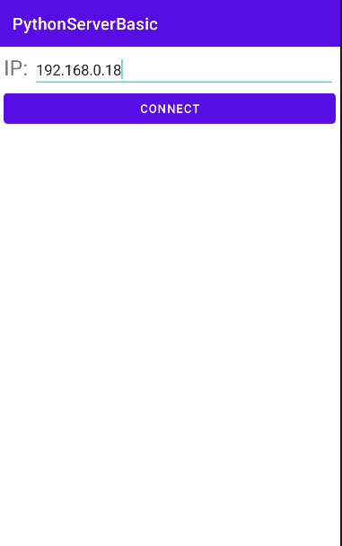
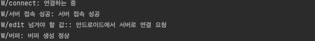
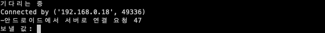

# 안드로이드 파이썬 서버 통신하기

> [문서 예제 출처](https://seopseop911.tistory.com/15)

> [공인 IP 확인 사이트](https://www.findip.kr/)

자바를 client로, 파이썬을 server로 구성할 것이다. 이를 위해 소켓을 구성해야 한다.(소켓은 원래 단어의 의미는 전구를 끼우는 데 사용하는 도구를 뜻한다.) Java 언어에서 소켓은 네트워크를 제어하는 클래스를 의미한다.

파이썬으로 구성한 소켓은 프로젝트의 [socket] 폴더 내부에 있다.(server.py)

---


## 1.1 파이썬 네트워크 구성하기(socket 모듈)

> [소켓 프로그래밍](https://on1ystar.github.io/socket%20programming/python/2021/03/21/socket-2/)

> [파이썬 소켓 연결 사용법](https://soooprmx.com/%ED%8C%8C%EC%9D%B4%EC%8D%AC-%EC%86%8C%EC%BC%93-%EC%97%B0%EA%B2%B0-%EC%82%AC%EC%9A%A9%EB%B2%95/)

파이썬으로 네트워크 프로그램을 만들기 위해서는 라이브러리가 필요하다. 따라서 파이썬 기본 패키지의 포함된 내장 socket 모듈을 import했다.


### 1.1.2 호스트 이름, IP 주소 얻기

gethostname() 메서드와 gethostbyname() 메서드로 호스트 이름과 IP 주소를 얻을 수 있다.

```Python
# gethost.py 파일
import socket

host = socket.gethostname()
ipAddress = socket.gethostbyname(host)
print("Host name: ", host)
print("IP Address: ", ipAddress)
```

```
Host name: erectbranch-MacBookPro.local
IP Address: 218.~~.~~~.~~
```

현재 사용자의 호스트 이름과 IP 주소가 출력된다.


### 1.1.3 소켓을 만들어 데이터를 수신 받기

1. 소켓 생성하기

```Python
server_sock = socket.socket(socket.AF_INET)
```

socket() 메서드는 두 가지 인자를 받아 소켓 객체를 반환한다. 이때 반환되는 소켓 객체는 File API와 유사한 socket descriptor이다. 따라서 with ~ as 구문도 사용 가능하다.

```Python
with socket.socket(family=socket.AF_INET, type=socket.SOCK_STREAM) as s
```

socket() 메서드가 받는 두 가지 인자란 바로 family와 type이다. 

> [Protocol Family, Address Family의 차이](https://mistrabbit.tistory.com/90)

* family: 파이썬은 다양한 소켓 패밀리를 지원한다. 여기서 패밀리란 '체계'를 의미하며 여기서는 어떤 소켓 체계를 사용하는지를 말한다.(family란 용어는 Protocol Family, Address Family 등으로도 사용한다.) 흔히 사용하는 패밀리는 AF_INET와 AF_INET6이 있다. 둘 다 주소 체계(Address Family)이며 AF_INET은 IPv4 인터넷 프로토콜, AF_INET6은 IPv6 인터넷 프로토콜을 의미한다.

* type: 소켓 유형을 지정하는 매개변수다. raw 소켓, 스트림 소켓, 데이터그램 소켓 등이 있다. 반드시 SOCK_STREAM(기본값, TCP 통신 소켓), SOCK_DGRAM(TCP 통신 소켓), SOCKET_RAW 또는 기타 SOCKET_ 상수 중 하나여야 한다.

위 예제에서 사용한 socket.AF_INET 주소 패밀리는 (host, port) 튜플로 구성된다. host는 인터넷 도메인 주소(www.korea.co.kr)나 IPv4 주소를 나타내는 문자열(211.223.201.30)이다. port는 포트 번호를 나타낸다. 

다른 호스트와 연결할 때 gethostname() 함수를 이용해서 호스트의 정보를 받아올 수 있으며, 'localhost'sk '127.0.0.1'로 루프 백 주소를 지정할 수도 있다.


2. 사용할 IP Address와 Port Number 등록

소켓 객체를 생성했다면 소켓을 주소와 결합(bind)해야 한다. 서버가 소켓을 포트에 매핑(mapping)하는 행위를 **바인딩**이라고 한다. 서버가 바인딩이 필요한 이유는 같은 포트로 여러 클라이언트와 동시에 접속할 수 있기 때문이다.

소켓과 네트워크 자원인 포트를 연결하므로, 프로그래머는 자신이 사용하는 포트가 명시적으로 몇 번인지, 자신의 IP가 무엇인지 알고 있어야 한다.

```Python
host = 'localhost'
port = 8888
server_sock.bind((host, port))
```

이때 address의 형식은 소켓 객체를 생성할 때 지정한 주소 패밀리의 형식을 따라야 한다. 예제에서는 AF_INET으로 지정했기 때문에 (host, port) 튜플 형태로 넘겨야 한다.


3. 요청 수신 대기 모드로 전환

바인딩이 끝난 뒤 수행해야 하는 절차는 바로 **리스닝**이다. listen() 메서드를 이용해서 생성하고 아직 연결되지 않은 소켓을 다른 클라이언트의 요청의 수신을 대기하는 상태로 만들 필요가 있다. 즉, 클라이언트가 바인드된 포트로 연결할 때까지 기다리는 블럭킹 함수다.

listen() 메서드는 매개 변수를 받아 외부 연결을 거부하기 전에 최대 n개의 연결 요청을 큐에 넣겠다고 소켓 라이브러리에 알린다. 이 소켓을 사용한 프로세스(또는 쓰레드)는 Block 상태가 된다.

```Python
server_sock.listen(1)
```


4. 클라이언트의 요청 수락

리스닝 절차를 마친 소켓은 클라이언트에게 연결 요청이 오면 코드의 다음 행을 진행(return)한다. 그리고 다음 행에는 주로 클라이언트의 연결 요청을 받아들이기 위한 accept() 메서드가 오게 된다.

```Python
conn, addr = server_sock.accept()
```

accept() 메서드는 클라이언트의 요청을 수락한 뒤, (conn, address) 튜플을 반환한다.

* conn: 연결된 클라이언트(소켓)과 데이터를 송수신할 수 있는 새로운 소켓 객체. 데이터를 주고 받을 수 있는 창구가 된다.

* address: 연결된 소켓과 바인딩된 주소 패밀리

참고로 새롭게 만들어진 소켓은 listen(), accept() 메서드가 호출될 때마다 만들어지기 때문에, 멀티스레드로 1:N의 연결도 구성할 수 있다.


5. 소켓에서 데이터 수신

소켓에서 데이터를 수신할 때는 socket.recv(), 데이터를 송신할 때는 socket.sendall()을 사용한다. (여기서 socket은 데이터를 주고 받기 위해 새로 생성된 새로운 소켓이다.)

데이터 수신을 위해 recv() 메서드를 사용한다면 매개변수로 버퍼의 크기를 전달해야 한다. socket.recv(bufsize)는 매개변수로 받은 최대 bufsize 바이트만큼의 데이터를 읽어온다. 만약 읽어들일 데이터가 없다면 상대방이 데이터를 송신할 때까지 대기한다.

```Python
msg = conn.recv(1024)
r_msg = msg.decode()
```

이렇게 수신받은 데이터는 bytes 타입의 바이트 시퀀스이다. 따라서 decode하는 작업이 필요하다. 반대로 데이터를 송신할 때(conn.sendall(r_msg.encode()))도 바이트 시퀀스로 보내야 하므로 인코딩하는 과정이 필요하다. 참고로 모든 데이터가 전송되거나 에러가 발생하기 전까지 인자 값 데이터를 전송하는 데 성공하면 None을 반환한다.


6. 소켓 닫기

소켓은 외부 리소스를 열어서 사용하는 것이므로 꼭 닫아 주어야 한다. 연결을 종료할 때는 서버와 클라이언트 양쪽이 모두 소켓을 닫아야 한다. 만약 이미 닫힌 소켓에서 데이터를 송수신하려고 하면 에러가 발생한다. 소켓을 닫을 때는 sock.close() 메서드를 사용한다.

```Python
conn.close()
server_sock.close()
```


## 1.2 안드로이드와 연결

아래는 server.py 코드 전문이다.

```Python
import socket

host = '192.168.0.18'    # 호스트 IP
port = 8080              # 임의로 지정한 포트 번호

server_sock = socket.socket(socket.AF_INET)    # 소켓 객체 생성
server_sock.bind((host, port))                 # 바인딩(소켓에 주소와 포트 매핑)
server_sock.listen(1)                          # 리스닝(클라이언트의 요청을 대기)

print("기다리는 중")
client_sock, addr = server_sock.accept()       # 요청을 수락하고 튜플을 반환 받는다.
                                               # (데이터 송수신을 위한 새로운 소켓 객체, 소켓에 바인딩된 주소 패밀리)

print('Connected by', addr)
data = client_sock.recv(1024)                  # 데이터를 수신받는다.(최대 수신 데이터 양: 1024)
print(data.decode("utf-8"), len(data))         # 바이트열 객체를 디코드한다.

data2 = int(input("보낼 값: "))                  # 안드로이드 프로세스로 보낼 값
# print(data2.encode())
client_sock.send(data)
client_sock.send(data2.to_bytes(4, byteorder='little'))     # bytes열 객체로 인코딩하여 송신한다.

client_sock.close()                            # 데이터 송수신 소켓을 닫는다.
server_sock.close()                            # 서버 소켓을 닫는다.
```

코드를 실행 시 다음과 같이 출력된다.


---


## 2 인터페이스 구성

이제 파이썬 서버와 데이터를 주고 받을 안드로이드 어플리케이션을 구성한다. 레이아웃으로 RelativeLayout을 사용했다. 내부에 LinearLayout을 만들고 하위 LinearLayout 두 개와 TextView를 수직으로 배치했다. 다만 예제에서 TextView는 따로 사용하지 않았다.

하위 LinearLayout 중 첫 번째는 TextView와 EditText가 들어간다. 사용자가 IP를 입력할 공간이다. 하위 LinearLayout 중 두 번째는 CONNECT 버튼을 넣었다. 사용자가 입력한 IP를 바탕으로 버튼을 누르면 접속을 시도한다.



아래는 activity_main.xml 코드다.

```xml
<?xml version="1.0" encoding="utf-8"?>
<RelativeLayout
    xmlns:android="http://schemas.android.com/apk/res/android"
    xmlns:app="http://schemas.android.com/apk/res-auto"
    xmlns:tools="http://schemas.android.com/tools"
    android:layout_width="match_parent"
    android:layout_height="match_parent"
    android:orientation="vertical"
    android:padding="15px"
    tools:context=".MainActivity">

    <LinearLayout
        android:layout_width="match_parent"
        android:layout_height="wrap_content"
        android:orientation="vertical"
        android:id="@+id/linearLayout">

        <!-- layout_centerInParent: true로 하면 부모 컨테이너의 정중앙에 배치된다. -->
        <LinearLayout
            android:layout_width="match_parent"
            android:layout_height="wrap_content"
            android:layout_centerInParent="true">

            <TextView
                android:layout_width="wrap_content"
                android:layout_height="wrap_content"
                android:text="IP: "
                android:textSize="25dp"
                tools:text="IP: "/>

            <EditText
                android:id="@+id/ip_edit"
                android:layout_width="match_parent"
                android:layout_height="wrap_content"
                android:ems="10"/>

        </LinearLayout>

        <LinearLayout
            android:layout_width="match_parent"
            android:layout_height="wrap_content"
            android:orientation="horizontal">

            <Button
                android:id="@+id/connect_btn"
                android:layout_width="wrap_content"
                android:layout_height="wrap_content"
                android:layout_weight="1"
                android:text="CONNECT"/>

        </LinearLayout>

        <!-- 따로 사용하지는 않음 -->
        <TextView
            android:id="@+id/show_text"
            android:layout_width="wrap_content"
            android:layout_height="wrap_content"
            android:textSize="25dp"/>

    </LinearLayout>

</RelativeLayout>
```

---


## 3 MainActivity 작성

이제 사용자가 입력한 IP 주소를 바탕으로 버튼을 누르면 파이썬 서버와 연결하도록 구성해야 한다. 

[입출력 스트림이란?](https://bamdule.tistory.com/179)

이때 외부의 데이터를 읽거나 데이터를 출력하기 위해 스트림 객체를 생성해야 한다. getInputStream() 메서드는 네트워크 소캣의 데이터를 읽기 위해 사용하며, InputStream 객체를 반환 받는다. getOutputStream은 소켓에 데이터를 출력하기 위해 사용하며, OutputStream 객체를 반환 받는다. (여기에 Java의 DataInputStream/DataOutputStream 클래스를 사용하여 기본형 타입(primitive type)의 데이터를 읽고 쓸 것이다.)

```Java
dos.writeUTF("안드로이드에서 서버로 연결 요청");    // UTF-8 형식으로 문자열을 출력한다.
```

OutputStream으로 출력한 문자열은 서버에 나타난다.


아래는 MainActivity.java 코드 전문이다.

```Java
import androidx.appcompat.app.AppCompatActivity;

import android.os.Bundle;
import android.os.Handler;
import android.util.Log;
import android.view.View;
import android.widget.Button;
import android.widget.EditText;
import android.widget.TextView;

import java.io.DataInputStream;
import java.io.DataOutputStream;
import java.io.IOException;
import java.net.Socket;

public class MainActivity extends AppCompatActivity implements View.OnClickListener {

    // 레이아웃
    Button connect_btn;

    EditText ip_edit;
    TextView show_text;

    // 소켓 통신을 위한 필드 변수, 객체
    private String html = "";     // 사용하지 않는다.
    private Handler mHandler;

    private Socket socket;

    private DataOutputStream dos;
    private DataInputStream dis;

    private String ip = "192.168.0.18";     // IP Address
    private int port = 8080;                // Port Number

    @Override
    protected void onCreate(Bundle savedInstanceState) {
        super.onCreate(savedInstanceState);
        setContentView(R.layout.activity_main);

        connect_btn = (Button) findViewById(R.id.connect_btn);
        connect_btn.setOnClickListener(this);

        ip_edit = (EditText) findViewById(R.id.ip_edit);
        show_text = (TextView) findViewById(R.id.show_text);

    }

    @Override
    public void onClick(View v) {
        switch (v.getId()) {
            case R.id.connect_btn:    // CONNECT 버튼을 누르면
                connect();            // 아래 connect() 메서드를 실행한다.
        }
    }

    // CONNECT 버튼을 누르면 실행되는 메서드
    void connect() {
        mHandler = new Handler();
        Log.w("connect", "연결하는 중");

        // 연결을 위해 실행될 쓰레드
        Thread checkUpdate = new Thread() {

            public void run() {

                // 사용자가 입력한 IP 주소를 문자열로 반환 받는다.
                String newip = String.valueOf(ip_edit.getText());

                // 서버에 접속한다.
                try {
                    socket = new Socket(newip, port);    // 소켓을 연다
                    Log.w("서버 접속 성공", "서버 접속 성공");
                } catch (IOException e1) {
                    Log.w("서버 접속 실패", "서버 접속 실패");
                    e1.printStackTrace();
                }
                
                Log.w("edit 넘겨야 할 값: ", "안드로이드에서 서버로 연결 요청");

                // socket.getInputStream(): 소켓의 데이터를 읽기 위한 InputStream 객체 반환
                // socket.getOutputStream(): 소켓에 데이터를 출력하기 위한 OutputStream 객체 반환
                try {
                    dis = new DataInputStream(socket.getInputStream());
                    dos = new DataOutputStream(socket.getOutputStream());
                    dos.writeUTF("안드로이드에서 서버로 연결 요청");    // 서버에 출력된다.
                } catch (IOException e) {
                    e.printStackTrace();
                    Log.w("버퍼", "버퍼 생성 실패");
                }
                Log.w("버퍼", "버퍼 생성 정상");

                // while 무한 루프로 서버에서 데이터를 받아온다. 
                // 한 번은 문자열을, 한 번은 숫자 데이터를 읽는다.
                try {
                    String line = "";
                    int line2;

                    while (true) {
                        line = (String) dis.readUTF();
                        line2 = (int) dis.read();
                        Log.w("서버에서 받아온 값", "" + line);
                        Log.w("서버에서 받아온 값", "" + line2);
                    }
                } catch (Exception e) {
                }

            }    // end of run()

        };    // end of checkUpdate Thread

        // 쓰레드 시작
        // 소켓 접속 시도, 버퍼 생성
        checkUpdate.start();
    }    // end of connect()

}
```

그리고 서버와 통신하기 위해 AndroidManifest.xml에 권한을 추가해야 한다. uses-permission 문장들을 추가했다. (WRITE_EXTERNAL_STORAGE, READ_EXTERNAL_STORAGE: 저장소 읽기/쓰기 권한)

```xml
<?xml version="1.0" encoding="utf-8"?>
<manifest xmlns:android="http://schemas.android.com/apk/res/android"
    xmlns:tools="http://schemas.android.com/tools">

    <uses-permission android:name="android.permission.WRITE_EXTERNAL_STORAGE" />
    <uses-permission android:name="android.permission.READ_EXTERNAL_STORAGE" />
    <uses-permission android:name="android.permission.INTERNET"/>
    <uses-permission android:name="android.permission.ACCESS_NETWORK_STATE" />
    <uses-permission android:name="android.permission.CHANGE_WIFI_STATE"/>
    <uses-permission android:name="android.permission.READ_PHONE_STATE"/>
    <uses-permission android:name="android.permission.READ_CONTACTS"/>

    <application
    <!--...-->
```

---


## 4 데이터 송수신 결과

아래는 안드로이드에서 성공적으로 파이썬 소켓과 연결이 된 화면이다.

* 안드로이드 스튜디오 

    

* 파이썬 서버

    

파이썬 서버에서 보낼 값에 10을 입력했다. 결과는 다음과 같다.


