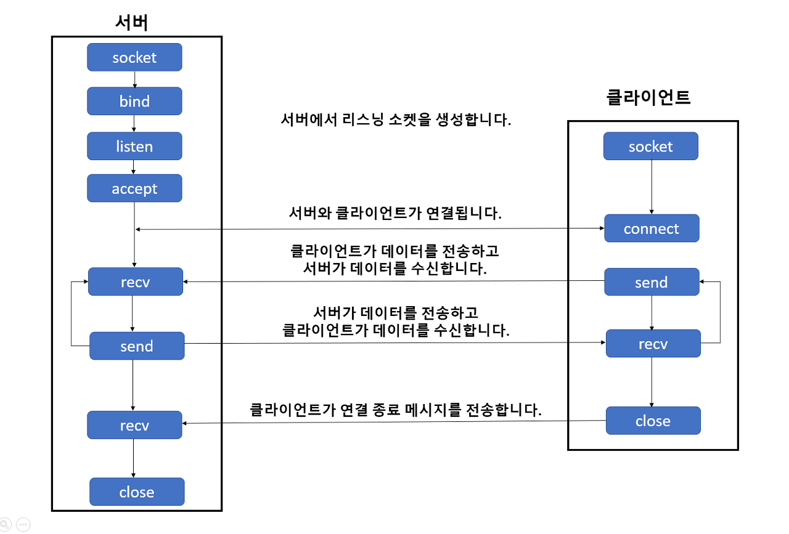

# 안드로이드 - 파이썬 서버 JSON 파일 주고 받기

## 1 소켓 통신 복습

> [파이썬 소켓 프로그래밍](https://webnautes.tistory.com/1381)

아래 그림은 TCP 통신에서의 소켓 API 호출 순서와 데이터 플로우다.



### 1.1 (Python 서버) **Python 서버 소켓 만들고 Android 클라이언트의 요청 수락까지**

Python 서버에서 socket(), bind(), listen(), accept() 순으로 함수들을 호출하여 리스닝 소캣을 생성한다. 이제 리스닝 소켓은 Android 클라이언트의 접속을 대기한다.

- socket(): 소켓 객체 생성

  - 매개변수는 family(체계: 가령 AF_INET6은 IPv6), type(소켓 유형: 가령 raw 소켓, 스트림 소켓, 데이터그램 소켓)을 의미.

<br/>

- bind(): 소켓에 host와 port를 mapping(여러 클라이언트가 같은 포트로 접근하는 것을 방지)

<br/>

- listen(): Android 클라이언트의 요청이 올 때까지 수신 대기. 인자는 최대 n개의 연결 요청을 받겠다는 의미.

  - 요청이 올 때까지 block 상태로 있다가, 클라이언트에게 연결 요청이 오면 코드의 다음 행을 진행(return)한다. 보통 다음 줄 코드로는 accept()를 위치시킨다.

<br/>

- accept(): Android 클라이언트의 요청을 수락하고 (conn, address) 튜플을 반환한다.

  - conn: 연결된 클라이언트와 데이터를 송수신할 수 있는 새로운 소켓 객체. 데이터를 주고 받을 수 있는 창구가 된다.

  - address: 연결된 소켓과 바인딩된 주소 패밀리.

> listen(), accept() 메서드가 호출될 때마다 새로운 소켓이 만들어지므로, 1:N의 멀티 쓰레드 연결도 구현할 수 있다.

<br/>

```Python
host = 'localhost'
port = 8888

server_sock = socket.socket(socket.AF_INET)

server_sock.bind((host, port))

server_sock.listen(1)

client_sock, addr = server_sock.accept()
```

---

### 1.2 (Android 클라이언트) **Android 클라이언트가 Python 서버(소켓)에 연결을 시도**

> [Android 소켓 사용하기](https://junyoung-developer.tistory.com/122)

android 클라이언트는 connect() 메서드를 이용해서 Python 서버에 연결을 시도한다. 접속에 성공하면 read(), write() 메서드를 이용해서 통신을 주고 받는다.

참고로 <U>bytes 타입의 바이트 시퀀스로 데이터를 주고 받기 때문</U>에, 보낼 때는 encode, 받을 때는 decode 과정이 필요하다.

> [InputStream, OutputStream 개념](https://velog.io/@changhee09/%EC%9E%90%EB%B0%94-InputStream-OutputStream)

이때 Socket 객체의 InputStream, OutputStream으로 데이터를 주고 받는다. Stream은 데이터가 전송되는 통로를 의미하므로, 바이트 데이터가 넘나드는 통로를 객체로 만든 것이다.

> InputStream은 데이터를 byte 단위로 읽어 들이는 통로, OutputStream은 데이터를 byte 단위로 쓰는 통로다.

- socket(): 소켓 객체 생성

- connect(): 매개변수로 (host, port)를 줘서 Python 소켓에 접속 시도

- OutputStream의 write()로 데이터를 적어서 Python 서버로 송신

- InputStream의 read()로 Python 서버의 데이터를 수신

> socket 객체를 생성할 때, 인자로 (host, port)를 주면 connect까지 한번에 진행할 수 있다.

<br/>

```Java
public void send(String data) {
    try{
        String ip = "192.168.0.18";
        int port = 8080;

        // 소켓 객체 생성
        // private static Socket socket;
        // socket = new Socket();

        // 서버로 연결(connect()
        // socket.connect(new InetSocketAddress(ip",port));

        // 소켓 객체 생성과 연결을 한번에
        Socket socket = new Socket(ip, port);

        // Python 서버로 데이터를 송신할 OutputStream
        ObjectOutputStream outputStream = new ObjectOutputStream(socket.getOutputStream());
        outputStream.writeObject(data);
        outputStream.flush();    // 버퍼 내 데이터를 모두 출력시키고 버퍼를 비운다.

        // Android에서 데이터를 받을 InputStream
        ObjectInputStream inputStream = new ObjectInputStream(socket.getInputStream());
        inputStream.readObject();

        socket.close();
    } catch (Exception ex) {
        ex.printStackTrace();
    }
}
```

위 코드는 송신/수신 데이터 출력 과정을 딱히 넣지 않았기 때문에 실제 응용해서는 추가해야 한다.

> 주의할 점은 Android는 소켓 연결을 시도하거나 응답을 받아서 처리할 때 **무조건 쓰레드를 사용**해야 한다.(강제사항이 되었기 때문에, 쓰레드를 사용하지 않으면 네트워킹 자체가 동작하지 않는다.)

---

### 1.3 (Python 서버) **accept()가 반환한 새로운 소켓으로 클라이언트(Android)와 통신**

> 예제에서 'client_sock'를 클라이언트와 통신하는 새로운 소켓 객체로 지정했다.

데이터를 수신할 때는 socket.recv(), 데이터를 송신할 때는 socket.sendall()을 사용한다.

Python 서버도 마찬가지로 bytes 타입의 바이트 시퀀스로 데이터를 주고 받기 때문에, 보낼 때는 encode, 받을 때는 decode 과정이 필요하다.

- socket.recv(): 안드로이드 클라이언트가 보낸 데이터를 수신. (받을 데이터가 없으면 대기한다.)

  - 매개변수로 준 최대 bufsize 바이트만큼의 데이터를 수신받는다.

> **버퍼 크기**란 <U>네트워크에서 한 번에 읽어들이는 데이터 크기</U>를 의미한다. 사실상 가져오는 동안 <U>일시적으로 그 데이터를 보관하는 시간</U>을 의미하기도 한다.(대체로 1024 바이트로 지정) 

> 버퍼 크기를 줄이면 버퍼링 시간은 줄어들겠지만, 잦은 버퍼링이 발생할 수 있다. 반면 버퍼 크기를 늘리면 버퍼링 시간은 늘겠지만, 버퍼링 횟수 자체는 줄어들 수 있다.

- socket.sendall()

> socket.send()으로 전송하면 요청한 데이터보다 덜 보내는 상황이 발생할 수 있다. 허나 socket.sendall() 메서드로 보내면, 요청한 데이터의 모든 버퍼 내용을 송신한다.(실패하면 Exception을 발생시킨다.)

```Python
# Android 클라이언트에게서 (bytes 타입) 데이터를 수신 받고, 받은 바이트열 객체를 decode한다.
data = client_sock.recv(1024)
data_decode = data.decode()

# print(data.decode("utf-8"))
# 위와 같이 print와 decode를 동시에 진행해도 된다.

# 서버에서 입력 값을 받아서, bytes열 객체로 encode해서 Android로 전송한다.
data_to_android = int(input("보낼 값: "))
client_sock.send(data_to_android.to_bytes(4, byteorder='little'))
```

> 참고로 데이터를 bytes열 객체로 encode할 때 쓴 to_bytes()는 python의 int에 [내장된 메서드](https://docs.python.org/ko/3/library/stdtypes.html)다. 첫 번째 인자는 length, 두 번째 인자는 byte 순서로 리틀 혹은 빅 엔디언을 지정한다.

> [엔디언](https://ko.wikipedia.org/wiki/%EC%97%94%EB%94%94%EC%96%B8): 빅 엔디언은 사람이 숫자를 쓰는 방법과 같이 큰 단위의 바이트가 앞에 오는 방법(0x59654148은 빅 엔디언으로 59 65 41 48)이고, 리틀 엔디언은 반대로 작은 단위의 바이트가 앞에 오는 방법(0x12345678은 78 56 34 12)이다.

---

### 1.4 **Android 클라이언트가 연결 종료 메시지를 전송하거나 소켓을 닫으면, Python 서버는 통신을 위해 사용한 소켓을 닫는다.**

2번의 Android의 데이터 송신, 수신 과정에서 'socket.close();' 문장을 넣었다. 이렇게 Android 클라이언트에서 소켓을 닫았다.

Python 서버에서는 아래와 같이 종료한다.

```Python
client_sock.close()    # 데이터 송수신용 소켓을 닫는다.
server_sock.close()    # Python 서버 소켓을 닫는다.
```

---

## 2 Python 서버에서 JSON 파일 받기

> [파이썬 소켓 JSON 주고 받기](https://gist.github.com/ferstar/c112f6aeb9dd47727ac6)

우선 Python 서버가 Android 클라이언트에서 보낸 JSON 파일(bytes열로 encode된)을 출력하게끔 할 것이다. 우선 이를 위해서 json 모듈을 알아야 한다.

> [파이썬의 json 모듈로 JSON 데이터 다루기](https://www.daleseo.com/python-json/)

json 모듈을 import해서 JSON 문자열을 다룰 수 있다.

- loads(): JSON 문자열을 Python 객체화한다.

> 따라서 Android에서 받은 bytes 타입(JSON을 encode한)을 decode해서, json.loads()를 통해 파이썬 객체로 변환할 것이다.

- dumps(): Python 객체를 JSON 문자열로 변환한다.

  - 속성으로 indent=2 를 주면 들여쓰기가 적용되며 보기 좋게 변환할 수 있다.(디폴트는 그냥 한 줄로 변환해 버린다.) json_string = json.dumps(json_object, indent=2)

> Python 서버에서 클라이언트로 보내기 위해서는, 1. 우선 JSON 문자열을 Python 객체로 만든 뒤, 2. bytes() 함수로 bytes 타입으로 변환해서 보내야 한다.

```Python
import socket
import json

HOST, PORT = "192.168.0.18", 9527

# (보내기) 보내기용 JSON 샘플
data = {
"name": "hello, I am Tom.",
"age": 10,
"info": "sample is simple."
}

# SOCK_STREAM: TCP socket을 의미한다.
sock = socket.socket(socket.AF_INET, socket.SOCK_STREAM)

try:
    # Android 서버와 연결
    sock.connect((HOST, PORT))

    # (보내기) 만약 JSON 샘플을 Android로 보내고 싶다면 아래와 같이 보내면 된다.
    sock.send(bytes(json.dumps(data), 'UTF-8'))

    # Android 서버에서 bytes 타입 데이터를 받아 decode한 뒤 다시 Python 객체화한다.
    received = json.loads(sock.recv(1024).decode('UTF-8'))
finally:
    # 통신을 종료한다.
    sock.close()

print ("Sent: {}".format(data))
print ("Received: {}".format(received))
```

만약 Android 클라이언트에게 받은 JSON 데이터를 저장하고 싶다면 아래와 같은 코드를 추가하면 된다.

- dump(): Python 객체를 JSON 파일로 저장한다.(dumps()와 다르니 유의)

```Python
with open('output.json', 'w') as f:
    json.dump(received, f, indent=2)
```

---
